# TILED EDITOR DOCUMENT

***Phát Hành 1.12.1***

**NHUT NGUYEN MINH**

## Tháng 25, 2026

---

**HƯỚNG DẪN SỬ DỤNG**

## Mục lục

1 [Giới thiệu](#gioi-thieu)
1.1 [Giới thiệu về Tiled](#gioi-thieu-ve-tiled)
1.2 [Bắt đầu](#bat-dau)
2 [Dự án](#du-an)
2.1 [Có gì trong một dự án](#co-gi-trong-mot-du-an)
2.2 [Phiên](#phien)
2.3 [Mở tệp trong dự án](#mo-tep-trong-du-an)
3 [Chỉnh sửa bản đồ](#chinh-sua-ban-do)
3.1 [Tạo bản đồ](#tao-ban-do)
3.2 [Định hướng bản đồ](#dinh-huong-ban-do)
3.3 [Thuộc tính bản đồ](#thuoc-tinh-ban-do)
4 [Làm việc với các lớp](#lam-viec-voi-cac-lop)
4.1 [Các loại lớp](#cac-loai-lop)
4.2 [Hệ số cuộn thị sai](#he-so-cuon-thi-sai)
4.3 [Lớp nhuộm màu](#lop-nhuom-mau)
4.4 [Chế độ pha trộn](#che-do-pha-tron)
5 [Chỉnh sửa Tile Layers](#chinh-sua-tile-layers)
5.1 [Bàn chải tem](#ban-chai-tem)
5.2 [Bàn chải địa hình](#ban-chai-dia-hinh)
5.3 [Công cụ điền xô](#cong-cu-dien-xo)
5.4 [Công cụ Shape Fill](#cong-cu-shape-fill)
5.5 [Tẩy](#tay)
5.6 [Công cụ lựa chọn](#cong-cu-lua-chon)
5.7 [Quản lý tem gạch](#quan-ly-tem-gach)
6 [Làm việc với các đối tượng](#lam-viec-voi-cac-doi-tuong)
6.1 [Công cụ vị trí](#cong-cu-vi-tri)
6.2 [Chọn đối tượng](#chon-doi-tuong)
6.3 [Chỉnh sửa đa giác](#chinh-sua-da-giac)
6.4 [Kết nối các đối tượng](#ket-noi-cac-doi-tuong)
7 [Chỉnh sửa bộ gạch](#chinh-sua-bo-gach)
7.1 [Hai loại Tileset](#hai-loai-tileset)
7.2 [Thuộc tính Tileset](#thuoc-tinh-tileset)
7.3 [Thuộc tính gạch](#thuoc-tinh-gach)
7.4 [Thông tin địa hình](#thong-tin-dia-hinh)
7.5 [Trình chỉnh sửa va chạm gạch](#trinh-chinh-sua-va-cham-gach)
7.6 [Trình chỉnh sửa hoạt hình gạch](#trinh-chinh-sua-hoat-hinh-gach)
8 [Thuộc tính tùy chỉnh](#thuoc-tinh-tuy-chinh)
8.1 [Thêm thuộc tính](#them-thuoc-tinh)
8.2 [Các loại tùy chỉnh](#cac-loai-tuy-chinh)
8.3 [Kế thừa tài sản gạch](#ke-thua-tai-san-gạch)
9 [Sử dụng mẫu](#su-dung-mau)
9.1 [Tạo mẫu](#tao-mau)
9.2 [Tạo phiên bản mẫu](#tao-phien-ban-mau)
9.3 [Chỉnh sửa mẫu](#chinh-sua-mau)
9.4 [Tách các phiên bản mẫu](#tach-cac-phien-ban-mau)
10 [Sử dụng địa hình](#su-dung-dia-hinh)
10.1 [Xác định thông tin địa hình](#xac-dinh-thong-tin-dia-hinh)
10.2 [Chỉnh sửa bằng Terrain Brush](#chinh-sua-bang-terrain-brush)
10.3 [Chế độ lấp đầy địa hình](#che-do-lap-day-dia-hinh)
10.4 [Xác suất gạch và địa hình](#xac-suat-gach-va-dia-hinh)
10.5 [Chuyển đổi Tile](#chuyen-doi-tile)
10.6 [Thức Words](#thuc-words)
11 [Sử dụng bản đồ vô hạn](#su-dung-ban-do-vo-han)
11.1 [Tạo bản đồ vô hạn](#tao-ban-do-vo-han)
11.2 [Chỉnh sửa bản đồ vô hạn](#chinh-sua-ban-do-vo-han)
11.3 [Chuyển đổi giữa bản đồ vô hạn và bản đồ kích thước cố định](#chuyen-doi-giua-ban-do-vo-han-va-ban-do-kich-thuoc-co-dinh)
12 [Làm việc với CKTG](#lam-viec-voi-cktg)
12.1 [Định nghĩa một thế giới](#dinh-nghia-mot-the-gioi)
12.2 [Chỉnh sửa thế giới](#chinh-sua-the-gioi)
12.3 [Sử dụng Pattern Matching](#su-dung-pattern-matching)
12.4 [Chỉ hiển thị hàng xóm trực tiếp](#chi-hien-thi-hang-xom-truc-tiep)
13 [Sử dụng lệnh](#su-dung-lenh)
13.1 [Nút lệnh](#nut-lenh)
13.2 [Chỉnh sửa lệnh](#chinh-sua-lenh)
13.3 [Lệnh ví dụ](#lenh-vi-du)
14 [Tự động lập bản đồ](#tu-dong-lap-ban-do)
14.1 [Tự động lập bản đồ là gì?](#tu-dong-lap-ban-do-la-gi)
14.2 [Thiết lập tệp quy tắc](#thiet-lap-tep-quy-tac)
14.3 [Thiết lập bản đồ quy tắc](#thiet-lap-ban-do-quy-tac)
14.4 [Thuộc tính tự động ánh xạ](#thuoc-tinh-tu-dong-anh-xa)
14.5 [Ví dụ](#vi-du)
14.6 [Cập nhật quy tắc cũ](#cap-nhat-quy-tac-cu)
14.7 [Tín dụng](#tin-dung)
15 [Định dạng xuất khẩu](#dinh-dang-xuat-khau)
15.1 [Định dạng tệp chung](#dinh-dang-tep-chung)
15.2 [Gỡ bỏ](#go-bo)
15.3 [GameMaker: Studio 1.4](#gamemaker-studio-1-4)
15.4 [GameMaker](#gamemaker)
15.5 [Godot 4](#godot-4)
15.6 [tBIN và tIDE](#tbin-va-tide)
15.7 [Các định dạng khác](#cac-dinh-dang-khac)
15.8 [Định dạng xuất tùy chỉnh](#dinh-dang-xuat-tuy-chinh)
15.9 [Tập lệnh Python](#tap-lenh-python)
15.10 [Xuất dưới dạng hình ảnh](#xuat-duoi-dang-hinh-anh)
16 [Phím tắt](#phim-tat)
16.1 [Tổng Quát](#tong-quat)
16.2 [Khi một lớp ngăn xếp được chọn](#khi-mot-lop-ngan-xep-duoc-chon)
16.3 [Khi một lớp đối tượng được chọn](#khi-mot-lop-doi-tuong-duoc-chon)
16.4 [Trong hộp thoại Thuộc tính](#trong-hop-thoai-thuoc-tinh)
17 [Tùy chọn người dùng](#tuy-chon-nguoi-dung)
18 [Kịch bản](#kich-ban)
19 [Thư viện và khung](#thu-vien-va-khung)
20 [Định dạng bản đồ TMX](#dinh-dang-ban-do-tmx)
21 [Nhật ký thay đổi TMX](#nhat-ky-thay-doi-tmx)
22 [Định dạng bản đồ JSON](#dinh-dang-ban-do-json)
23 [Mã ô toàn cầu](#ma-o-toan-cau)

---

### Tài liệu lát gạch, Bản phát hành 1.12.1

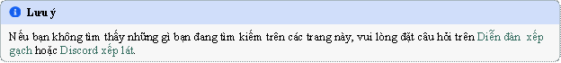


### CHƯƠNG MỘT
**GIỚI THIỆU**

# 1.1 Giới thiệu về Tiled

Tiled là một trình chỉnh sửa cấp độ 2D giúp bạn phát triển nội dung trò chơi của mình. Tính năng chính của nó là chỉnh sửa bản đồ ô ở nhiều dạng khác nhau, nhưng nó cũng hỗ trợ vị trí hình ảnh miễn phí cũng như các cách mạnh mẽ để chú thích cấp độ của bạn với thông tin bổ sung được trò chơi sử dụng. Tiled tập trung vào tính linh hoạt chung trong khi cố gắng duy trì trực quan.

Về bản đồ gạch, nó hỗ trợ các lớp gạch hình chữ nhật thẳng, nhưng cũng có các lớp isometric, so le, hình lục giác và xiên so le. Một bộ ô có thể là một hình ảnh duy nhất chứa nhiều ô hoặc có thể là một tập hợp các hình ảnh riêng lẻ. Để hỗ trợ các kỹ thuật giả mạo độ sâu nhất định, các ô và lớp có thể được bù đắp bằng khoảng cách tùy chỉnh và thứ tự kết xuất của chúng có thể được định cấu hình.

Công cụ chính để chỉnh sửa *các lớp gạch* là cọ tem cho phép vẽ và sao chép các khu vực gạch hiệu quả. Nó cũng hỗ trợ vẽ các đường và vòng tròn. Ngoài ra, có một số công cụ lựa chọn và một công cụ thực hiện *chuyển đổi địa hình tự động*. Cuối cùng, nó có thể áp dụng các thay đổi dựa trên *đối sánh mẫu* để tự động hóa các phần công việc của bạn.

Tiled cũng hỗ trợ *các lớp đối tượng*, theo truyền thống chỉ để chú thích bản đồ của bạn với thông tin nhưng gần đây chúng cũng có thể được sử dụng để đặt hình ảnh. Bạn có thể thêm các đối tượng hình chữ nhật, điểm, hình elip, đa giác, đa giác và ô. Vị trí đối tượng không giới hạn ở lưới ô và các đối tượng cũng có thể được chia tỷ lệ hoặc xoay. Các lớp đối tượng cung cấp rất nhiều sự linh hoạt để thêm hầu hết mọi thông tin vào cấp độ mà trò chơi của bạn cần.

Những điều đáng nói khác là hỗ trợ thêm các định dạng bản đồ hoặc bộ gạch tùy chỉnh thông qua các plugin, *mở rộng Tiled* với JavaScript, bộ nhớ tem ô, *hỗ trợ hoạt ảnh ô* và *trình chỉnh sửa xung đột ô*.

# 1.2 Bắt đầu

## 1.2.1 Thiết lập một dự án mới

Khi khởi chạy Tiled lần đầu tiên, chúng ta được chào đón bằng cửa sổ sau:

Để làm cho tất cả các tài sản của chúng tôi có thể dễ dàng truy cập từ *chế độ xem Dự án*, cũng như có thể nhanh chóng chuyển đổi giữa nhiều dự án, trước tiên bạn nên thiết lập một *dự án Tiled*. Tuy nhiên, đây là một bước hoàn toàn tùy chọn có thể được bỏ qua khi muốn.

Chọn *Tệp -> Mới -> Dự án mới...* để tạo tệp dự án mới. Bạn nên lưu tệp này trong thư mục gốc của dự án của bạn. Thư mục mà bạn lưu trữ dự án sẽ được tự động thêm vào để các tệp của nó hiển thị trong dạng xem Dự án.

Khi cần, bạn có thể thêm các thư mục bổ sung vào dự án hoặc thay thế thư mục được thêm theo mặc định. Ví dụ: bạn có thể chọn thêm một số thư mục cấp cao nhất như "bộ lách", "bản đồ", "mẫu", v.v. Nhấp chuột phải vào chế độ xem Dự án và chọn *Thêm thư mục vào Dự án...* để thêm các thư mục có liên quan.

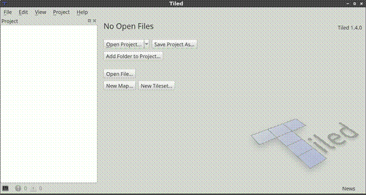

Hình 1: Cửa sổ lát gạch

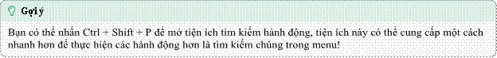

## 1.2.2 Tạo bản đồ mới

Để tạo bản đồ mới, hãy chọn *Tệp -> Mới -> Bản đồ mới...* (Ctrl+N). Hộp thoại sau sẽ bật lên:

Ở đây, chúng tôi chọn kích thước bản đồ ban đầu, kích thước ô, hướng, định dạng lớp ô, thứ tự hiển thị ô (chỉ được hỗ trợ cho *bản đồ Trực giao* và *Xiên*) và bản đồ có vô hạn hay không. Để biết thêm chi tiết về hướng bản đồ và các tùy chọn liên quan, hãy xem bản đồ. Tất cả những điều này có thể được thay đổi sau này khi cần thiết, vì vậy không quan trọng là phải làm đúng ngay lần đầu tiên.

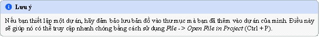

Sau khi lưu bản đồ của chúng ta, chúng ta sẽ thấy lưới ô và một lớp ô ban đầu sẽ được thêm vào bản đồ. Tuy nhiên, trước khi chúng ta có thể bắt đầu sử dụng bất kỳ ô nào, chúng ta cần thêm một bộ gạch. Chọn *Tệp -> Mới -> Bộ gạch mới...* để mở hộp thoại New Tileset:

Nhấp vào nút *Duyệt...* và chọn bộ gạch `tmw_desert_spacing.png` từ các ví dụ vận chuyển bằng Tiled (hoặc sử dụng một gói của riêng bạn nếu bạn muốn). Bộ ô ví dụ này sử dụng kích thước ô là 32x32. Nó cũng có lề một pixel xung quanh các ô và khoảng cách một pixel giữa các ô (điều này thực sự khá hiếm, thông thường bạn nên để các giá trị này ở mức 0).

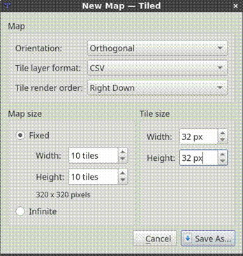

Hình 2: Bản đồ mới

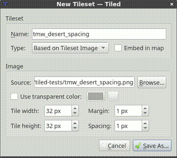

Hình 3: Bộ gạch mới

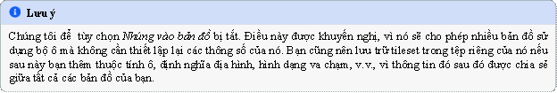

Sau khi lưu bộ gạch, Tiled sẽ trông như sau:

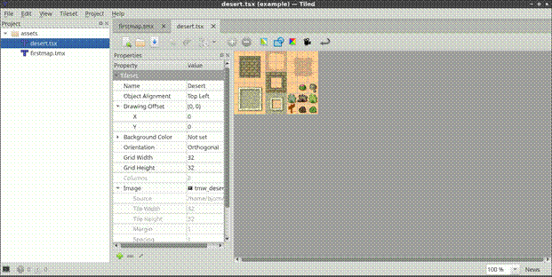

Hình 4: Bộ gạch được tạo

Vì chúng ta không muốn làm bất cứ điều gì khác với tileset vào lúc này, chỉ cần chuyển trở lại tệp bản đồ:

Chúng tôi đã sẵn sàng để chọn một số ô và bắt đầu vẽ! Nhưng trước tiên, chúng ta hãy xem nhanh các *loại layer khác nhau* được hỗ trợ bởi Tiled.

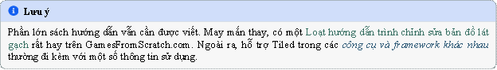

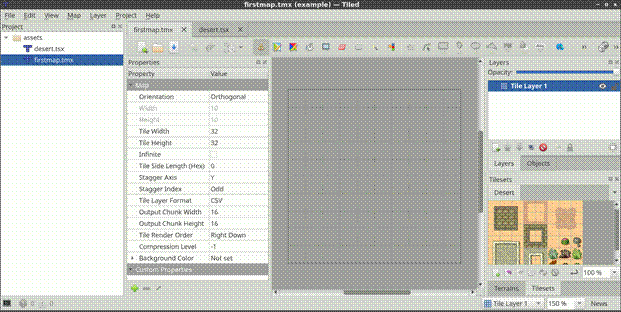

Hình 5: Bộ gạch có thể sử dụng được trên bản đồ

---

### CHƯƠNG HAI

**DỰ ÁN**

# 2.1 Có gì trong một dự án

Tệp dự án Tiled chủ yếu xác định danh sách các thư mục chứa nội dung thuộc dự án đó. Ngoài ra, nó cung cấp một neo cho *tệp phiên*.

Ngoài danh sách các thư mục, một dự án hiện có các thuộc tính sau, có thể được thay đổi thông qua *Dự án -> Thuộc tính dự án...* hộp thoại.

### Phiên bản tương thích
Phiên bản Tiled để nhắm mục tiêu khi lưu hoặc xuất tệp. Có thể được sử dụng để duy trì khả năng tương thích với các phiên bản Tiled cũ hơn hoặc với *Thư viện và Khung chưa* hỗ trợ một số thay đổi không tương thích ngược.

### Thư mục tiện ích mở rộng
Một thư mục dành riêng cho dự án nơi bạn có thể đặt *các tiện ích mở rộng Tiled*. Nó mặc định chỉ đơn giản là các phần mở rộng, vì vậy khi bạn có một thư mục được gọi là "phần mở rộng" cùng với tệp dự án của mình, nó sẽ được chọn tự động. Thư mục được tải ngoài các tiện ích mở rộng toàn cục.

### Tệp quy tắc tự động ánh xạ
Đề cập đến tệp quy tắc *Tự động lập bản đồ* hoặc một bản đồ quy tắc duy nhất nên được sử dụng cho tất cả các bản đồ trong khi dự án này được tải. Nó bị bỏ qua đối với các bản đồ có tệp `rules.txt` được lưu cùng với chúng.

Bất kỳ loại nào được xác định trong *Trình sửa kiểu tùy chỉnh* cũng được lưu trong dự án.

# 2.2 Phiên

Mỗi tệp dự án nhận được một tệp *.tiled-session* được liên kết, được lưu trữ cùng với tệp đó. Tệp phiên thường không nên được chia sẻ với người khác và lưu trữ các tệp đã mở gần đây nhất của bạn, một phần của trạng thái trình chỉnh sửa cuối cùng của chúng, các tham số được sử dụng gần đây nhất trong hộp thoại, v.v.

Khi chuyển đổi dự án, Tiled sẽ tự động chuyển sang phiên liên kết, vì vậy bạn có thể dễ dàng tiếp tục từ nơi bạn đã dừng lại. Khi không có dự án nào được tải, một tệp phiên toàn cầu sẽ được sử dụng.

# 2.3 Mở tệp trong dự án

Một ưu điểm khác của việc thiết lập dự án là bạn có thể nhanh chóng mở bất kỳ tệp nào có phần mở rộng được nhận dạng nằm trong một trong các thư mục của dự án. Sử dụng *File -> Open File in Project* (Ctrl+P) để mở bộ lọc tệp và chỉ cần nhập tên của tệp bạn muốn mở.

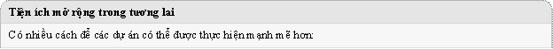

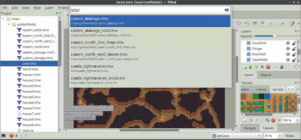

Hình 1: Mở tệp trong Project

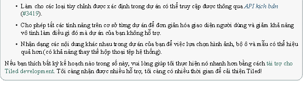

---

### CHƯƠNG BA

**CHỈNH SỬA BẢN ĐỒ**

Bản đồ là tệp nội dung cấp cao nhất chứa *các lớp* và tệp bộ gạch *tham chiếu* (có thể nhúng tùy chọn). Nó xác định hệ tọa độ, kích thước ô, hướng, thứ tự hiển thị và các tùy chọn cấu hình trên toàn bản đồ khác ảnh hưởng đến cách nội dung được hiển thị và xuất.

# 3.1 Tạo bản đồ

Bạn có thể tạo bản đồ mới thông qua *File -> New -> New Map*. Hộp thoại Bản đồ mới cho phép bạn đặt:
- **Định hướng** (xem *Hướng bản đồ*)
- **Định dạng lớp ngăn xếp** (định dạng lưu trữ cho dữ liệu ngăn xếp)
- **Thứ tự kết xuất** (chỉ dành cho bản đồ trực giao và xiên)
- **Kích thước bản đồ** (chiều rộng / chiều cao cố định hoặc vô hạn)
- **Kích thước ô** (chiều rộng/chiều cao ô tính bằng pixel)

Tất cả các tùy chọn này có thể được thay đổi sau này trong bảng Properties, thông qua *Map -> Map Properties...*.

# 3.2 Định hướng bản đồ

Hướng bản đồ kiểm soát cách chiếu lưới ô và cách các ô được định vị tương đối với nhau. Tiled hỗ trợ các hướng sau.

## 3.2.1 Trực giao
Lưới từ trên xuống cổ điển trong đó các ô hình chữ nhật được sắp xếp thành hàng và cột thẳng. Đây là định hướng thẳng thắn nhất.

## 3.2.2 Đẳng áp
Bản đồ isometric được chiếu để tạo ra giao diện giống như 3D. Các ô vẫn được sắp xếp theo lưới, nhưng được vẽ dưới dạng kim cương (mặc dù Tiled không biến đổi tác phẩm nghệ thuật của bạn, bạn sẽ cần cung cấp các ô hình kim cương). Vị trí đối tượng được lưu trữ trong một không gian tọa độ được chiếu (xem *Lớp đối tượng*).

## 3.2.3 Isometric (so le)
Bản đồ isometric so le cũng sử dụng các ô hình kim cương, nhưng lưới được xếp so le mỗi hàng hoặc cột khác. Việc so le chính xác được kiểm soát bởi **các thuộc tính bản đồ** Stagger Axis **và** Stagger Index. Hướng này cho phép bản đồ dựa trên các ô isometric vẫn có hình chữ nhật tổng thể.

## 3.2.4 Hình lục giác (so le)
Bản đồ lục giác sử dụng các ô lục giác được sắp xếp theo lưới so le. Giống như các bản đồ isometric so le, sự so le được kiểm soát bởi **Stagger Axis** và **Stagger Index**. Bản đồ lục giác cũng hỗ trợ **Chiều dài cạnh lục giác** xác định chiều dài của các cạnh thẳng của ô lục giác.

Bảng sau đây cho thấy **Trục so le** liên quan như thế nào với hai hướng ô hex phổ biến:

| Trục so le | Định hướng gạch Hex |
|---|---|
| X | Đỉnh nhọn |
| Y | Đỉnh thẳng |

## 3.2.5 Xiên
Bản đồ xiên áp dụng biến đổi xiên để đạt được phép chiếu giả 3D. Lượng độ lệch được kiểm soát bởi thuộc tính bản đồ nghiêng, tính bằng pixel.
- **Độ lệch X** xác định độ lệch ngang được áp dụng cho mỗi hàng, trong khi **Độ lệch Y** xác định độ lệch dọc được áp dụng cho mỗi cột.

# 3.3 Thuộc tính bản đồ

Các thuộc tính sau đây đặc biệt phù hợp khi đặt cấu hình bản đồ.

## 3.3.1 Kích thước bản đồ (Cố định so với Vô hạn)
Bản đồ có thể có **kích thước cố định** hoặc **vô hạn**. Bản đồ cố định có chiều rộng và chiều cao được đặt trong các ô, trong khi bản đồ vô hạn có canvas tự động phát triển mở rộng khi bạn vẽ. Sự lựa chọn ảnh hưởng đến cách các lớp gạch được lưu trữ.

Để biết chi tiết về cách làm việc với bản đồ vô hạn và chuyển đổi giữa hai bản đồ, hãy xem *Sử dụng Bản đồ vô hạn*.

## 3.3.2 Kích thước gạch
Chiều rộng và chiều cao của ô xác định kích thước của mỗi ô tính bằng pixel. Các giá trị này ảnh hưởng đến lưới ngăn xếp và ranh giới bản đồ, nhưng không ảnh hưởng đến kích thước mà ngăn xếp được hiển thị (trừ khi bộ ngăn xếp có liên quan có **Kích thước hiển thị ngăn xếp** được đặt thành **Kích thước lưới bản đồ**).

## 3.3.3 Nguồn gốc thị sai
Nguồn gốc thị sai xác định điểm tham chiếu cho *hệ số cuộn thị sai* trên các lớp. Nó được lưu trữ trên mỗi bản đồ và mặc định là (0, 0), là trên cùng bên trái của hộp giới hạn của bản đồ.

## 3.3.4 Định dạng lớp gạch
Định dạng lớp ngăn xếp xác định cách lưu trữ dữ liệu ngăn xếp khi lưu hoặc xuất bản đồ. Một số định dạng nhỏ gọn hơn hoặc phân tích cú pháp nhanh hơn các định dạng khác. Bạn có thể thay đổi định dạng bất kỳ lúc nào trong **bảng Thuộc tính**, thông qua *Bản đồ -> Thuộc tính bản đồ...*.

---

### CHƯƠNG BỐN

**LÀM VIỆC VỚI CÁC LỚP**

Bản đồ lát gạch hỗ trợ nhiều loại nội dung khác nhau và nội dung này được sắp xếp thành nhiều lớp khác nhau. Các layer phổ biến nhất là *Tile Layer* và *Object Layer*. Ngoài ra còn có một *Lớp hình ảnh* để bao gồm đồ họa nền trước hoặc nền đơn giản. Thứ tự của các lớp xác định thứ tự hiển thị nội dung của bạn.

Các lớp có thể được ẩn, chỉ hiển thị một phần và có thể bị khóa. Các lớp cũng có *hệ số cuộn lệch và thị sai*, có thể được sử dụng để định vị chúng độc lập với nhau, ví dụ như độ sâu giả. Cuối cùng, nội dung của chúng có thể được nhuộm màu bằng cách nhân với một *màu sắc tùy chỉnh*.

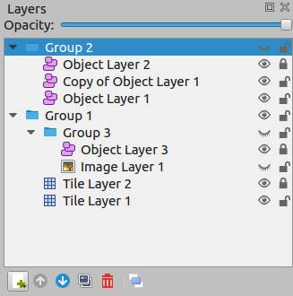

Hình 1: Biểu tượng mắt và khóa chuyển đổi khả năng hiển thị và trạng thái khóa của một lớp tương ứng.

Bạn sử dụng *Group Layers* để sắp xếp các layer thành một hệ thống phân cấp. Điều này làm cho nó thoải mái hơn khi làm việc với một lượng lớn các lớp.

# 4.1 Các loại lớp

## 4.1.1 Lớp gạch
Các lớp ngăn xếp cung cấp một cách hiệu quả để lưu trữ một khu vực rộng lớn chứa đầy dữ liệu ngăn xếp. Dữ liệu là một mảng tham chiếu ô đơn giản và do đó không có thông tin bổ sung nào có thể được lưu trữ cho từng vị trí. Thông tin bổ sung duy nhất được lưu trữ là một vài cờ, cho phép lật đồ họa ô theo chiều dọc, chiều ngang hoặc ngược đường chéo (để hỗ trợ xoay theo gia số 90 độ).

Thông tin cần thiết để hiển thị từng lớp ngăn xếp được lưu trữ cùng với bản đồ, bản đồ này chỉ định vị trí và thứ tự hiển thị của các ngăn xếp dựa trên hướng và nhiều thuộc tính khác.

Mặc dù chỉ có thể tham khảo các ô, các lớp gạch cũng có thể hữu ích để xác định các thông tin phi đồ họa khác nhau trong cấp độ của bạn. Thông tin va chạm thường có thể được truyền tải bằng cách sử dụng một bộ gạch đặc biệt và bất kỳ loại đối tượng nào không cần thuộc tính tùy chỉnh và luôn được căn chỉnh với lưới cũng có thể được đặt trên một lớp ô.

## 4.1.2 Lớp đối tượng
Các lớp đối tượng rất hữu ích vì chúng có thể lưu trữ nhiều loại thông tin không phù hợp với một lớp ô. Các đối tượng có thể được định vị, thay đổi kích thước và xoay tự do. Chúng cũng có thể có các thuộc tính tùy chỉnh riêng lẻ. Có nhiều loại đối tượng:
- **Hình chữ nhật** - để đánh dấu các khu vực hình chữ nhật tùy chỉnh
- **Hình elip** - để đánh dấu các khu vực hình elip hoặc hình tròn tùy chỉnh
- **Điểm** - để đánh dấu vị trí chính xác (kể từ Tiled 1.1)
- **Đa giác** - khi một hình chữ nhật hoặc hình elip không cắt nó (thường là khu vực va chạm)
- **Polyline** - có thể là một con đường để đi theo hoặc một bức tường để va chạm
- **Tile** - để tự do đặt, chia tỷ lệ và xoay đồ họa ô của bạn
- **Văn bản** - cho văn bản hoặc ghi chú tùy chỉnh (kể từ Tiled 1.0)

Tất cả các đối tượng đều có thể được đặt tên, trong trường hợp đó, tên của chúng sẽ hiển thị trong nhãn phía trên chúng (theo mặc định chỉ dành cho các đối tượng đã chọn). Các đối tượng cũng có thể được cung cấp một *lớp*, rất hữu ích vì nó có thể được sử dụng để tùy chỉnh màu của nhãn của chúng và các *thuộc tính tùy chỉnh có sẵn* cho đối tượng này. Đối với các đối tượng ô, lớp có thể được *kế thừa từ ô của chúng*.

Đối với hầu hết các loại bản đồ, các đối tượng được định vị bằng pixel thuần túy. Ngoại lệ duy nhất cho điều này là bản đồ isometric (không so le isometric). Đối với bản đồ đẳng cự, nó được coi là hữu ích để lưu trữ vị trí của chúng trong một không gian tọa độ được chiếu. Đối với điều này, các ô đẳng áp được giả định là đại diện cho các hình vuông được chiếu với cả hai cạnh bằng *chiều cao của ô*. Nếu bạn đang sử dụng một không gian tọa độ khác cho các đối tượng trong trò chơi isometric của mình, bạn sẽ cần chuyển đổi các tọa độ này cho phù hợp.

Chiều rộng và chiều cao của đối tượng cũng chủ yếu được lưu trữ bằng pixel. Đối với bản đồ đẳng cự, tất cả các đối tượng hình dạng (hình chữ nhật, điểm, hình elip, đa giác và đa giác) được chiếu vào cùng một không gian tọa độ được mô tả ở trên. Điều này dựa trên giả định rằng các đối tượng này thường được sử dụng để đánh dấu các khu vực trên bản đồ.

## 4.1.3 Lớp hình ảnh
Các lớp hình ảnh cung cấp một cách để nhanh chóng bao gồm một hình ảnh duy nhất làm nền trước hoặc nền của bản đồ của bạn. Chúng hiện có chức năng hạn chế và bạn có thể cân nhắc thêm hình ảnh dưới dạng Tileset và đặt nó dưới dạng *Đối tượng Tile*. Bằng cách này, bạn có khả năng tự do chia tỷ lệ và xoay hình ảnh.

Tuy nhiên, các lớp hình ảnh có thể được lặp lại dọc theo các trục tương ứng thông qua *các thuộc tính* Lặp lại X *và* Lặp lại Y của chúng.

Ưu điểm khác của việc sử dụng layer hình ảnh là nó tránh chọn / kéo hình ảnh trong khi sử dụng công cụ Select Objects. Tuy nhiên, kể từ Tiled 1.1, điều này cũng có thể đạt được bằng cách khóa lớp đối tượng chứa đối tượng ô mà bạn muốn tránh tương tác.

## 4.1.4 Lớp nhóm
Các lớp nhóm hoạt động giống như các thư mục và có thể được sử dụng để tổ chức các lớp thành một hệ thống phân cấp. Điều này chủ yếu hữu ích khi bản đồ của bạn chứa một lượng lớn các lớp.

Khả năng hiển thị, độ mờ, độ bù, khóa và *màu sắc* của một lớp nhóm ảnh hưởng đến tất cả các lớp con. Các lớp có thể dễ dàng kéo vào và ra khỏi nhóm bằng chuột. Các thao tác Raise Layer / Lower Layer cũng cho phép di chuyển các layer vào và ra khỏi nhóm.

# 4.2 Hệ số cuộn thị sai
Hệ số cuộn thị sai xác định lượng mà lớp di chuyển liên quan đến máy ảnh.

Theo mặc định, giá trị của nó là 1, có nghĩa là vị trí của nó trên màn hình thay đổi với tốc độ tương tự như vị trí của máy ảnh (theo hướng ngược lại). Giá trị thấp hơn làm cho nó di chuyển chậm hơn, mô phỏng một lớp ở xa hơn, trong khi giá trị cao hơn làm cho nó di chuyển nhanh hơn, mô phỏng một lớp được đặt giữa màn hình và máy ảnh.

Giá trị 0 làm cho lớp hoàn toàn không di chuyển, điều này có thể hữu ích để bao gồm một số phần của giao diện người dùng trong trò chơi của bạn hoặc để đánh dấu ranh giới khung nhìn chung của nó.
Các giá trị âm làm cho layer di chuyển theo hướng ngược lại, mặc dù điều này hiếm khi hữu ích.

Khi hệ số cuộn thị sai được đặt trên một lớp nhóm, nó sẽ áp dụng cho tất cả các lớp con của nó. Hệ số cuộn thị sai hiệu quả của một lớp được xác định bằng cách nhân hệ số cuộn thị sai với hệ số cuộn của tất cả các lớp mẹ.

## 4.2.1 Điểm tham chiếu thị sai
Để phù hợp không chỉ tốc độ cuộn mà còn cả vị trí của các lớp, chúng ta cần sử dụng các điểm tham chiếu giống nhau. Trong Tiled, đây là nguồn gốc thị sai và trung tâm của chế độ xem. Nguồn thị sai được lưu trữ trên mỗi bản đồ và mặc định là (0,0), là trên cùng bên trái của hộp giới hạn bản đồ. Khoảng cách giữa hai điểm này được nhân với hệ số thị sai để xác định vị trí cuối cùng trên màn hình cho mỗi lớp. Ví dụ:
- Nếu điểm gốc thị sai nằm ở trung tâm của chế độ xem, khoảng cách là (0,0) và không có hệ số thị sai nào có bất kỳ ảnh hưởng nào. Các layer được hiển thị ở vị trí ban đầu, nếu thị sai bị tắt.
- Bây giờ, khi bản đồ được cuộn sang phải 10 pixel, khoảng cách giữa điểm gốc thị sai và trung tâm của chế độ xem là 10. Vì vậy, một layer có hệ số thị sai là 0,7 sẽ chỉ di chuyển 0,7 * 10 = 7 pixel.

Thông thường, một chuyển đổi khung nhìn được sử dụng để cuộn toàn bộ bản đồ. Trong trường hợp này, người ta có thể cần điều chỉnh vị trí của từng lớp để tính đến hệ số thị sai của nó. Thay vì nhân trực tiếp khoảng cách với hệ số thị sai, bây giờ chúng ta nhân với `1 - parallaxFactor` để có được vị trí lớp. Ví dụ:
- Khi máy ảnh di chuyển sang phải 10 pixel, layer sẽ di chuyển 10 pixel sang trái (-10), vì vậy bằng cách định vị layer ở 10 * (1 - 0,7) = 3, chúng ta đảm bảo rằng nó chỉ di chuyển 7 pixel sang trái.

# 4.3 Lớp nhuộm màu
Khi bạn đặt thuộc tính *Tint Color* của một lớp, điều này ảnh hưởng đến cách hình ảnh được hiển thị. Điều này bao gồm các ô, đối tượng ô và hình ảnh của *Lớp hình ảnh*.

Mỗi giá trị màu pixel được nhân với màu sắc. Bằng cách này, bạn có thể làm tối hoặc tô màu đồ họa của mình theo nhiều cách khác nhau mà không cần thiết lập các hình ảnh riêng biệt cho nó.

Màu sắc cũng có thể được đặt trên một *Group Layer*, trong trường hợp đó nó được kế thừa bởi tất cả các layer trong nhóm.

# 4.4 Chế độ pha trộn
Tiled cung cấp hỗ trợ cho một số chế độ pha trộn phổ biến (còn được gọi là toán tử tổng hợp) cho các lớp. Các chế độ này cho phép bạn sửa đổi giao diện của một lớp bằng cách pha trộn nó với các lớp bên dưới nó theo nhiều cách khác nhau. Theo mặc định, các layer trong Tiled sử dụng chế độ pha trộn Bình thường.

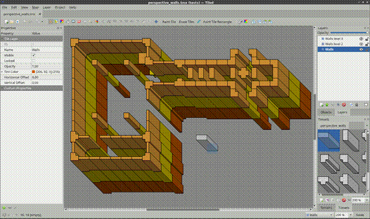
Hình 2: Một bộ gạch màu xám được hiển thị bằng một màu khác nhau cho mỗi lớp.

| Chế độ | Tương đương SVG |
|---|---|
| Bình thường | src-qua |
| Thêm | Thêm vào đó |
| Nhân | Nhân |
| Màn hình | Màn hình |
| Lớp phủ | Lớp phủ |
| Tối | Tối |
| Làm sáng | làm sáng |
| Màu sắc Dodge | né màu |
| Đốt màu | Đốt cháy màu |
| Ánh sáng cứng | ánh sáng cứng |
| Ánh sáng dịu nhẹ | ánh sáng dịu nhẹ |
| Sự khác biệt | Sự khác biệt |
| Loại trừ | Loại trừ |

Trong OpenGL, các chế độ pha trộn này có thể được triển khai bằng cách sử dụng `glBlendEquation` với các giá trị từ tiện ích mở rộng `KHR_blend_equation_advanced`. Trong Vulkan, chúng là một phần của phần mở rộng `VK_EXT_blend_operation_advanced`.

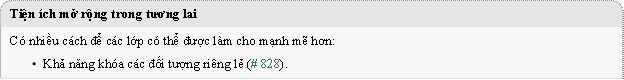

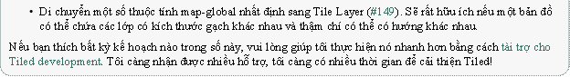

---

### CHƯƠNG NĂM
**CHỈNH SỬA LỚP GẠCH**

*Tile Layers* là thứ làm cho Tiled trở thành một *trình chỉnh sửa bản đồ ô*. Mặc dù không linh hoạt như *Object Layers*, nhưng chúng cung cấp khả năng lưu trữ dữ liệu hiệu quả và hiệu suất kết xuất tốt cũng như tạo nội dung hiệu quả. Mỗi bản đồ mới đều có một bản đồ theo mặc định, mặc dù hãy xóa nó khi bạn không sử dụng nó.

# 5.1 Bàn chải tem
Phím tắt: B 

Công cụ chính để chỉnh sửa các layer ô là Stamp Brush. Nó có thể được sử dụng để sơn các viên gạch đơn lẻ cũng như các "con tem" lớn hơn, đó là nơi nó được đặt tên. Sử dụng nút chuột phải, nó cũng có thể nhanh chóng chụp tem gạch từ lớp hiện đang hoạt động. Tem ngăn xếp thường được tạo bằng cách chọn một hoặc nhiều ngăn xếp trong dạng xem Bộ gạch.

Bàn chải tem có một số tính năng bổ sung:
- Trong khi giữ Shift, bấm vào hai điểm bất kỳ để vẽ một đường giữa chúng.
- Trong khi giữ Ctrl+Shift, nhấp vào hai điểm bất kỳ, vẽ một hình tròn hoặc hình elip ở giữa điểm đầu tiên.
- Kích hoạt *Chế độ ngẫu nhiên* bằng cách sử dụng nút xúc xắc trên thanh công cụ Tùy chọn công cụ để có Bàn chải tem vẽ với các ô ngẫu nhiên từ tem gạch. Xác suất của mỗi ô phụ thuộc vào tần suất xuất hiện trên tem ô, cũng như xác suất được đặt trên mỗi ô trong *Trình chỉnh sửa ô*.
- Kích hoạt *Chế độ lấp đầy địa hình* bằng cách sử dụng nút Terrain tile 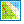 trên thanh công cụ để Stamp Brush vẽ bằng cách sử dụng các ô địa hình ngẫu nhiên. Điều này làm cho các ô liền kề khớp với địa hình cạnh và góc cần đặt. Gạch địa hình được mô tả chi tiết trong *Sử dụng địa hình*.
- Kết hợp với chế độ xem *Tile Stamps*, nó cũng có thể đặt ngẫu nhiên từ một tập hợp các tem gạch được xác định trước. Điều này có thể hữu ích hơn Chế độ ngẫu nhiên, đặt ngẫu nhiên các ô riêng lẻ.
- Bạn có thể lật tem ô hiện tại theo chiều ngang / chiều dọc bằng cách sử dụng X và Y tương ứng. Bạn cũng có thể xoay trái / phải bằng cách sử dụng Z và Shift + Z tương ứng. Các hành động này cũng có thể được kích hoạt từ thanh công cụ Tùy chọn công cụ.

# 5.2 Bàn chải địa hình
Phím tắt: T 

Terrain Brush cho phép chỉnh sửa hiệu quả với một số loại chuyển đổi địa hình nhất định (dựa trên góc, dựa trên cạnh hoặc kết hợp). Việc thiết lập nó yêu cầu liên kết thông tin địa hình với các ô của bạn, được mô tả chi tiết trong *Sử dụng địa hình*.

Tương tự như Stamp Brush, bạn có thể vẽ các đường bằng cách giữ Shift. Khi giữ Ctrl, kích thước của khu vực đã chỉnh sửa được tăng lên để bao phủ toàn bộ ngăn xếp thay vì chỉ một góc hoặc cạnh.
Khi giữ Alt, các thao tác chỉnh sửa cũng được áp dụng ở mức xoay 180 độ. Điều này đặc biệt hữu ích khi chỉnh sửa bản đồ chiến lược mà hai bên cần có cơ hội ngang nhau. Công cụ sửa đổi hoạt động tốt khi kết hợp với Shift để vẽ đường hoặc Ctrl để tăng khu vực đã chỉnh sửa.

# 5.3 Công cụ điền xô
Phím tắt: F 

Công cụ Bucket Fill cung cấp một cách nhanh chóng để lấp đầy các khu vực trống hoặc các khu vực được bao phủ bởi các ô giống nhau. Tem ô hiện đang hoạt động sẽ được lặp lại trong khu vực được lấp đầy. Nó cũng có thể được sử dụng kết hợp với *Chế độ ngẫu nhiên* hoặc *Chế độ lấp đầy địa hình*.

Khi giữ Shift, công cụ sẽ lấp đầy khu vực hiện được chọn bất kể nội dung của nó. Điều này hữu ích để điền vào các khu vực tùy chỉnh đã được chọn trước đó bằng cách sử dụng một hoặc nhiều *Công cụ Lựa chọn*.

Bạn cũng có thể lật và xoay tem hiện tại như được mô tả cho *Stamp Brush*.

# 5.4 Công cụ Shape Fill
Phím tắt: P 

Công cụ này cung cấp một cách nhanh chóng để điền vào hình chữ nhật hoặc hình elip bằng một ô hoặc mẫu nhất định.
- Giữ phím Shift sẽ lấp đầy một hình vuông hoặc hình tròn chính xác.
- Giữ Alt sẽ vẽ hình chữ nhật hoặc hình elip ở giữa vị trí bắt đầu. Bạn cũng có thể lật và xoay tem hiện tại như được mô tả cho *Stamp Brush*.

# 5.5 Tẩy
Phím tắt: E 

Một công cụ tẩy đơn giản. Nhấp chuột trái sẽ xóa các ô đơn lẻ và nhấp chuột phải có thể được sử dụng để xóa nhanh các khu vực hình chữ nhật.
- Giữ Shift sẽ xóa trên tất cả các lớp.

# 5.6 Công cụ lựa chọn
Có nhiều công cụ chọn gạch khác nhau đều hoạt động theo cách tương tự:
-  **Chọn hình chữ nhật** cho phép chọn các khu vực hình chữ nhật (phím tắt: R)
-  **Magic Wand** cho phép lựa chọn các khu vực được kết nối được lấp đầy bằng cùng một ô (phím tắt: W)
-  **Select Same Tile** cho phép chọn các ô giống nhau trên toàn bộ lớp (phím tắt: S)

Theo mặc định, mỗi công cụ này sẽ thay thế khu vực hiện được chọn. Các công cụ sửa đổi sau có thể được sử dụng để thay đổi chế độ lựa chọn trước khi bắt đầu lựa chọn:
- Giữ phím Shift để mở rộng vùng chọn hiện tại với khu vực mới
- Giữ Ctrl để trừ khu vực mới khỏi vùng chọn hiện tại
- Giữ Ctrl và Shift để chọn giao điểm của khu vực mới với vùng chọn hiện tại

Bạn cũng có thể khóa vào một trong các chế độ này (Thêm, Trừ hoặc Giao nhau) bằng cách nhấp vào một trong các nút công cụ trên thanh công cụ Tùy chọn công cụ.
Trong khi chọn một khu vực, có thể sử dụng các công cụ sửa đổi sau:
- Giữ phím Shift để hạn chế vùng chọn vào một hình vuông.
- Giữ Ctrl để mở rộng lựa chọn từ vị trí bắt đầu.

# 5.7 Quản lý tem gạch
Thường có thể hữu ích khi lưu trữ tem gạch hiện tại ở đâu đó để sử dụng lại sau này. Các phím tắt sau đây hoạt động cho mục đích này:
- Ctrl + 1-9 - Lưu trữ tem ô hiện tại. Khi không có công cụ vẽ ngăn xếp nào được chọn, hãy cố gắng chụp lựa chọn ngăn xếp hiện tại (tương tự như Ctrl + C).
- 1-9 - Gọi lại tem được lưu trữ tại vị trí này (tương tự như Ctrl + V)

Tem gạch cũng có thể được lưu trữ theo tên và mở rộng với các biến thể bằng cách sử dụng *chế độ xem Tem gạch*.

---

### CHƯƠNG SÁU
**LÀM VIỆC VỚI ĐỐI TƯỢNG**

Sử dụng các đối tượng, bạn có thể thêm rất nhiều thông tin vào bản đồ để sử dụng trong trò chơi của mình. Chúng có thể thay thế các lựa chọn thay thế tẻ nhạt như tọa độ mã hóa cứng (như điểm xuất hiện) trong mã nguồn của bạn hoặc duy trì các tệp dữ liệu bổ sung để lưu trữ các yếu tố trò chơi.

Bằng cách sử dụng *các đối tượng gạch*, các đối tượng thuộc nhiều loại khác nhau có thể dễ dàng nhận ra hoặc chúng có thể được sử dụng cho mục đích đồ họa thuần túy. Trong một số trường hợp, chúng có thể thay thế hoàn toàn việc sử dụng các lớp gạch, như đã được chứng minh bởi ví dụ "Sticker Knight" vận chuyển với Tiled.

Tất cả các đối tượng có thể có *thuộc tính tùy chỉnh*, cũng có thể được sử dụng để tạo *kết nối giữa các đối tượng*. Để bắt đầu sử dụng các đối tượng, hãy thêm *Lớp đối tượng* vào bản đồ của bạn.

# 6.1 Công cụ vị trí
Mỗi loại đối tượng có công cụ định vị riêng.

Bản xem trước được hiển thị về đối tượng bạn sắp đặt khi di chuột qua bản đồ. Trong khi đặt một đối tượng, bạn có thể nhấn Escape hoặc nhấp chuột phải để hủy vị trí của đối tượng. Nhấn Escape một lần nữa để chuyển sang *công cụ Select Objects*.

## 6.1.1 Chèn hình chữ nhật
Phím tắt: R 

Hình chữ nhật là loại đối tượng đầu tiên được Tiled hỗ trợ, đó là lý do tại sao các đối tượng là hình chữ nhật theo mặc định trong *Định dạng bản đồ TMX*. Chúng rất hữu ích để đánh dấu các khu vực hình chữ nhật và gán các thuộc tính tùy chỉnh cho chúng. Chúng cũng thường được sử dụng để chỉ định các hộp va chạm.

Đặt một hình chữ nhật bằng cách nhấp và kéo theo bất kỳ hướng nào. Giữ Shift làm cho nó vuông và giữ Ctrl sẽ đính kích thước của nó vào kích thước ô.
Các đối tượng hình chữ nhật có nguồn gốc ở trên cùng bên trái. Tuy nhiên, nếu hình chữ nhật trống (chiều rộng và chiều cao đều bằng 0), nó sẽ được hiển thị dưới dạng một hình vuông nhỏ xung quanh vị trí của nó. Điều này chủ yếu là để giữ cho nó hiển thị và có thể lựa chọn.

## 6.1.2 Điểm chèn
Phím tắt: I 

Điểm là những đối tượng đơn giản nhất mà bạn có thể đặt trên bản đồ. Chúng chỉ đại diện cho một vị trí và không thể thay đổi kích thước hoặc xoay. Chỉ cần nhấp vào bản đồ để định vị một đối tượng điểm.

## 6.1.3 Chèn hình elip
Phím tắt: C 

Hình elip hoạt động giống như *hình chữ nhật*, ngoại trừ việc chúng được hiển thị dưới dạng hình elip. Hữu ích khi khu vực hoặc hình dạng va chạm của bạn cần đại diện cho một hình tròn hoặc hình elip.

## 6.1.4 Chèn viên nang
Phím tắt: Shift + C 

Viên nang hoạt động giống như *hình chữ nhật*, ngoại trừ việc chúng được hiển thị dưới dạng viên nang. Hữu ích khi khu vực hoặc hình dạng va chạm của bạn cần đại diện cho một hình tròn hoặc viên nang.

## 6.1.5 Chèn đa giác
Phím tắt: P 

Đa giác là cách linh hoạt nhất để xác định hình dạng của một khu vực. Chúng được sử dụng phổ biến nhất để xác định hình dạng va chạm.

Khi đặt một đa giác, lần nhấp đầu tiên xác định vị trí của đối tượng cũng như vị trí của điểm đầu tiên của đa giác. Các nhấp chuột tiếp theo được sử dụng để thêm các điểm bổ sung vào đa giác. Đa giác cần có ít nhất ba điểm. Nhấp vào điểm đầu tiên một lần nữa để hoàn tất việc tạo đa giác. Bạn có thể nhấn Escape để hủy việc tạo đa giác.

Khi bạn muốn thay đổi một đa giác sau khi nó đã được đặt, bạn cần sử dụng *công cụ Chỉnh sửa đa giác*.

**Đa đường**
Các đường đa giác được tạo ra bằng cách không đóng một đa giác. Nhấp chuột phải hoặc nhấn Enter trong khi tạo đa giác để hoàn thành nó dưới dạng đa giác.

Đa đường được hiển thị dưới dạng một đường thẳng và chỉ yêu cầu hai điểm. Mặc dù chúng có thể đại diện cho các bức tường va chạm, nhưng chúng cũng thường được sử dụng để đại diện cho các con đường cần đi theo.

Bạn có thể mở rộng một polyline hiện có ở một trong hai đầu khi nó được chọn, bằng cách nhấp vào các dấu chấm được hiển thị. Cũng có thể hoàn thành polyline bằng cách kết nối nó với một trong hai đầu của một đối tượng polyline hiện có khác. Đối tượng polyline khác cũng cần được chọn, vì các dấu chấm tương tác chỉ hiển thị trên các polyline đã chọn.

Công cụ *Chỉnh sửa đa giác* cũng được sử dụng để chỉnh sửa nhiều đường.

Trong khi tạo hoặc mở rộng đa giác/đa giác bằng *công cụ Insert Polygon*, bạn có thể nhấn Backspace để xóa điểm đã thêm trước đó.

## 6.1.6 Chèn gạch
Phím tắt: T 

Các ô có thể được chèn dưới dạng đối tượng để có sự linh hoạt hoàn toàn trong việc đặt, chia tỷ lệ và xoay hình ảnh ô trên bản đồ của bạn. Giống như tất cả các đối tượng, các đối tượng ngăn xếp cũng có thể có các thuộc tính tùy chỉnh được liên kết với chúng. Điều này làm cho chúng hữu ích cho việc đặt các đối tượng tương tác dễ nhận biết cần thông tin đặc biệt, như rương có nội dung xác định hoặc NPC với tập lệnh được xác định.

Để đặt đối tượng ngăn xếp, trước tiên hãy chọn ngăn xếp bạn muốn đặt trong *dạng xem Bộ lát*. Sau đó sử dụng nút chuột trái trên bản đồ để bắt đầu đặt đối tượng, di chuyển để định vị nó và thả ra để hoàn tất việc đặt đối tượng.

Để thay đổi ô được sử dụng bởi các đối tượng ô hiện có, hãy chọn tất cả các đối tượng bạn muốn thay đổi bằng *công cụ Chọn đối tượng*, sau đó nhấp chuột phải vào ô trong *chế độ xem Tilesets* và chọn *Thay thế ô của các đối tượng đã chọn*.

Bạn có thể tùy chỉnh căn chỉnh các đối tượng ngăn xếp bằng cách sử dụng *thuộc tính Căn chỉnh đối tượng* trên Tileset. Vì lý do tương thích, thuộc tính này được đặt thành *Không xác định* theo mặc định, trong trường hợp đó, các đối tượng ngăn xếp được căn chỉnh dưới cùng bên trái theo tất cả các hướng ngoại trừ trên *bản đồ Isometric*, nơi chúng được căn giữa dưới cùng. Đặt thuộc tính này thành *Trên cùng bên trái* làm cho căn chỉnh của các đối tượng ô phù hợp với căn chỉnh của *các đối tượng hình chữ nhật*.

## 6.1.7 Chèn mẫu
Phím tắt: V 

Có thể được sử dụng để nhanh chóng chèn nhiều phiên bản của mẫu được chọn trong dạng xem Mẫu. Xem *Tạo phiên bản mẫu*.

## 6.1.8 Chèn văn bản
Phím tắt: X 

Các đối tượng văn bản có thể được sử dụng để thêm văn bản nhiều dòng tùy ý vào bản đồ của bạn. Bạn có thể định cấu hình các thuộc tính phông chữ khác nhau và khu vực bao bọc / cắt, làm cho chúng hữu ích cho cả ghi chú nhanh cũng như văn bản được sử dụng trong trò chơi.

# 6.2 Chọn đối tượng
Phím tắt: S 

Khi bạn không chèn các đối tượng mới, bạn thường sử dụng công cụ Select Objects. Nó đóng gói rất nhiều chức năng, được nêu dưới đây.

## 6.2.1 Chọn và bỏ chọn
Bạn có thể chọn các đối tượng bằng cách bấm vào chúng hoặc bằng cách kéo một lasso hình chữ nhật, chọn bất kỳ đối tượng nào giao với khu vực của đối tượng đó. Bằng cách giữ Shift hoặc Ctrl trong khi nhấp chuột, bạn có thể thêm / xóa các đối tượng đơn lẻ vào / khỏi vùng chọn. Nhấn Escape để bỏ chọn tất cả các đối tượng.

Khi nhấn và kéo vào một đối tượng, đối tượng này được chọn và di chuyển. Khi điều này ngăn bạn bắt đầu vùng chọn hình chữ nhật, bạn có thể giữ phím Shift để buộc vùng chọn hình chữ nhật.

Theo mặc định, bạn tương tác với đối tượng trên cùng. Khi bạn cần chọn một đối tượng bên dưới một đối tượng khác, trước tiên hãy chọn đối tượng cao hơn và sau đó giữ Alt trong khi nhấp vào cùng một vị trí để chọn đối tượng thấp hơn. Bạn cũng có thể giữ Alt trong khi mở menu ngữ cảnh để nhận danh sách tất cả các đối tượng tại vị trí được nhấp, vì vậy bạn có thể chọn trực tiếp đối tượng mong muốn.

Bạn có thể nhanh chóng chuyển sang *công cụ Chỉnh sửa đa giác* bằng cách nhấp đúp vào đa giác hoặc đa giác mà bạn muốn chỉnh sửa.

## 6.2.2 Di chuyển
Bạn có thể chỉ cần kéo bất kỳ đối tượng nào hoặc kéo các đối tượng đã được chọn bằng cách kéo bất kỳ đối tượng nào trong số chúng. Giữ phím Ctrl để chuyển đổi tính năng đính vào lưới ô.

Giữ Alt để buộc thao tác di chuyển trên các đối tượng hiện được chọn, bất kể bạn nhấp vào đâu trên bản đồ. Điều này hữu ích khi các đối tượng được chọn nhỏ hoặc bị che bởi các đối tượng khác.

Các đối tượng đã chọn cũng có thể được di chuyển bằng các phím mũi tên. Theo mặc định, điều này di chuyển các đối tượng từng pixel. Giữ Shift trong khi sử dụng các phím mũi tên để di chuyển các đối tượng theo khoảng cách của một ô.

## 6.2.3 Thay đổi kích thước
Bạn có thể sử dụng bộ điều khiển thay đổi kích thước để thay đổi kích thước một hoặc nhiều đối tượng được chọn. Giữ Ctrl để giữ tỷ lệ khung hình của đối tượng và / hoặc Shift để đặt điểm gốc thay đổi kích thước ở giữa.

Lưu ý rằng bạn chỉ có thể thay đổi chiều rộng và chiều cao một cách độc lập khi thay đổi kích thước một đối tượng. Khi có nhiều đối tượng được chọn, tỷ lệ khung hình là không đổi vì sẽ không có cách nào để làm cho điều đó hoạt động cho các đối tượng được xoay mà không có sự hỗ trợ đầy đủ cho các phép biến đổi.

## 6.2.4 Xoay
Để xoay, hãy bấm vào bất kỳ đối tượng nào được chọn để thay đổi bộ điều khiển thay đổi kích thước thành bộ điều khiển xoay. Trước khi xoay, bạn có thể kéo điểm gốc quay sang vị trí khác nếu cần. Giữ phím Shift để xoay theo gia số 15 độ. Nhấp lại vào bất kỳ đối tượng nào đã chọn để quay lại chế độ thay đổi kích thước.

Bạn cũng có thể xoay các đối tượng đã chọn theo các bước 90 độ bằng cách nhấn Z hoặc Shift + Z.

## 6.2.5 Thay đổi thứ tự xếp chồng
Nếu Lớp đối tượng *đang hoạt động* có thuộc tính Draw Order được đặt thành Manual (mặc định là Top Down), bạn có thể kiểm soát thứ tự xếp chồng của các đối tượng được chọn trong lớp đối tượng của chúng bằng cách sử dụng các phím sau:
- PgUp - Nâng các đối tượng đã chọn
- PgDown - Hạ thấp các đối tượng được chọn
- Trang chủ - Di chuyển các đối tượng đã chọn lên trên cùng
- Kết thúc - Di chuyển các đối tượng đã chọn xuống Dưới cùng

Bạn cũng có thể tìm thấy các hành động này trong menu ngữ cảnh. Khi bạn có nhiều Object Layers, menu ngữ cảnh cũng chứa các hành động để di chuyển các đối tượng đã chọn sang một layer khác.

## 6.2.6 Lật đối tượng
Bạn có thể lật các đối tượng đã chọn theo chiều ngang bằng cách nhấn X hoặc theo chiều dọc bằng cách nhấn Y. Đối với các đối tượng lát gạch, điều này cũng lật ngược hình ảnh của chúng.

# 6.3 Chỉnh sửa đa giác
Phím tắt: E

Đa giác và đa giác có nhu cầu chỉnh sửa riêng và do đó được bao phủ bởi một công cụ riêng biệt, cho phép chọn và di chuyển xung quanh các nút của chúng. Bạn có thể chọn và di chuyển các nút của nhiều đa giác cùng một lúc. Nhấp vào một phân đoạn để chọn các nút ở cả hai đầu. Nhấn Escape để bỏ chọn tất cả các nút hoặc để chuyển trở lại *công cụ Select Objects*.

Có thể xóa các nút bằng cách chọn chúng và chọn "Xóa nút" từ menu ngữ cảnh. Phím Delete cũng có thể được sử dụng để xóa các nút đã chọn hoặc các đối tượng đã chọn nếu không có nút nào được chọn.

Khi bạn đã chọn nhiều nút liên tiếp của cùng một đa giác, bạn có thể nối chúng lại với nhau bằng cách chọn "Tham gia các nút" từ menu ngữ cảnh. Bạn cũng có thể chia các phân đoạn giữa các nút bằng cách chọn "Tách phân đoạn". Ngoài ra, bạn có thể chỉ cần nhấp đúp vào một phân đoạn để tách phân đoạn đó tại vị trí đó.

Bạn cũng có thể xóa một phân đoạn khi hai nút liên tiếp được chọn trong một đa giác bằng cách chọn "Xóa phân đoạn" trong menu ngữ cảnh. Thao tác này sẽ chuyển đổi một đa giác thành một đa giác hoặc biến một đối tượng đa giác thành hai đối tượng đa đường.

Có thể mở rộng một polyline ở hai đầu, bằng cách nhấp chuột phải vào các nút đó và chọn "Extend Polyline", hoặc bằng cách chuyển sang *công cụ Insert Polygon* và nhấp vào một trong hai đầu của một polyline đã được chọn.

# 6.4 Kết nối các đối tượng

Nó thường có thể hữu ích để kết nối một đối tượng với một đối tượng khác, chẳng hạn như khi một công tắc sẽ mở một cánh cửa nhất định hoặc một NPC nên đi theo một con đường nhất định. Để thực hiện việc này, hãy thêm thuộc tính tùy chỉnh của đối tượng `type` vào đối tượng nguồn. Sau đó, thuộc tính này có thể được đặt thành đối tượng mục tiêu mong muốn theo một số cách.

Đảm bảo giá trị thuộc tính được chọn, như được thấy trên ảnh chụp màn hình sau:

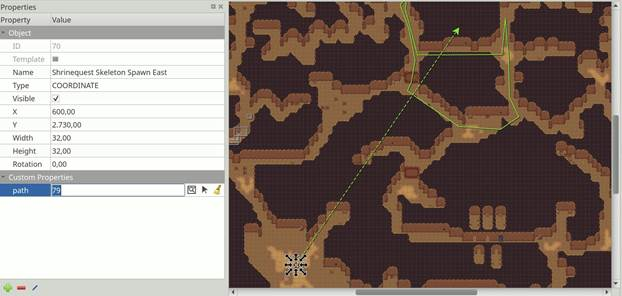
Hình 1: Thuộc tính kết nối đối tượng

Sau đó, bạn có thể đặt kết nối bằng cách:
- Nhập ID của đối tượng đích.
- Nhấp vào biểu tượng có cửa sổ và kính lúp để mở hộp thoại nơi bạn có thể lọc tất cả các đối tượng trên bản đồ để tìm đối tượng mục tiêu của mình.
- Nhấp vào biểu tượng mũi tên và sau đó nhấp vào một đối tượng trên bản đồ để đặt nó làm đối tượng đích.

Như được hiển thị trên ảnh chụp màn hình ở trên, bất kỳ kết nối nào giữa các đối tượng đều được hiển thị dưới dạng mũi tên, lấy màu của đối tượng mục tiêu của chúng (được định nghĩa là một phần của *lớp đối tượng* hoặc theo màu của lớp đối tượng). Bạn có thể chuyển đổi hiển thị các mũi tên này bằng cách sử dụng *View -> Show Object References*.

Nếu bạn muốn đến đối tượng mục tiêu, nhưng nó ở rất xa, bạn có thể nhảy đến đó bằng cách nhấp chuột phải vào thuộc tính và chọn *Go to Object*.

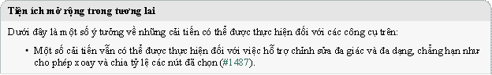

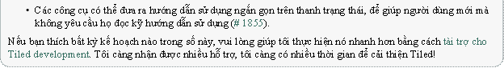

---

### CHƯƠNG BẢY

**CHỈNH SỬA BỘ GẠCH**

Để chỉnh sửa một bộ ô, nó cần được mở rõ ràng để chỉnh sửa. Các bộ ô bên ngoài có thể được mở thông qua *menu Tệp*, nhưng nói chung cách nhanh nhất để chỉnh sửa bộ ô khi nó đã được mở trong chế độ xem *Bộ gạch* là nhấp vào nút *Chỉnh sửa bộ gạch* nhỏ trong thanh công cụ bên dưới bộ ô.

# 7.1 Hai loại Tileset

Bộ gạch là một tập hợp các ô. Tiled hiện hỗ trợ hai loại tileset, được chọn khi tạo một tileset mới:

**Dựa trên hình ảnh Tileset**
Bộ ô này xác định kích thước cố định cho tất cả các ô và hình ảnh mà từ đó các ô này được cho là sẽ được cắt. Ngoài ra, nó hỗ trợ một lề xung quanh các ô và khoảng cách giữa các ô, cho phép sử dụng các hình ảnh bộ gạch tình cờ có khoảng trống giữa hoặc xung quanh các ô của chúng hoặc những hình ảnh đã đùn các pixel viền của mỗi ô để tránh chảy màu.

**Bộ sưu tập hình ảnh**
Trong loại tileset này, mỗi ô tham chiếu đến tệp hình ảnh của riêng nó. Nó rất hữu ích khi các viên gạch không có cùng kích thước hoặc khi việc đóng gói gạch thành một kết cấu được thực hiện sau này.

Bất kể loại tileset nào, bạn có thể liên kết rất nhiều siêu thông tin với nó và các ô của nó. Một số thông tin này có thể được sử dụng trong trò chơi của bạn, như *thông tin va chạm* và *hình ảnh động*. Các thông tin khác chủ yếu dành cho một số công cụ chỉnh sửa nhất định.

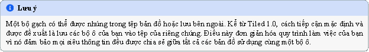

# 7.2 Thuộc tính Tileset

Bạn có thể truy cập các thuộc tính tileset bằng cách sử dụng hành động menu *Tileset > Tileset Properties*.

**Tên** Tên của bộ ô. Được sử dụng để xác định bộ gạch trong chế độ xem *Bộ gạch* khi chỉnh sửa bản đồ.

**Căn chỉnh đối tượng**
Căn chỉnh để sử dụng cho *các đối tượng ô* đề cập đến các ô từ bộ gạch này. Điều này ảnh hưởng đến vị trí của ô so với vị trí của đối tượng (điểm gốc) và cũng là vị trí xung quanh đó xoay được áp dụng.
Các giá trị có thể là: *Không xác định* (mặc định), *Trên cùng bên trái*, *Trên cùng*, *Trên cùng bên phải*, *Trái*, *Trung tâm*, *Phải*, *Dưới cùng bên trái*, *Dưới cùng* và *Dưới cùng bên phải*. Khi không được chỉ định, căn chỉnh đối tượng ô thường là *Dưới cùng bên trái*, ngoại trừ các bản đồ Isometric ở *dưới cùng*.

**Vẽ bù đắp**
Độ lệch bản vẽ tính bằng pixel, được áp dụng khi hiển thị bất kỳ ô nào từ bộ ô (như một phần của lớp ô hoặc dưới dạng đối tượng ô). Điều này có thể hữu ích để làm cho các ô của bạn thẳng hàng với lưới.

**Màu nền**
Màu nền cho bộ gạch, có thể được đặt trong trường hợp nền màu xám đậm mặc định không phù hợp với ô của bạn.

**Định hướng**
Khi bộ ô chứa các ô isometric, bạn có thể đặt tùy chọn này thành *Isometric*. Giá trị này, cùng với các thuộc tính **Chiều rộng lưới** và **Chiều cao lưới**, được tính đến bởi các lớp phủ được hiển thị trên đầu các ô. Điều này hữu ích, ví dụ như khi chỉ định *Thông tin địa hình*. Nó cũng ảnh hưởng hướng được sử dụng bởi *Trình chỉnh sửa va chạm ô*.

**Cột**
Đây là thuộc tính chỉ đọc cho bộ ô dựa trên hình ảnh bộ ô, nhưng đối với bộ ô bộ sưu tập hình ảnh, bạn có thể kiểm soát số cột được sử dụng khi hiển thị bộ ô ở đây.

**Hình Ảnh**
Thuộc tính này chỉ tồn tại cho các bộ ô dựa trên hình ảnh bộ lách. Chọn trường giá trị sẽ hiển thị Chỉnh *sửa. . .*
, cho phép bạn thay đổi các thông số liên quan đến việc cắt gạch từ hình ảnh.

Tất nhiên, như với hầu hết các kiểu dữ liệu trong Tiled, bạn cũng có thể liên kết *Thuộc tính tùy chỉnh* với bộ lát.

# 7.3 Thuộc tính gạch
**Mã nhận dạng**

**Lớp học**
ID của ngăn xếp trong bộ gạch (chỉ đọc)

Thuộc tính này đề cập đến các lớp tùy chỉnh được xác định trong *Trình chỉnh sửa loại tùy chỉnh*. Xem phần về *Ô được nhập* để biết thêm thông tin.

**Chiều rộng và chiều cao**
Kích thước của ngăn xếp (chỉ đọc)

**Xác suất**
Thể hiện xác suất tương đối mà ô này sẽ được chọn trong số nhiều tùy chọn. Giá trị này được sử dụng trong
*Chế độ ngẫu nhiên* và bằng *bàn chải địa hình*.

**Hình Ảnh**
Chỉ liên quan đến các ngăn xếp là một phần của bộ ngăn xếp bộ sưu tập hình ảnh, điều này hiển thị tệp hình ảnh của ngăn xếp và cho phép bạn thay đổi nó.

# 7.4 Thông tin địa hình

Thông tin địa hình có thể được thêm vào bộ gạch để cho phép sử dụng *Terrain Brush*. Xem phần xác *định thông tin địa hình*.

# 7.5 Trình chỉnh sửa va chạm gạch

Trình chỉnh sửa xung đột ô có sẵn bằng cách nhấp vào nút *Trình chỉnh sửa xung đột ô*  trên thanh công cụ. Thao tác này sẽ mở ra một dạng xem nơi bạn có thể tạo và chỉnh sửa hình dạng trên ngăn xếp. Bạn cũng có thể liên kết các thuộc tính tùy chỉnh với từng hình dạng.

Thông thường các hình dạng này xác định thông tin va chạm cho một sprite nhất định hoặc cho một ô đại diện cho hình học mức, nhưng tất nhiên bạn cũng có thể sử dụng chúng để thêm một số điểm nóng nhất định vào sprite của mình như cho bộ phát hạt hoặc nguồn phát súng.

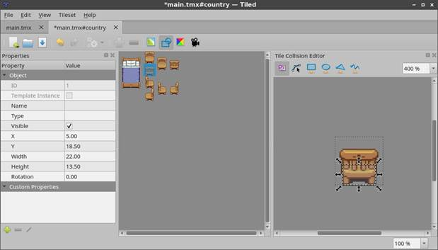
Hình 1: Trình chỉnh sửa va chạm gạch

Để có thể dễ dàng kiểm tra xem các ô của bạn có thiết lập hình dạng va chạm phù hợp hay không, chúng có thể được hiển thị trên bản đồ. Để bật tính năng này, hãy chọn *Show Tile Collision Shapes* trong menu *View*. Các hình dạng va chạm được hiển thị cho cả lớp ô và đối tượng ô.

# 7.6 Trình chỉnh sửa hoạt hình gạch

Trình chỉnh sửa hoạt ảnh ô cho phép xác định một hoạt ảnh vòng lặp tuyến tính duy nhất với mỗi ô bằng cách tham chiếu đến các ô khác trong bộ ô làm khung của nó. Mở nó bằng cách nhấp vào *Trình chỉnh sửa hoạt ảnh ô cái*  nút.

Hoạt ảnh ô có thể được xem trước trực tiếp trong Tiled, điều này rất hữu ích để có được cảm giác về giao diện của nó trong trò chơi. Bạn có thể bật hoặc tắt bản xem trước thông qua *Xem > Hiển thị hoạt ảnh ô*.

Các bước sau cho phép thêm hoặc chỉnh sửa ảnh động ô:
- Chọn ngăn xếp trong cửa sổ Lát gạch chính. Thao tác này sẽ làm cho *cửa sổ Tile Animation Editor* hiển thị ảnh động (ban đầu trống) được liên kết với ô đó, cùng với tất cả các ô khác từ bộ ô.
- Kéo các ô từ chế độ xem bộ ô trong Trình chỉnh sửa hoạt ảnh ô vào danh sách bên trái để thêm khung hoạt hình. Bạn có thể kéo nhiều ô cùng một lúc. Mỗi khung hình mới có thời lượng mặc định là 100 mili giây (hoặc giá trị khác khi được đặt bằng trường *Thời lượng khung hình* ở trên cùng).
- Nhấp đúp vào thời lượng của khung hình để thay đổi nó.
- Kéo các khung xung quanh trong danh sách để sắp xếp lại chúng.

Bản xem trước của hoạt ảnh hiển thị ở góc dưới cùng bên trái.

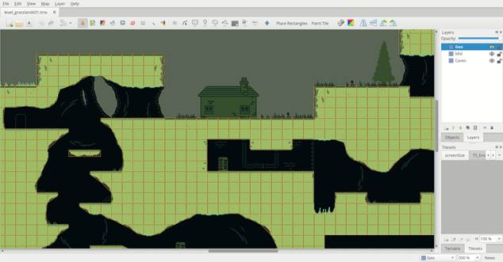
Hình 2: Hình dạng va chạm được hiển thị trên bản đồ. Bản đồ này là từ [Cuộc phiêu lưu của Owyn](https://store.steampowered.com/app/1020940/Owyns_Adventure/).

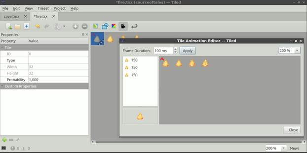
Hình 3: Trình chỉnh sửa hoạt hình xếp hình

Bạn có thể thay đổi thời lượng của nhiều khung hình cùng một lúc bằng cách chọn chúng, thay đổi giá trị trong *Thời lượng khung hình*
rồi nhấp vào *Áp dụng*.

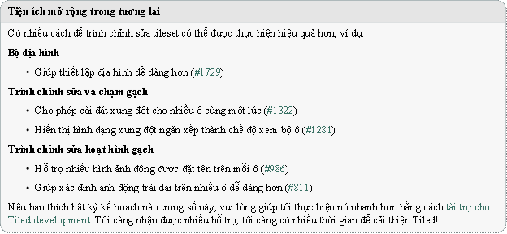

---

### CHƯƠNG TÁM

**THUỘC TÍNH TÙY CHỈNH**

Một trong những điểm mạnh chính của Tiled là nó cho phép thiết lập các thuộc tính tùy chỉnh trên tất cả các cấu trúc dữ liệu cơ bản của nó. Bằng cách này, bạn có thể bao gồm nhiều dạng thông tin tùy chỉnh, sau này có thể được sử dụng bởi trò chơi của bạn hoặc bởi khung bạn đang sử dụng để tích hợp bản đồ lát gạch.

Thuộc tính tùy chỉnh được hiển thị trong dạng xem Thuộc tính. Chế độ xem này phân biệt ngữ cảnh, thường hiển thị các thuộc tính của đối tượng được chọn cuối cùng. Nó cũng hỗ trợ nhiều lựa chọn, để thay đổi thuộc tính của nhiều đối tượng cùng một lúc.

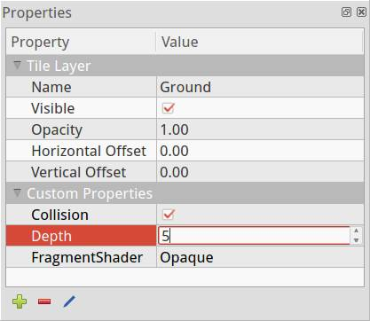
Hình 1: Chế độ xem thuộc tính

# 8.1 Thêm thuộc tính

Khi bạn thêm một thuộc tính (sử dụng nút '+' ở cuối chế độ xem Thuộc tính), bạn sẽ được nhắc nhập tên và loại thuộc tính đó. Tiled hỗ trợ các loại thuộc tính cơ bản sau:
- **bool** (đúng hoặc sai)
- **color** (giá trị màu 32 bit)
- **file** (tham chiếu tệp, được lưu dưới dạng đường dẫn tương đối)
- **float** (một số dấu phẩy động)
- **int** (một số nguyên)
- **object** (tham chiếu đến một đối tượng) - *Since Tiled 1.4*
- **string** (bất kỳ văn bản nào, bao gồm cả văn bản nhiều dòng)

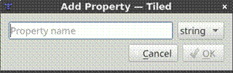
Hình 2: Thêm hộp thoại thuộc tính

Loại thuộc tính được sử dụng để chọn trình chỉnh sửa tùy chỉnh trong dạng xem Thuộc tính. Chọn một số hoặc loại boolean cũng tránh được giá trị sẽ được trích dẫn trong xuất JSON và Lua.

Menu ngữ cảnh cho các thuộc tính tệp tùy chỉnh cung cấp một cách nhanh chóng để mở tệp trong trình chỉnh sửa ưa thích của nó. Đối với tham chiếu đối tượng, có một hành động để chuyển nhanh đến đối tượng được tham chiếu.

# 8.2 Các loại tùy chỉnh

Ngoài các loại thuộc tính cơ bản được liệt kê ở trên, bạn có thể xác định các loại tùy chỉnh trong dự án của mình. Tiled hỗ trợ *enum tùy chỉnh* và *các lớp tùy chỉnh*.

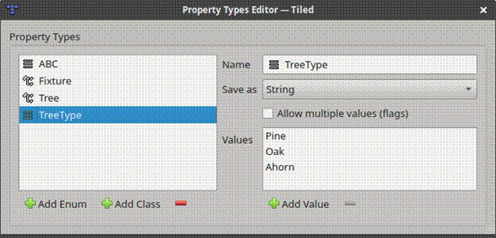
Hình 3: Trình chỉnh sửa các loại tùy chỉnh

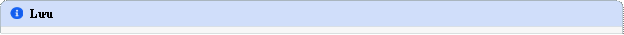

## 8.2.1 Enums tùy chỉnh

Enum rất hữu ích nếu bạn muốn giới hạn các tùy chọn cho một thuộc tính nhất định trong một tập hợp giá trị cố định.

Enum cũng xác định cách lưu giá trị của nó. Nó có thể được lưu dưới dạng chuỗi, lưu trực tiếp một trong các giá trị của nó. Ngoài ra, nó có thể được lưu dưới dạng một số, chỉ mục của giá trị hiện tại trong danh sách các giá trị. Cái trước dễ đọc hơn trong khi cái sau có thể tải dễ dàng và hiệu quả hơn.

Cuối cùng, enum cũng có thể cho phép chọn nhiều giá trị. Trong trường hợp này, mỗi tùy chọn được hiển thị với một hộp kiểm. Khi lưu dưới dạng chuỗi, một danh sách được phân tách bằng dấu phẩy được sử dụng và khi lưu dưới dạng số, các chỉ mục đã chọn được mã hóa dưới dạng cờ bit. Trong cả hai trường hợp, số lượng cờ tối đa được hỗ trợ là 31, vì bên trong một số nguyên có dấu 32 bit được sử dụng để lưu trữ giá trị.

## 8.2.2 Lớp học tùy chỉnh

Một lớp rất hữu ích nếu bạn muốn có thể thêm một tập hợp các thuộc tính cùng một lúc, với các giá trị mặc định được xác định trước. Nó cũng có thể ngăn chặn việc đặt quá nhiều tiền tố tên tài sản. Các lớp học có thể có các thành viên đề cập đến các lớp khác.

Mỗi kiểu dữ liệu có thuộc tính "Class", có thể được sử dụng để tham chiếu đến một lớp tùy chỉnh. Các thành viên của lớp này sau đó sẽ có sẵn trực tiếp dưới dạng thuộc tính tùy chỉnh của thực thể đó (trước Tiled 1.9, tính năng này chỉ có sẵn cho các đối tượng và ngăn xếp dưới dạng thuộc tính "Loại").

Mỗi lớp cũng có thể có một màu tùy chỉnh, được sử dụng để làm cho các đối tượng dễ nhận biết hơn. Màu lớp được sử dụng khi hiển thị các đối tượng hình dạng, nhãn tên đối tượng và kết nối giữa các đối tượng.

Trong định dạng tệp *JSON* và *Lua*, các thuộc tính lớp tùy chỉnh được sử dụng làm giá trị thuộc tính được lưu bằng cách sử dụng cấu trúc đối tượng gốc và bảng.

# 8.3 Kế thừa tài sản gạch

Khi các thuộc tính tùy chỉnh được thêm vào ngăn xếp, các thuộc tính này cũng sẽ hiển thị khi một phiên bản đối tượng của ngăn xếp đó được chọn. Điều này cho phép dễ dàng ghi đè cho mỗi đối tượng các thuộc tính mặc định nhất định được liên kết với ngăn xếp. Điều này trở nên đặc biệt hữu ích khi kết hợp với *Gạch nhập*.

Các thuộc tính kế thừa sẽ được hiển thị bằng màu xám (màu văn bản bị vô hiệu hóa), trong khi các thuộc tính bị ghi đè sẽ được hiển thị bằng màu đen (màu văn bản thông thường).

## 8.3.1 Gạch đánh máy

Nếu bạn đang sử dụng *các đối tượng ngăn xếp*, bạn có thể đặt lớp trên ô để tránh phải đặt lớp trên mỗi thực thể đối tượng. Việc đặt lớp trên ngăn xếp làm cho các thuộc tính được xác định trước hiển thị khi chọn ngăn xếp, cho phép ghi đè các giá trị. Nó cũng làm cho những giá trị có thể bị ghi đè hiển thị khi chọn một thực thể đối tượng ngăn xếp, một lần nữa cho phép bạn ghi đè chúng.

Một trường hợp sử dụng ví dụ cho việc này là xác định các lớp tùy chỉnh như "NPC", "Kẻ thù" hoặc "Vật phẩm" với các thuộc tính như "tên", "sức khỏe" hoặc "trọng lượng". Sau đó, bạn có thể chỉ định các giá trị cho những giá trị này trên các ngăn xếp đại diện cho các thực thể này. Và khi đặt các ô đó dưới dạng đối tượng, bạn có thể ghi đè các giá trị đó nếu cần.

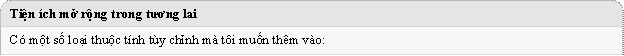

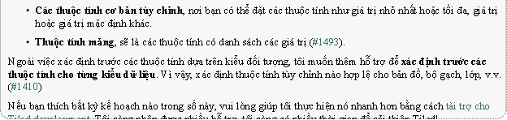

---

### CHƯƠNG CHÍN

**SỬ DỤNG MẪU**

Bất kỳ đối tượng nào đã tạo đều có thể được lưu dưới dạng mẫu. Sau đó, các mẫu này có thể được khởi tạo ở nơi khác dưới dạng các đối tượng kế thừa các thuộc tính của mẫu. Điều này có thể tiết kiệm rất nhiều công việc tẻ nhạt trong việc thiết lập lớp đối tượng và thuộc tính, hoặc thậm chí chỉ tìm đúng ô trong bộ ô.

Mỗi mẫu được lưu trữ trong tệp riêng của nó, nơi chúng có thể được sắp xếp trong các thư mục. Bạn có thể lưu mẫu ở định dạng XML hoặc JSON, giống như tệp bản đồ và bộ ô.

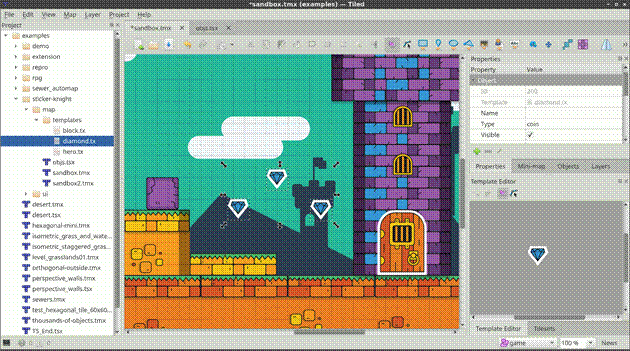

# 9.1 Tạo mẫu

Một mẫu có thể được tạo bằng cách nhấp chuột phải vào bất kỳ đối tượng nào trong bản đồ và chọn "Lưu dưới dạng mẫu". Bạn sẽ được yêu cầu chọn tên tệp và định dạng để lưu mẫu. Nếu đối tượng đã có tên, tên tệp được đề xuất sẽ dựa trên tên đó.

Để có thể chọn các mẫu của bạn để chỉnh sửa hoặc khởi tạo, bạn thường sẽ muốn sử dụng *chế độ xem Dự án*, vì vậy hãy đảm bảo lưu các mẫu của bạn trong một thư mục là một phần của dự án của bạn. Cũng có thể kéo mẫu từ trình quản lý tệp.

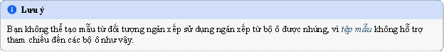

# 9.2 Tạo phiên bản mẫu
Phím tắt: V

Khởi tạo mẫu hoạt động bằng cách kéo và thả mẫu từ chế độ xem Dự án vào bản đồ hoặc bằng cách sử dụng công cụ "Chèn mẫu" bằng cách chọn một mẫu và nhấp vào bản đồ. Cái sau thuận tiện hơn khi bạn muốn tạo nhiều phiên bản.

# 9.3 Chỉnh sửa mẫu

Chỉnh sửa mẫu được thực hiện bằng cách sử dụng *chế độ xem Trình chỉnh sửa mẫu*. Bạn có thể mở mẫu để chỉnh sửa bằng cách chọn mẫu đó trong dạng xem Dự án hoặc bằng cách kéo tệp mẫu trên *dạng xem Trình chỉnh sửa mẫu*. Mẫu cũng có thể được chọn bằng cách sử dụng *thao tác* Mở tệp trong Dự án.

Khi chọn mẫu trong *dạng xem* Trình chỉnh sửa mẫu*, dạng xem Thuộc tính* sẽ hiển thị các thuộc tính của mẫu, nơi chúng có thể được chỉnh sửa.

Mọi thay đổi đối với mẫu đều được lưu tự động và được phản ánh ngay lập tức trên tất cả các phiên bản mẫu.

Nếu một thuộc tính của một phiên bản mẫu bị thay đổi, nó sẽ được đánh dấu nội bộ là thuộc tính bị ghi đè và sẽ không được thay đổi khi mẫu thay đổi.

Nếu một tệp mẫu thay đổi trên đĩa, nó sẽ tự động được tải lại và mọi thay đổi sẽ được phản ánh trong *Trình sửa mẫu* cũng như trên bất kỳ phiên bản mẫu nào.

# 9.4 Tách các phiên bản mẫu

Việc tách một phiên bản mẫu sẽ ngắt kết nối nó khỏi bản mẫu, vì vậy bất kỳ chỉnh sửa nào khác đối với bản mẫu sẽ không ảnh hưởng đến phiên bản được tách rời.

Để tách một phiên bản, nhấp chuột phải vào phiên bản đó và chọn *Tách rời*.

Nếu trình tải bản đồ của bạn không hỗ trợ mẫu đối tượng, nhưng bạn vẫn muốn sử dụng chúng, bạn có thể bật *tùy chọn Xuất* *mẫu Tách rời*.

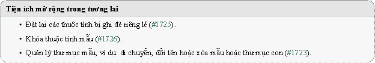

---

### CHƯƠNG MƯỜI

**SỬ DỤNG ĐỊA HÌNH**

Khi chỉnh sửa bản đồ ô, đôi khi chúng ta không nghĩ về ô mà là về *địa hình* - khu vực ô có chuyển đổi sang các loại ô khác. Giả sử chúng ta muốn vẽ một mảng cỏ, một con đường hoặc một nền tảng nào đó. Trong trường hợp này, việc chọn thủ công các ô phù hợp cho các chuyển đổi hoặc kết nối khác nhau nhanh chóng trở nên tẻ nhạt. *Terrain Brush* đã được thêm vào để giúp chỉnh sửa bản đồ ô dễ dàng hơn trong những trường hợp như vậy.

**Cảnh báo**
Mặc dù Tiled đã hỗ trợ địa hình từ phiên bản 0.9 và sau đó hỗ trợ một tính năng tương tự được gọi là "Wang tiles" kể từ phiên bản 1.1, nhưng cả hai tính năng đều được thống nhất và mở rộng trong Tiled 1.5. Do đó, *thông tin địa hình được xác định trong Tiled 1.5 không thể được sử dụng bởi các phiên bản cũ hơn.*

Terrain Brush dựa vào bộ gạch cung cấp một hoặc nhiều *Bộ địa hình* - bộ gạch được gắn nhãn theo bố cục địa hình của chúng. Tiled hỗ trợ các bộ địa hình sau:

### Bộ góc
Các ô cần khớp với các ô lân cận ở các góc của chúng, với sự chuyển đổi từ loại địa hình này sang loại địa hình khác ở giữa. Một bộ hoàn chỉnh với 2 địa hình có 16 ô.

### Bộ cạnh
Các ô cần khớp với các ô lân cận ở hai bên của chúng. Điều này phổ biến đối với đường xá, hàng rào hoặc nền tảng. Một bộ hoàn chỉnh với 2 địa hình có 16 ô.

### Set hỗn hợp
Các ô dựa vào các ô lân cận phù hợp bằng cách sử dụng cả góc và hai bên của chúng. Điều này cho phép một bộ gạch cung cấp nhiều biến thể hơn, với chi phí cần nhiều hơn đáng kể gạch. Một bộ hoàn chỉnh với 2 địa hình có 256 ô, nhưng các bộ giảm như [bộ gạch Blob 47 ô](https://web.archive.org/web/20230101/cr31.co.uk/stagecast/wang/blob.html) cũng có thể được sử dụng với loại này.

Dựa trên thông tin trong một bộ địa hình, *Terrain Brush* có thể hiểu bản đồ và tự động chọn các ô phù hợp khi thực hiện chỉnh sửa. Khi cần thiết, nó cũng điều chỉnh các ô lân cận để đảm bảo chúng kết nối chính xác với khu vực đã sửa đổi. Một bộ địa hình có thể chứa tối đa 254 địa hình.

Stamp *Brush*, cũng như *Bucket Fill Tool* và *Shape Fill Tool*, cũng có một chế độ mà chúng có thể *lấp đầy một khu vực với địa hình ngẫu nhiên*.

# 10.1 Xác định thông tin địa hình

## 10.1.1 Tạo bộ địa hình

Trước hết, hãy chuyển sang tệp tileset. Nếu bạn đang xem bản đồ và đã chọn bộ ô, bạn có thể thực hiện việc này bằng cách nhấp vào nút *Chỉnh sửa bộ gạch* nhỏ bên dưới chế độ xem Bộ gạch.

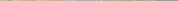
Hình 1: Nút Chỉnh sửa Tileset

Sau đó, kích hoạt chế độ chỉnh sửa địa hình bằng cách nhấp vào *nút Bộ địa hình* 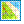 trên thanh công cụ. Khi chế độ này được kích hoạt, *chế độ xem Bộ địa hình* sẽ hiển thị, với một nút để thêm một bộ mới. Trong ví dụ này, chúng ta sẽ định nghĩa một *Corner Set*.


Hình 2: Thêm một bộ địa hình

Khi thêm một bộ địa hình, tên của bộ mới sẽ tự động lấy nét. Đặt tên dễ nhận biết, trong ví dụ chúng ta sẽ gõ "Desert Ground". Chúng ta cũng có thể đặt một trong các ô làm biểu tượng của bộ bằng cách nhấp chuột phải vào ô và chọn "Sử dụng làm hình ảnh bộ địa hình".

## 10.1.2 Thêm địa hình
Bộ mới sẽ có một địa hình được thêm vào theo mặc định. Nếu chúng tôi đã biết chúng tôi cần những cái bổ sung, hãy nhấp vào Thêm *địa hình* để thêm nhiều hơn.

Mỗi địa hình có một tên, màu sắc và có thể có một trong các ô làm biểu tượng của nó để làm cho nó dễ nhận biết hơn. Bấm hai lần vào địa hình để chỉnh sửa tên của địa hình. Để thay đổi màu sắc, nhấp chuột phải vào địa hình và chọn "Chọn màu tùy chỉnh". Để gán một biểu tượng, hãy chọn địa hình và sau đó nhấp chuột phải vào một ô, chọn "Sử dụng làm hình ảnh địa hình".


Hình 3: Địa hình của chúng ta


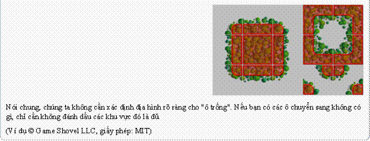
Với địa hình được thiết lập, chúng tôi đã sẵn sàng đánh dấu từng ô của mình.

## 10.1.3 Đánh dấu gạch
Lưu ý rằng đối với *Bộ góc*, chúng ta chỉ có thể đánh dấu các góc của ô. Đối với *Edge Set*, chúng tôi bị giới hạn trong việc đánh dấu các cạnh của ô của chúng tôi. Nếu chúng ta cần cả hai, chúng ta cần sử dụng *Mixed Set*. Nếu hóa ra chúng ta chọn sai loại bộ địa hình, chúng ta vẫn có thể thay đổi loại trong chế độ xem Properties (nhấp chuột phải vào bộ địa hình và chọn *Terrain Set Properties...*).

Với địa hình chúng ta muốn đánh dấu đã chọn, hãy nhấp và kéo để đánh dấu các khu vực của các ô phù hợp với địa hình này.


Hình 4: Ở đây chúng tôi đã đánh dấu tất cả các góc cát trong bộ gạch ví dụ của chúng tôi.

Nếu bạn mắc lỗi, chỉ cần sử dụng Hoàn tác (hoặc nhấn Ctrl+Z). Hoặc nếu bạn nhận thấy lỗi sau này, hãy sử dụng *Xóa địa hình* để xóa loại địa hình khỏi một góc hoặc chọn loại địa hình chính xác và sơn lên nó. Mỗi góc chỉ có thể có một loại địa hình liên quan đến nó.

Bây giờ làm tương tự cho từng loại địa hình khác. Cuối cùng, bạn sẽ đánh dấu tất cả các ô ngoại trừ các đối tượng đặc biệt.


Hình 5: Chúng tôi đã đánh dấu xong địa hình của các ô của chúng tôi.

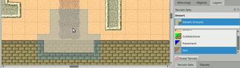

### Chế độ xem mẫu
Bên cạnh tab *Địa hình*, cũng có tab *Patterns*. Chế độ xem này có thể hữu ích khi đánh dấu các tập hợp hoàn chỉnh, vì nó có thể làm nổi bật các mẫu vẫn còn thiếu. Mỗi mẫu đã xuất hiện trên ô trong bộ gạch đều được làm tối để làm nổi bật các mẫu còn thiếu. Tuy nhiên, lưu ý rằng một bộ địa hình không nhất thiết phải có tất cả các mẫu có thể, đặc biệt là khi sử dụng nhiều hơn 2 địa hình.


Hình 6: Chế độ xem mẫu, hiển thị tất cả các kết hợp có thể có trong tập hợp.

# 10.2 Chỉnh sửa bằng Terrain Brush

Bây giờ bạn có thể tắt chế độ *Bộ địa hình*  bằng cách nhấp lại vào nút thanh công cụ. Sau đó chuyển trở lại bản đồ và kích hoạt cửa sổ *Bộ địa hình*. Chọn bộ địa hình mà chúng ta vừa thiết lập, để chúng ta có thể sử dụng địa hình của nó.

Nhấp vào địa hình cát và thử vẽ. Bạn có thể ngay lập tức nhận thấy rằng không có gì xảy ra. Điều này là do chưa có ô nào khác trên bản đồ, vì vậy công cụ địa hình không thực sự biết cách trợ giúp (vì chúng tôi cũng không có chuyển đổi sang "không có gì" trong bộ ô của chúng tôi). Có hai cách để giải quyết vấn đề này:
- Chúng ta có thể giữ Ctrl (Command trên máy Mac) để vẽ một khu vực lớn hơn một chút. Bằng cách này, chúng tôi sẽ vẽ ít nhất một viên gạch duy nhất chứa đầy địa hình đã chọn, mặc dù điều này không thuận tiện cho việc sơn các khu vực lớn hơn.
- Giả sử chúng ta đang tạo ra một bản đồ sa mạc, tốt hơn là bắt đầu bằng cách lấp đầy toàn bộ bản đồ bằng cát. Chỉ cần chuyển trở lại cửa sổ *Tilesets* trong giây lát, chọn gạch cát và sau đó sử dụng *Bucket Fill Tool*.

Khi chúng ta đã sơn một ít cát, hãy chọn địa hình Cobblestone. Bây giờ bạn có thể thấy công cụ đang hoạt động!


Hình 7: Vẽ đá cuội

Cuối cùng, hãy xem điều gì sẽ xảy ra khi bạn thử vẽ một số bụi bẩn trên đá cuội. Bởi vì không có sự chuyển đổi trực tiếp từ bụi bẩn sang đá cuội, công cụ Terrain trước tiên chèn các chuyển tiếp sang cát và từ đó sang đá cuội. Gọn gàng!


# 10.3 Chế độ lấp đầy địa hình

Hình 8: Vẽ bụi bẩn

Stamp *Brush*, *Bucket Fill Tool* và *Shape Fill Tool* có *Terrain Fill Mode*, có thể được sử dụng để vẽ hoặc lấp đầy một khu vực với địa hình ngẫu nhiên. Khi chế độ này được kích hoạt, mỗi ô sẽ được chọn ngẫu nhiên từ tất cả các ô trong Bộ Địa hình đã chọn, đảm bảo khớp với tất cả các cạnh và/hoặc góc liền kề.


Hình 9: Stamp Brush với Chế độ lấp đầy địa hình được bật

Lưu ý rằng vì chế độ này đảm bảo rằng các ô mới được đặt khớp với bất kỳ ô nào đã có sẵn, nên nói chung sẽ không có gì thay đổi khi vẽ bằng Bàn chải tem trên địa hình hiện có. Ngoại lệ là khi có nhiều biến thể của cùng một ô, trong trường hợp đó nó sẽ ngẫu nhiên giữa các biến thể đó.


Hình 10: Đổ đầy xô với chế độ lấp đầy địa hình được bật

Khi tô một hình dạng hoặc một khu vực, chỉ các cạnh của khu vực được lấp đầy cần kết nối với bất kỳ ô hiện có nào. Bên trong khu vực này hoàn toàn ngẫu nhiên.

# 10.4 Xác suất gạch và địa hình

Cả *Chế độ lấp đầy địa hình* và Bàn chải địa hình theo mặc định sẽ xem xét tất cả các ô phù hợp với xác suất bằng nhau. Cả ô riêng lẻ cũng như địa hình đều có thuộc tính *Xác suất*, có thể được sử dụng để thay đổi tần suất chọn một ô hoặc địa hình nhất định so với các tùy chọn hợp lệ khác.

Xác suất tương đối của một viên gạch là tích của xác suất của chính nó và xác suất của địa hình ở mỗi góc và / hoặc bên.

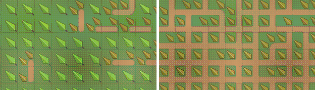
Hình 11: Bên trái hiển thị "đường dẫn" với xác suất 0,1, bên phải hiển thị "đường dẫn" với xác suất 10.

## 10.4.1 Xác suất cho các biến thể

Một cách sử dụng phổ biến cho xác suất, đặc biệt là ở cấp độ ô riêng lẻ, là làm cho một số biến thể nhất định của ô ít phổ biến hơn những biến thể khác. Bộ gạch ví dụ của chúng tôi chứa một số bụi cây và các đồ trang trí khác mà chúng tôi có thể muốn rải rác ngẫu nhiên trên sa mạc.

Để đạt được điều này, trước hết chúng tôi đánh dấu tất cả chúng là gạch "cát", bởi vì đây là địa hình cơ bản của chúng. Sau đó, để làm cho chúng ít phổ biến hơn gạch cát thông thường, chúng ta có thể đặt xác suất của chúng là 0,01. Giá trị này có nghĩa là mỗi loại có khả năng được chọn thấp hơn 100 lần so với gạch cát thông thường (vẫn có xác suất mặc định là 1). Để chỉnh sửa thuộc tính *Xác suất* của các ô, chúng ta cần thoát khỏi chế độ *Bộ địa hình*.


Hình 12: Đặt xác suất thấp trên gạch trang trí.


# 10.5 Chuyển đổi Tile

Gạch hỗ trợ lật và xoay gạch. Khi sử dụng địa hình, các ô có thể được tự động lật và/hoặc xoay để tạo ra các biến thể mà nếu không sẽ không có sẵn trong bộ ô. Điều này có thể được bật trong Thuộc *tính Tileset*.

Các tùy chọn liên quan đến chuyển đổi sau đây có sẵn:

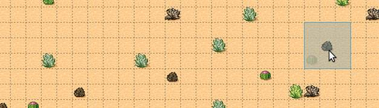
Hình 13: Các ô trang trí ngẫu nhiên xuất hiện với xác suất thấp.

**Lật ngang**
Cho phép lật gạch theo chiều ngang.

**Lật theo chiều dọc**
Cho phép lật gạch theo chiều dọc. Ví dụ: điều này sẽ bị tắt khi đồ họa chứa bóng theo hướng dọc.

**Xoay**
Cho phép các ô được xoay (90, 180 hoặc 270 độ).

**Ưu tiên gạch chưa biến đổi**
Khi bật tính năng chuyển đổi, có thể xảy ra trường hợp một mẫu nhất định có thể được điền bằng một ô thông thường hoặc một ngăn xếp đã chuyển đổi. Khi bật tùy chọn này, các ngăn xếp chưa được chuyển đổi sẽ luôn được ưu tiên. Việc tắt tùy chọn này cho phép sử dụng các phép biến đổi để tạo ra nhiều biến thể hơn.


Hình 14: Khi bật xoay, [bộ gạch Blob thông thường](https://web.archive.org/web/20230101/cr31.co.uk/stagecast/wang/blob.html) 47 ô có thể giảm xuống chỉ còn 15 ô.

# 10.6 Thức Words

Bây giờ bạn sẽ có một ý tưởng khá tốt về cách sử dụng công cụ này trong dự án của riêng bạn. Một số điều cần lưu ý:
- Để một địa hình tương tác với địa hình khác, chúng cần phải là một phần của cùng một *Bộ địa hình*. Điều này cũng có nghĩa là tất cả các ô cần phải là một phần của cùng một bộ ô. Nếu bạn có các ô trong các bộ ô khác nhau mà bạn muốn chuyển đổi sang nhau, bạn sẽ cần hợp nhất các bộ ô thành một.
- Vì việc xác định thông tin địa hình có thể hơi tốn nhiều công sức, bạn sẽ muốn tránh sử dụng các bộ gạch nhúng để thông tin địa hình có thể được chia sẻ giữa một số bản đồ.
- Công cụ Terrain cũng hoạt động tốt với các bản đồ isometric. Để đảm bảo lớp phủ địa hình được hiển thị chính xác, hãy thiết lập *Hướng*, *Chiều rộng lưới* và *Chiều cao lưới* trong thuộc tính bộ lát.
- Công cụ này sẽ xử lý bất kỳ số lượng địa hình nào (tối đa 254) và mỗi góc của ô có thể có một loại địa hình khác nhau. Tuy nhiên, có những cách khác để xử lý quá trình chuyển đổi mà công cụ này không thể xử lý. Ngoài ra, nó không thể chỉnh sửa nhiều lớp cùng một lúc. Để có cách đặt ô tự động linh hoạt hơn nhưng cũng phức tạp hơn, hãy xem *Tự động lập bản đồ*.
- Có một [bộ sưu tập các bộ ô chứa](http://opengameart.org/content/terrain-transitions) các hiệu ứng chuyển tiếp tương thích với công cụ này trên [OpenGameArt.org](http://opengameart.org/).

---

### CHƯƠNG MƯỜI MỘT

**SỬ DỤNG BẢN ĐỒ VÔ HẠN**

Bản đồ vô hạn trong Tiled giải phóng bạn khỏi những ràng buộc của bản đồ có kích thước cố định. Với canvas "tự động phát triển", bạn có thể vẽ trên lưới vô hạn mà không bị giới hạn bởi chiều rộng và chiều cao. Tài liệu này hướng dẫn bạn tạo, chỉnh sửa và chuyển đổi bản đồ vô hạn trong Tiled.


# 11.1 Tạo bản đồ vô hạn
1. Mở hộp thoại Bản đồ mới (*Tệp -> Mới -> Bản đồ mới*).
2. Đảm bảo tùy chọn 'Vô hạn' được chọn. Bản đồ bạn tạo ra sẽ có một canvas vô hạn.

# 11.2 Chỉnh sửa bản đồ vô hạn
Hầu hết các công cụ trong Tiled hoạt động theo cách tương tự đối với bản đồ vô hạn cũng như đối với bản đồ có kích thước cố định. Tuy nhiên, *công cụ Bucket Fill* chỉ lấp đầy các ranh giới hiện tại của một lớp ô. Khi bạn vẽ, những giới hạn này mở rộng.

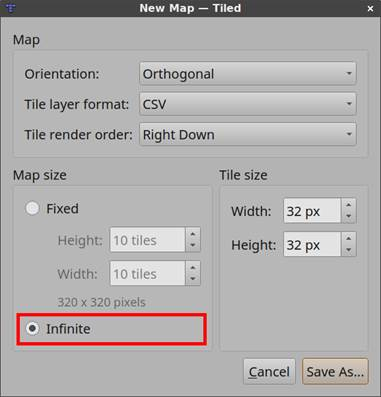

# 11.3 Chuyển đổi giữa bản đồ vô hạn và bản đồ kích thước cố định
Bạn có thể chuyển đổi giữa bản đồ vô hạn và bản đồ có kích thước cố định trong cửa sổ Thuộc tính bản đồ. Khi chuyển đổi bản đồ vô hạn thành bản đồ có kích thước cố định, Tiled xác định chiều rộng và chiều cao của bản đồ cuối cùng dựa trên ranh giới của tất cả các lớp ô.

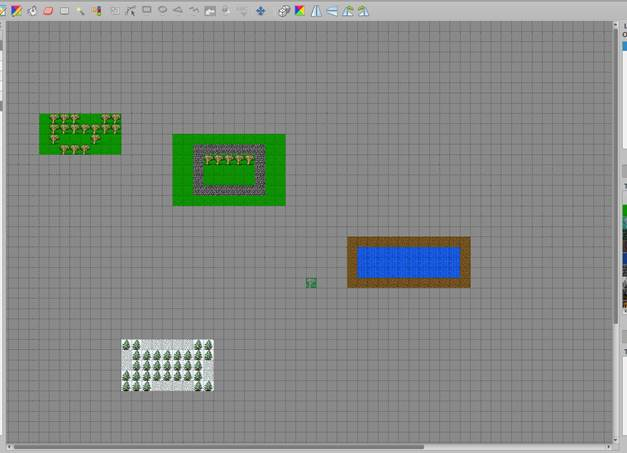
Hình 1: Bản đồ vô hạn ban đầu

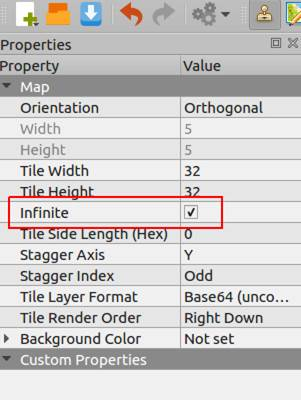
Hình 2: Bỏ chọn thuộc tính Infinite trong Map Properties

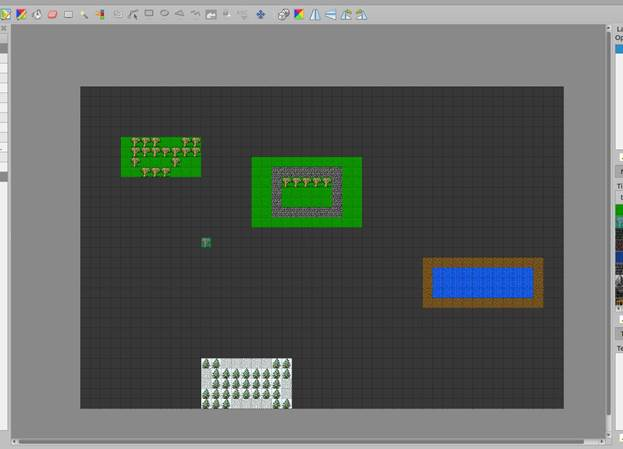
Hình 3: Bản đồ được chuyển đổi

---

### CHƯƠNG MƯỜI HAI

**LÀM VIỆC VỚI THẾ GIỚI**

Đôi khi một trò chơi có một thế giới rộng lớn được chia thành nhiều bản đồ để làm cho thế giới dễ tiêu hóa hơn bởi trò chơi (sử dụng ít bộ nhớ hơn) hoặc dễ dàng chỉnh sửa hơn bởi nhiều người (tránh xung đột hợp nhất). Sẽ rất hữu ích nếu các bản đồ từ một thế giới như vậy có thể được nhìn thấy trong cùng một chế độ xem và có thể nhanh chóng chuyển đổi giữa các chỉnh sửa các bản đồ khác nhau. Xác định một thế giới cho phép bạn làm chính xác điều đó.


Hình 1: Nhiều bản đồ từ [Thế giới Mana](https://www.themanaworld.org/) được hiển thị cùng một lúc.

# 12.1 Định nghĩa một thế giới

Một thế giới được xác định trong tệp .world, là một tệp JSON cho Tiled biết bản đồ nào là một phần của thế giới và ở vị trí nào. Thế giới có thể được tạo ra bằng cách sử dụng *Thế giới > Thế giới mới...* hành động.

Bạn cũng có thể tạo tệp .world bằng tay. Dưới đây là một ví dụ đơn giản về định nghĩa thế giới, xác định vị trí toàn cầu (tính bằng pixel) của ba bản đồ:


Sau khi xác định, một thế giới cần được tải bằng cách chọn *Thế giới > Tải Thế giới...* từ menu. Nhiều thế giới có thể được tải cùng một lúc và các thế giới sẽ tự động được tải lại khi Tiled được khởi động lại.

Khi bản đồ được mở, Tiled sẽ kiểm tra xem nó có phải là một phần của bất kỳ thế giới nào được tải hay không. Nếu vậy, bất kỳ bản đồ nào khác trong cùng một thế giới cũng được tải và hiển thị cùng với bản đồ đã mở. Bạn có thể nhấp vào bất kỳ bản đồ nào khác để mở chúng để chỉnh sửa, thao tác này sẽ chuyển đổi tệp trong khi vẫn giữ chế độ xem ở cùng một vị trí.

Các thế giới được tải lại tự động khi tệp của chúng được thay đổi trên đĩa.

# 12.2 Chỉnh sửa thế giới
Khi bạn đã tải một thế giới, bạn có thể chọn 'Công cụ thế giới' từ thanh công cụ để thêm, xóa và di chuyển bản đồ trong thế giới.

**Thêm bản đồ**
Nhấp vào nút 'Thêm bản đồ hiện tại vào thế giới đã tải' trên thanh công cụ, từ menu thả xuống, chọn thế giới bạn muốn thêm nó vào. Để thêm một bản đồ khác vào thế giới hiện tại, bạn có thể sử dụng nút 'Thêm bản đồ khác vào thế giới hiện tại' từ thanh công cụ. Ngoài ra, bạn có thể truy cập cả hai hành động bằng cách nhấp chuột phải vào trình chỉnh sửa bản đồ.

**Xóa bản đồ**
Nhấn nút 'Xóa bản đồ hiện tại khỏi thế giới hiện tại' trên thanh công cụ. Ngoài ra, nhấp chuột phải vào bản đồ trong trình chỉnh sửa bản đồ và chọn 'Xóa. . . từ Thế giới. . .' từ menu ngữ cảnh.

**Bản đồ di chuyển**
Chỉ cần kéo xung quanh bản đồ trong trình chỉnh sửa bản đồ. Bạn có thể hủy bỏ việc di chuyển bản đồ bằng cách nhấn 'Escape' hoặc bằng cách nhấp chuột phải.

Ngoài ra, bạn có thể sử dụng các phím mũi tên để di chuyển bản đồ được chọn hiện tại - giữ Shift sẽ thực hiện các bước lớn hơn.

**Lưu tệp Thế giới**
Bạn có thể lưu các tệp thế giới đã thao túng bằng cách sử dụng *menu Thế giới > Lưu Thế giới*. Thế giới cũng sẽ tự động được lưu nếu bạn khởi chạy bất kỳ công cụ bên ngoài nào đã bật tùy chọn 'Lưu bản đồ trước khi thực thi'.

# 12.3 Sử dụng Pattern Matching

Đối với các dự án mà bản đồ tuân theo một kiểu đặt tên nhất định cho phép vị trí của mỗi bản đồ trên thế giới được lấy từ tên tệp, biểu thức chính quy có thể được sử dụng kết hợp với hệ số nhân và độ lệch.

Đây là một ví dụ:


Biểu thức chính quy được khớp trên tất cả các tệp nằm trong cùng một thư mục với tệp thế giới. Nó bắt hai số, số đầu tiên được lấy là x và số thứ hai là y. Sau đó, chúng sẽ được nhân với multiplierX và multiplierY một cách đặc biệt, và cuối cùng offsetX và offsetY được thêm vào. Độ lệch tồn tại chủ yếu để cho phép nhiều bộ bản đồ trong cùng một thế giới được định vị tương đối với nhau. Giá trị cuối cùng trở thành vị trí (tính bằng pixel) của mỗi bản đồ.


Hình 2: Hòn đảo từ [Alchemic Cutie](https://alchemiccutie.com/), sử dụng các mẫu để tự động hiển thị từng bản đồ ở đúng vị trí.

Định nghĩa thế giới có thể sử dụng kết hợp các bản đồ và mẫu được xác định thủ công.

# 12.4 Chỉ hiển thị hàng xóm trực tiếp
Tiled rất cẩn thận khi chỉ tải mỗi bản đồ, bộ gạch và hình ảnh một lần, nhưng đôi khi thế giới quá lớn để có thể tải hoàn toàn. Có thể không đủ bộ nhớ hoặc hiển thị toàn bộ bản đồ quá chậm.

Trong trường hợp này, có một tùy chọn chỉ tải các hàng xóm trực tiếp của bản đồ hiện tại. Thêm "onlyShowAdjacentMaps": true vào đối tượng JSON cấp cao nhất.

Để làm được điều này, không chỉ vị trí mà còn cả kích thước của mỗi bản đồ cần được xác định. Đối với các bản đồ riêng lẻ, điều này được thực hiện bằng cách sử dụng các thuộc tính chiều rộng và chiều cao. Đối với các mẫu, các thuộc tính là mapWidth và mapHeight, mặc định là hệ số nhân đã xác định để thuận tiện. Tất cả các giá trị đều tính bằng pixel.


---

### CHƯƠNG MƯỜI BA

**SỬ DỤNG LỆNH**

Nút Command cho phép bạn tạo và chạy các lệnh shell (các chương trình khác) từ Tiled.

Bạn có thể thiết lập bao nhiêu lệnh tùy thích. Điều này hữu ích nếu bạn chỉnh sửa bản đồ cho nhiều trò chơi và bạn muốn thiết lập lệnh cho mỗi trò chơi. Hoặc bạn có thể thiết lập nhiều lệnh cho cùng một trò chơi để tải các điểm kiểm tra hoặc cấu hình khác nhau.

# 13.1 Nút lệnh
Nó nằm trên thanh công cụ chính ở bên phải của nút làm lại. Nhấp vào nó sẽ chạy lệnh mặc định (lệnh đầu tiên trong danh sách lệnh). Nhấp vào mũi tên bên cạnh nó sẽ hiển thị một menu cho phép bạn chạy bất kỳ lệnh nào bạn đã thiết lập, cũng như một tùy chọn để mở hộp thoại Edit Commands. Bạn cũng có thể tìm thấy tất cả các lệnh trong menu Tệp.

Ngoài ra, bạn có thể thiết lập các phím tắt tùy chỉnh cho từng lệnh.

# 13.2 Chỉnh sửa lệnh
Hộp thoại 'Chỉnh sửa lệnh' chứa danh sách các lệnh. Mỗi lệnh có một số thuộc tính:

**Tên**
Tên của lệnh như nó sẽ được hiển thị trong danh sách thả xuống, vì vậy bạn có thể dễ dàng xác định nó.

**Có thể thực thi**
Tập tin thực thi để chạy. Nó phải là một đường dẫn đầy đủ hoặc tên của một tệp thực thi trong PATH hệ thống.

**Lập luận**
Các đối số để chạy tệp thực thi.

**Thư mục làm việc**
Đường dẫn đến thư mục làm việc.

**Phím tắt**
Một chuỗi phím tùy chỉnh để kích hoạt lệnh. Bạn có thể sử dụng 'Xóa' để đặt lại phím tắt.

**Hiển thị đầu ra trong chế độ xem Bảng điều khiển**
Nếu tính năng này được bật, thì đầu ra (stdout và stderr) của lệnh này sẽ được hiển thị trong Bảng điều khiển. Bạn có thể tìm thấy Bảng điều khiển trong *Chế độ xem > Chế độ xem và Thanh công cụ > Bảng điều khiển*.

**Lưu bản đồ trước khi thực hiện**
Nếu tính năng này được bật, thì bản đồ hiện tại sẽ được lưu trước khi thực hiện lệnh.

**Đã bật**
Một cách nhanh chóng để tắt các lệnh và xóa chúng khỏi danh sách thả xuống. Lệnh mặc định là lệnh được bật đầu tiên.

Lưu ý rằng nếu tệp thực thi hoặc bất kỳ đối số nào của nó chứa dấu cách, các phần này cần được trích dẫn.

## 13.2.1 Biến thay thế
Trong các trường tệp thực thi, đối số và thư mục làm việc, bạn có thể sử dụng các biến sau:

`%mapfile`
đường dẫn đầy đủ của tệp hiện tại (bản đồ hoặc bộ lát).

`%đường dẫn bản đồ`
đường dẫn trong đó tệp hiện tại được đặt.

`%đường dẫn dự án`
đường dẫn mà dự án hiện tại tọa lạc.

`%Lớp đối tượng`
lớp của đối tượng hiện được chọn, nếu có (cũng có sẵn dưới dạng %objecttype để tương thích với Tiled < 1.9).

`%objectid`
ID của đối tượng hiện được chọn, nếu có.

`%tên lớp`
tên của layer hiện được chọn.

`%tileid`
danh sách được phân tách bằng dấu phẩy với ID của các ngăn xếp đã chọn, nếu có.

`%tệp thế giới`
Con đường đầy đủ của thế giới mà bản đồ hiện tại là một phần, nếu có.

Đối với trường thư mục làm việc, bạn có thể sử dụng thêm biến sau:

`%đường dẫn thực thi`
đường dẫn đến tệp thực thi.

# 13.3 Lệnh ví dụ
Khởi chạy một trò chơi tùy chỉnh có tên là "mygame" với tham số -loadmap và mapfile:


Trên Mac, hãy nhớ rằng Ứng dụng là các thư mục, vì vậy bạn cần chạy tệp thực thi thực tế từ bên trong Nội dung / MacOS thư mục:


Hoặc sử dụng open (và lưu ý dấu ngoặc kép vì một trong các đối số chứa dấu cách):


Một số hệ thống cũng có lệnh mở tệp trong chương trình thích hợp:
- OSX: mở %mapfile
- Các hệ thống GNOME như Ubuntu: gnome-open %mapfile
- Tiêu chuẩn FreeDesktop.org: xdg-open %mapfile

---

### CHƯƠNG MƯỜI BỐN

**TỰ ĐỘNG LẬP BẢN ĐỒ**

# 14.1 Tự động lập bản đồ là gì?
Tự động ánh xạ có thể tự động đặt hoặc thay thế các ngăn xếp dựa trên các quy tắc bạn xác định. Nó tìm kiếm các ô trong bản đồ làm việc của bạn khớp với đầu vào của từng quy tắc và nếu tìm thấy bất kỳ ô nào, nó sẽ đặt đầu ra tương ứng. Điều này cho phép việc sắp xếp các ô phức tạp hoặc lặp đi lặp lại hoàn toàn tự động, điều này có thể giúp trang trí các cấp độ của bạn nhanh hơn nhiều và có thể giúp bạn tự động sửa lỗi.

Nếu các ô của bạn được thiết lập để hoạt động như các góc và cạnh của hình dạng, bạn có thể muốn xem xét việc sử dụng *Địa hình* để thay thế. Địa hình cung cấp một cách thuận tiện hơn để tự động hóa việc đặt các viên gạch như vậy.

Tự động lập bản đồ có thể được áp dụng theo cách thủ công thông qua *Bản đồ > Bản đồ tự động* hoặc động khi bạn vẽ trên bản đồ nếu bạn bật *Bản đồ > AutoMap trong khi vẽ*.


# 14.2 Thiết lập tệp quy tắc
Các quy tắc tự động ánh xạ được xác định trong các tệp bản đồ thông thường, mà chúng ta sẽ gọi là **bản đồ quy tắc**. Các tệp này sau đó được tham chiếu bởi một tệp văn bản, thường được gọi là `rules.txt`. Các `rules.txt` có thể liệt kê bất kỳ số lượng bản đồ quy tắc nào, theo thứ tự áp dụng các quy tắc của chúng.

Có hai cách để làm cho bản đồ quy tắc được xác định trong `rules.txt` áp dụng cho bản đồ:
- Kể từ Tiled 1.4, hãy mở *Project > Project Properties* và đặt thuộc tính "Automapping rules" thành tệp `rules.txt` mà bạn đã tạo trong dự án của mình. Nếu bạn chỉ có một bản đồ quy tắc duy nhất, bạn cũng có thể tham khảo trực tiếp tệp bản đồ đó.
- Ngoài ra, bạn có thể lưu `rules.txt` của mình trong cùng một thư mục với các tệp bản đồ mà bạn muốn áp dụng các quy tắc. Điều này cũng có thể được sử dụng để ghi đè các quy tắc toàn dự án cho một bộ bản đồ nhất định.

Mỗi dòng trong tệp `rules.txt` là:
- Đường dẫn đến bản đồ **quy tắc**.
- Đường dẫn đến một tệp .txt khác có cùng cú pháp (ví dụ: trong một thư mục khác).
- Kể từ Tiled 1.9 Một bộ lọc tên tệp bản đồ, được bao bọc trong `[]` và sử dụng `*` làm ký tự đại diện.
- Một nhận xét, khi dòng bắt đầu bằng `#` hoặc `//`.

Theo mặc định, tất cả các quy tắc Tự động lập bản đồ sẽ chạy trên bất kỳ bản đồ nào mà bạn Tự động lập bản đồ. Bộ lọc tên tệp bản đồ cho phép bạn hạn chế quy tắc bản đồ áp dụng. Ví dụ: bất kỳ bản đồ quy tắc nào được liệt kê sau `[thị trấn*]` sẽ chỉ áp dụng cho các bản đồ có tên tệp bắt đầu bằng "thị trấn". Để bắt đầu áp dụng lại quy tắc cho tất cả các bản đồ, bạn có thể sử dụng `[*]`, sẽ khớp với bất kỳ tên bản đồ nào.

# 14.3 Thiết lập bản đồ quy tắc
Bản đồ **quy tắc** là một tệp bản đồ tiêu chuẩn, có thể được đọc và viết bằng Tiled (thường ở định dạng TMX hoặc TMJ). Bản đồ quy tắc có thể xác định bất kỳ số lượng quy tắc nào. Tối thiểu, bản đồ quy tắc chứa:
- Một hoặc nhiều lớp đầu vào, mô tả (các) mẫu mà bản đồ làm việc sẽ được tìm kiếm.
- Một hoặc nhiều lớp đầu ra, mô tả cách bản đồ làm việc được thay đổi khi tìm thấy mẫu đầu vào.

Ngoài ra, các thuộc tính tùy chỉnh trên bản đồ quy tắc, các lớp của nó và trên các đối tượng có thể được sử dụng để tinh chỉnh hành vi tổng thể hoặc hành vi của các quy tắc cụ thể.

Mỗi vùng ô liền kề trên lớp đầu vào và đầu ra là một quy tắc. Các ô được coi là liền kề nếu chúng nằm cạnh nhau theo chiều dọc, chiều ngang hoặc đường chéo (kết nối 8 chiều). Bạn có thể bao gồm nhiều quy tắc trong một bản đồ, miễn là bạn để lại khoảng trống giữa chúng. Theo mặc định, tất cả các quy tắc sẽ khớp đồng thời và áp dụng đầu ra của chúng theo thứ tự từ trên xuống dưới, từ trái sang phải - các quy tắc có giá trị Y nhỏ hơn đến trước và nếu có các quy tắc ở cùng giá trị Y, thì các quy tắc có X nhỏ hơn sẽ đến trước. Nếu bạn muốn các quy tắc khớp theo thứ tự và tính đến đầu ra của các quy tắc trước đó, bạn có thể sử dụng **thuộc tính bản đồ** `MatchInOrder`.

## 14.3.1 Xác định đầu vào
Các lớp đầu vào xác định (các) mẫu ô mà quy tắc sẽ tìm kiếm. Đây là Tile Layers và tên của chúng phải tuân theo sơ đồ sau:


Sau dấu gạch dưới đầu tiên sẽ có **tên** của lớp đầu vào mục tiêu. Ví dụ: `input_Ground` sẽ tìm kiếm các ô trên một layer có tên là *Ground*. Tên lớp đầu vào có thể bao gồm nhiều dấu gạch dưới hơn, vì vậy `input_test_case` sẽ tìm các ô trên một lớp có tên *là test_case*. Nếu bản đồ làm việc bao gồm nhiều lớp theo tên này, lớp dưới cùng sẽ được sử dụng. Nếu bản đồ làm việc không chứa lớp mục tiêu được đặt tên, quy tắc sẽ kiểm tra một lớp trống giả.

`not` là tùy chọn. Nếu có, nó sẽ đảo ngược ý nghĩa của lớp, vì vậy thay vì khớp với các ô trên lớp, Tiled sẽ khớp với bất kỳ thứ gì ngoại trừ các ô đó.

**Chỉ mục** là tùy chọn. Các chỉ mục trên các lớp đầu vào cho phép bạn tạo các quy tắc khớp với bất kỳ đầu vào nào trong số một số đầu vào hoàn toàn riêng biệt. Bất kỳ đầu vào nào có cùng chỉ mục đều được coi là một phần của cùng một điều kiện và mỗi chỉ mục khác nhau là tập hợp các điều kiện độc lập của riêng nó. Bất kỳ điều kiện nào trong số này được khớp sẽ được tính là khớp với quy tắc. Một chỉ mục có thể trống hoặc có thể là bất kỳ chuỗi nào không bắt đầu bằng `not` và không chứa bất kỳ dấu gạch dưới nào.

Nhiều lớp đầu vào có cùng tên và chỉ mục được cho phép rõ ràng và có mục đích. Việc có nhiều lớp đầu vào có cùng tên và chỉ mục cho phép bạn xác định các ô có thể khác nhau trên mỗi tọa độ làm đầu vào và bất kỳ sự kết hợp nào của các ô đó sẽ được tính là một kết hợp phù hợp.

### Ví dụ đầu vào
Giả sử bạn muốn ghép các khu vực hai ô trên mặt đất, có lẽ để ngẫu nhiên hóa chúng. Bạn có thể muốn kết hợp bất kỳ sự kết hợp nào giữa cỏ và gạch hoa, nhưng chỉ toàn bộ đá hai ô. Bạn có thể đạt được điều này như sau:

| Lớp gạch | Tên |
|---|---|
| 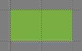 | input1_Ground |
|  | input1_Ground |
|  | input2_Ground |

Hai layer đầu tiên đều có chỉ số 1, vì vậy Automapping sẽ khớp với bất kỳ sự kết hợp nào của các ô cỏ và hoa đó. Lớp cuối cùng có chỉ mục 2, vì vậy các ô của nó được kiểm tra riêng biệt. Điều này có nghĩa là các đầu vào này sẽ khớp với bất kỳ phần nào của lớp Ground trông giống như bất kỳ phần nào trong số này:

   

### Phù hợp với các trường hợp đặc biệt
Trong một số trường hợp, chỉ riêng ô của bạn là không đủ để xác định kịch bản bạn muốn khớp. Tiled cung cấp "Bộ ô quy tắc tự động ánh xạ" tích hợp để xử lý một số trường hợp đặc biệt nhất định, có thể được thêm vào bản đồ quy tắc của bạn thông qua *Bản đồ > Thêm bộ ô quy tắc tự động ánh xạ*.

**Trống**
Ô này khớp với bất kỳ ô trống nào. Nếu được sử dụng trên lớp đầu ra, ô này sẽ xuất ra một ô trống, cho phép bạn xóa ô bằng Tự động ánh xạ.

**Bỏ qua**
Ô này không ảnh hưởng đến quy tắc theo bất kỳ cách nào. Chức năng duy nhất của nó là cho phép kết nối các bộ phận bị ngắt kết nối thành một quy tắc duy nhất, nhưng nó cũng có thể được sử dụng để rõ ràng.

**Không trống**
Ô này khớp với mọi ô không trống.

**Khác**
Ngăn xếp này khớp với bất kỳ ô nào chứa một ngăn xếp *khác* với tất cả các ô được sử dụng bởi quy tắc hiện tại nhắm mục tiêu cùng một lớp đầu vào. Điều này bao gồm các ô trống, trừ khi ngăn xếp Trống được quy tắc sử dụng rõ ràng ở nơi khác (kể từ Tiled 1.10).

**Phủ nhận**
Ngăn xếp này phủ nhận điều kiện tại một vị trí cụ thể, làm cho các lớp đầu vào khác có cùng tên lớp mục tiêu hoạt động giống như đầu vào và ngược lại, nhưng chỉ ở vị trí đó, điều này có thể đơn giản hóa quy tắc của bạn trong một số trường hợp.

Ý nghĩa của các ô này bắt nguồn từ thuộc tính **MatchType** tùy chỉnh của chúng. Điều này có nghĩa là bạn cũng có thể thiết lập các ô của riêng mình để phù hợp với những trường hợp đặc biệt này!

## 14.3.2 Xác định đầu ra
Các lớp đầu ra xác định những gì sẽ được xuất ra khi đầu vào của quy tắc khớp với một cái gì đó trong bản đồ làm việc. Đây có thể là Tile hoặc Object Layers và tên của chúng phải tuân theo lược đồ này, tương tự như tên lớp đầu vào:


Mọi thứ sau dấu gạch dưới đầu tiên là **tên**, xác định lớp nào trong bản đồ làm việc mà các ô hoặc đối tượng sẽ được đặt trên đó. Nếu bản đồ làm việc bao gồm nhiều lớp theo tên này, lớp dưới cùng sẽ được sử dụng. Nếu quy tắc khớp và bản đồ làm việc chưa chứa lớp đầu ra được đặt tên, Automapping sẽ tạo lớp.

**Chỉ mục** là tùy chọn và không liên quan đến các chỉ mục đầu vào. Thay vào đó, các chỉ số đầu ra được sử dụng để ngẫu nhiên hóa đầu ra: mỗi khi quy tắc tìm thấy kết quả phù hợp, một chỉ mục đầu ra ngẫu nhiên được chọn và chỉ các lớp đầu ra có chỉ mục đó mới có nội dung của chúng được đặt vào bản đồ làm việc.

Tính năng mới trong Tiled 1.11 Để thuận tiện, Tiled 1.11 đã giới thiệu hai thay đổi đối với hành vi liên quan đến chỉ mục. Nếu một chỉ mục đầu ra hoàn toàn trống cho một quy tắc nhất định, nó sẽ không bao giờ được chọn cho quy tắc đó. Điều này hữu ích khi một số quy tắc có nhiều tùy chọn ngẫu nhiên hơn những quy tắc khác. Ngoài ra, khi không có chỉ mục nào được chỉ định, phần đầu ra của quy tắc đó sẽ luôn áp dụng khi quy tắc khớp. Điều này có thể được sử dụng để kết hợp một phần vô điều kiện của đầu ra của quy tắc với một phần ngẫu nhiên.

### Ví dụ đầu ra ngẫu nhiên
Tiếp tục với ví dụ trước đây, bạn có thể sử dụng các layer đầu ra như thế này để ngẫu nhiên hóa layer Ground:

| Lớp gạch | Tên |
|---|---|
| 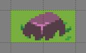 | output1_Ground |
|  | output2_Ground |
|  | output3_Ground |
| 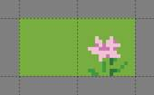 | output4_Ground |

Theo mặc định, đầu ra của quy tắc được phép chồng chéo đầu ra trước đó từ cùng một quy tắc, điều này không phải lúc nào cũng là những gì bạn muốn. Trong ví dụ trên, các đá đầu ra có thể bị ghi đè một phần bởi các đầu ra tiếp theo từ quy tắc đó. Bạn có thể đặt **thuộc tính bản đồ NoOverlappingOutput** thành true để tránh điều này. Tuy nhiên, điều này sẽ chỉ áp dụng cho các quy tắc chồng chéo đầu ra của chính chúng, - đầu ra từ các quy tắc khác nhau sẽ vẫn được phép trùng lặp. Nếu bạn muốn tránh bất kỳ loại chồng chéo nào, bạn sẽ cần thiết kế đầu vào của mình sao cho đầu vào của bạn đủ cụ thể để các quy tắc khác nhau không trùng lặp.

Đôi khi, bạn có thể muốn một số kết quả nhất định xuất hiện thường xuyên hơn hoặc ít hơn những đầu ra khác. Ví dụ trên sẽ trông đẹp hơn nhiều nếu hoa và đá không xuất hiện thường xuyên. Bạn có thể kiểm soát xác suất của chỉ mục đầu ra bằng cách đặt **thuộc tính lớp Xác suất** trên một trong các lớp cho chỉ mục đó.

**Cảnh báo**
Mặc dù Automapping có thể xuất ra Objects, nhưng có một số lưu ý khi phát hiện xem chúng có phải là một phần của đầu ra của quy tắc nhất định hay không:
- Xoay đối tượng không được tính đến.
- Căn chỉnh đối tượng của Tile Objects không được tính đến.
- Ellipse và Text Objects sử dụng hình chữ nhật giới hạn của chúng.
- Các vị trí điểm được kiểm tra *độc quyền*, một Điểm phải nằm trong một ô nhất định để được tính là một phần của nó, chỉ chạm vào ô là không đủ.
- Đa giác và Đa giác được kiểm tra như thể chúng là Điểm tại vị trí của chúng, phần còn lại của hình dạng không được tính đến.
Bạn có thể đảm bảo các Đối tượng này được xuất ra bằng cách đặt **các ô Bỏ qua đặc biệt** vào lớp đầu ra ô ở vị trí của chúng. Bạn cũng có thể cần kết nối ô này với phần còn lại của quy tắc bằng nhiều ô Bỏ qua hơn để đảm bảo nó không được coi là một quy tắc riêng biệt.

Mọi thuộc tính tùy chỉnh được đặt trên lớp đầu ra (không phải **Xác suất**) sẽ được sao chép vào lớp đích khi đầu ra được áp dụng. Thông thường, bạn không cần thêm bất kỳ thuộc tính nào như vậy vào các lớp đầu ra, nhưng đây có thể là một cách để tự động hóa các thuộc tính cài đặt trên các lớp của bạn dựa trên nội dung của chúng.

# 14.4 Thuộc tính tự động ánh xạ
Hành vi của các quy tắc của bạn có thể được sửa đổi bằng các thuộc tính trên bản đồ quy tắc, các lớp đầu vào và đầu ra và trên cơ sở mỗi quy tắc bằng cách sử dụng các đối tượng.

## 14.4.1 Thuộc tính bản đồ

**Xóa gạch**
Đây là một thuộc tính bản đồ boolean. Khi thuộc tính này là true, khu vực được bao phủ bởi các ô trong các lớp đầu vào sẽ bị xóa khỏi các lớp đầu ra trước khi áp dụng các quy tắc. Thuộc tính này chủ yếu được cung cấp để tương thích ngược, bởi vì vì Tiled 1.9 ô có thể bị xóa bằng cách xuất **ô đặc biệt** Empty, rõ ràng hơn và linh hoạt hơn.
Mặc dù có tên, thuộc tính này cũng ảnh hưởng đến các Lớp đối tượng đầu ra, xóa bất kỳ Đối tượng nào chồng chéo hoàn toàn hoặc một phần vùng đã xóa. Đây hiện là cách duy nhất để xóa Đối tượng thông qua Tự động ánh xạ.


**Tự động lập bản đồBán kính**
Thuộc tính bản đồ này là một số: 1, 2, 3. . . Khi sử dụng Tự động ánh xạ trong khi vẽ, thuộc tính này xác định mức độ vượt quá các ô bị ảnh hưởng bởi các thay đổi của Ánh xạ tự động sẽ tìm kiếm kết quả trùng khớp.

**MatchOutsideMap kể từ khi xếp 1.2**
Thuộc tính bản đồ boolean này xác định xem các quy tắc có thể khớp ngay cả khi vùng đầu vào của chúng nằm một phần bên ngoài bản đồ hay không. Theo mặc định, nó là false đối với bản đồ có giới hạn và true đối với bản đồ vô hạn. Trong một số trường hợp, có thể hữu ích khi bật tính năng này cho các bản đồ có giới hạn. Các ô bên ngoài ranh giới bản đồ chỉ đơn giản được coi là trống, trừ khi một trong hai **OverflowBorder** hoặc **WrapBorder** cũng đúng.
Tiled 1.0 và 1.1 hoạt động như thể thuộc tính này là đúng, trong khi các phiên bản cũ hơn của Tiled hoạt động như thể thuộc tính này là sai.

**OverflowBorder kể từ khi lát gạch 1.3**
Thuộc tính bản đồ boolean này tùy chỉnh hành vi của thuộc tính **MatchOutsideMap**. Khi thuộc tính này đúng, các ô bên ngoài ranh giới bản đồ được coi như thể chúng là bản sao của các ô đến gần nhất, "tràn" đường viền của bản đồ với khu vực bên ngoài một cách hiệu quả.
Khi thuộc tính này đúng, nó ngụ ý **MatchOutsideMap**. Lưu ý rằng thuộc tính này không ảnh hưởng đến các bản đồ vô hạn (vì không có khái niệm về đường biên).

**WrapBorder kể từ khi lát gạch 1.3**
Thuộc tính bản đồ boolean này tùy chỉnh hành vi của thuộc tính **MatchOutsideMap**. Khi thuộc tính này là Đúng, bản đồ "quấn" xung quanh chính nó một cách hiệu quả, làm cho các ô trên một đường viền của bản đồ ảnh hưởng đến các khu vực ở biên giới kia và ngược lại.
Khi thuộc tính này đúng, nó ngụ ý **MatchOutsideMap**. Lưu ý rằng thuộc tính này không ảnh hưởng đến các bản đồ vô hạn (vì không có khái niệm về đường biên).
Nếu cả **WrapBorder** và **OverflowBorder** đều đúng, **WrapBorder** sẽ được ưu tiên hơn **OverflowBorder**.

**MatchInOrder kể từ khi xếp 1.9**
Khi thuộc tính bản đồ boolean này được đặt thành true, mỗi quy tắc sẽ được áp dụng ngay sau khi tìm thấy kết quả trùng khớp. Điều này vô hiệu hóa việc khớp đồng thời các quy tắc, nhưng cho phép mỗi quy tắc tính đến đầu ra của các quy tắc đã áp dụng trước đó (như đã từng xảy ra trước Tiled 1.9).
Ngoài ra, bạn có thể chia nhỏ các quy tắc của mình trên nhiều bản đồ quy tắc. Bản đồ quy tắc luôn được áp dụng theo thứ tự, vì vậy mỗi bản đồ quy tắc có thể dựa vào bất kỳ sửa đổi nào được áp dụng bởi bản đồ quy tắc trước đó.

## 14.4.2 Thuộc tính lớp
Các thuộc tính sau được hỗ trợ trên cơ sở mỗi lớp:

**AutoEmpty (bí danh: StrictEmpty)**
Thuộc tính lớp boolean này có thể được thêm vào các lớp input và inputnot để tùy chỉnh hành vi cho các ô trống trong một quy tắc.
Thông thường, các ô trống chỉ đơn giản là bị bỏ qua. Khi **AutoEmpty** là true, các ô trống trong vùng nhập sẽ khớp với các ô trống trong lớp đích. Điều này chỉ có thể xảy ra khi bạn có nhiều lớp input/inputnot và một số ngăn xếp là một phần của cùng một quy tắc trống trong khi những ngăn khác thì không. Thông thường, sử dụng **ô đặc biệt** Empty là cách tốt nhất để chỉ định một ô trống, nhưng thuộc tính này hữu ích khi bạn có nhiều lớp đầu vào, một số trong số đó cần khớp với nhiều ô trống. Lưu ý rằng vùng đầu vào được xác định bởi *tất cả các* lớp đầu vào, bất kể chỉ mục.

**IgnoreHorizontalFlip Mới trong Tiled 1.11**
Thuộc tính lớp boolean này có thể được thêm vào các lớp input và inputnot để khớp với các phiên bản lật ngang của ngăn xếp đầu vào.

**Bỏ qua VerticalFlip**
Thuộc tính lớp boolean này có thể được thêm vào các lớp input và inputnot để khớp với các phiên bản lật dọc của ngăn xếp đầu vào.

**Bỏ qua DiagonalFlip**
Thuộc tính lớp boolean này có thể được thêm vào các lớp input và inputnot để khớp với các phiên bản chống lật chéo của ô đầu vào. Loại lật này được sử dụng để xoay gạch 90 độ.

**Bỏ qua HexRotate120**
Thuộc tính lớp boolean này có thể được thêm vào các lớp đầu vào và đầu vào để khớp với các ô xoay 120 độ trên bản đồ lục giác. Tuy nhiên, lưu ý rằng Tự động lập bản đồ hiện không thực sự hoạt động đối với bản đồ hình lục giác vì nó không tính đến trục so le.

**Xác suất kể từ khi xếp gạch 1.10**
Thuộc tính lớp float này có thể được thêm vào các lớp đầu ra để kiểm soát xác suất mà một chỉ số đầu ra nhất định sẽ được chọn. Xác suất cho mỗi chỉ số đầu ra là tương đối với nhau và mặc định là 1.0. Ví dụ: nếu bạn có đầu ra A với xác suất 2 và đầu ra B với xác suất 0,5, A sẽ được chọn gấp bốn lần B. Nếu nhiều lớp đầu ra có cùng chỉ mục được đặt Xác suất, xác suất của lớp cuối cùng (trên cùng) sẽ được sử dụng.

## 14.4.3 Thuộc tính đối tượng
Một số tùy chọn có thể được đặt trên các quy tắc riêng lẻ, ngay cả trong cùng một bản đồ quy tắc. Để làm điều này, hãy thêm một Object Layer vào bản đồ quy tắc của bạn có tên là `rule_options`. Trên layer này, bạn có thể tạo các đối tượng hình chữ nhật đơn giản và bất kỳ tùy chọn nào bạn đặt trên các đối tượng này sẽ áp dụng cho tất cả các quy tắc mà chúng chứa.

Các tùy chọn sau được hỗ trợ cho mỗi quy tắc:

**Chế độ**
Chỉ áp dụng một quy tắc cho mỗi N ô trên trục X (mặc định là 1).

**ModY**
Chỉ áp dụng một quy tắc cho mỗi N ô trên trục Y (mặc định là 1).

**Bù đắp X**
Độ lệch được áp dụng kết hợp với ModX (mặc định là 0).

**Bù đắp Y**
Độ lệch được áp dụng kết hợp với ModY (mặc định là 0).

**Xác suất**
Khả năng áp dụng một quy tắc, ngay cả khi các lớp đầu vào của nó sẽ khớp, từ 0 đến 1. Giá trị 0 vô hiệu hóa quy tắc một cách hiệu quả, trong khi giá trị 1 (mặc định) có nghĩa là nó không bao giờ bị bỏ qua.

**Vô hiệu hóa**
Một cách thuận tiện để (tạm thời) vô hiệu hóa một số quy tắc (mặc định là sai).

**Không chồng chéoĐầu ra**
Khi được đặt thành true, đầu ra của một quy tắc không được phép chồng chéo các đầu ra khác của cùng một quy tắc (mặc định là false).

**IgnoreLock kể từ khi xếp 1.10**
Kể từ Tiled 1.10, các quy tắc tự động ánh xạ không còn sửa đổi các lớp bị khóa nữa. Đặt thuộc tính này thành true để bỏ qua khóa. Điều này có thể hữu ích khi bạn có các layer chỉ được thay đổi bởi các quy tắc và muốn giữ chúng bị khóa.

Tất cả các tùy chọn này cũng có thể được đặt trên chính bản đồ quy tắc, trong trường hợp đó chúng áp dụng làm mặc định cho tất cả các quy tắc, sau đó có thể được ghi đè cho các quy tắc cụ thể bằng cách đặt các đối tượng hình chữ nhật.

# 14.5 Ví dụ

## 14.5.1 Vách đá RPG
Một kịch bản Tự động lập bản đồ phổ biến là tự động hóa vị trí của các cạnh vách đá. Bộ gạch thường sẽ bao gồm các ô vách đá như sau:


**Địa hình** có thể được sử dụng để đặt đỉnh của vách đá, nhưng chúng không thể tự thêm các vách đá thẳng đứng một cách đáng tin cậy. May mắn thay, chúng không có vấn đề gì đối với Tự động lập bản đồ.

Góc dưới và góc dưới của vách đá là những góc duy nhất cần gạch vách đá trong bộ gạch này, vì vậy chỉ cần ba quy tắc để thêm chúng. Các quy tắc được hiển thị bên dưới, từng lớp.

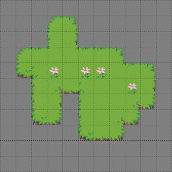
Hình 4: Bản đồ xuất phát: đỉnh bằng phẳng của vách đá được vẽ bằng Địa hình.


Hình 5: Tự động lập bản đồ có thể thêm các ô vách đá thích hợp.

| Lớp gạch | Tên |
|---|---|
| 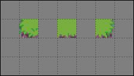 | input_Cliff |
|  | output1_Cliff |
|  | output2_Cliff |

Không cần phải lặp lại các ô bên và góc trên layer "input_Cliff" thứ hai, bạn có thể để trống các ô đó và chỉ bao gồm các ô đầu vào bổ sung mà bạn cần.

Với các quy tắc bổ sung này, bạn sẽ nhận được kết quả được hiển thị ở đầu phần này: tất cả các vách đá tại chỗ, không có lỗ trong suốt nơi các cạnh và góc tiếp xúc với vách đá.

Vì các quy tắc này hoạt động với một lớp có tên là "Vách đá", chúng sẽ không ảnh hưởng đến các vách đá được vẽ trên bất kỳ lớp nào khác. Nếu bạn muốn tự động ánh xạ các vách đá trên một số lớp khác nhau, điều này có thể cần thiết nếu bạn muốn có các ngăn xếp vách đá, bạn sẽ cần sao chép bản đồ quy tắc và điều chỉnh tên lớp đầu vào và đầu ra.

### Tự động lập bản đồ trong khi vẽ
Các quy tắc trên hoạt động tốt nếu bạn vẽ đỉnh vách đá của mình bằng Địa hình và sau đó kích hoạt Tự động lập bản đồ theo cách thủ công, nhưng điều gì sẽ xảy ra nếu bạn muốn thấy các vách đá xuất hiện khi bạn vẽ bằng Địa hình hoặc muốn tiếp tục vẽ bằng Địa hình sau khi tự động lập bản đồ thủ công?

Hình 8: Nếu không có một số quy tắc bổ sung, Automap While Drawing có thể tạo ra kết quả lộn xộn.

Đối với điều này, các quy tắc của bạn sẽ cần tính đến các ô có thể đã được đặt trước đó bởi Tự động lập bản đồ.


Có hai cách tiếp cận bạn có thể thực hiện để làm cho các quy tắc Tự động ánh xạ của bạn tính đến đầu ra của chính nó:
- Bao gồm các ô đó làm đầu vào thay thế trong tất cả các quy tắc hoặc
- Tạo một bộ quy tắc khác để đặt lại tất cả các ô thay thế về một điều kiện thống nhất.

Tùy chọn thích hợp sẽ phụ thuộc vào các quy tắc cụ thể của bạn. Trong trường hợp này, cách thứ hai đơn giản hơn: tất cả những gì bạn phải làm là xóa bất kỳ ô vách đá nào và thay thế các biến thể được đặt bên cạnh vách đá bằng các phiên bản cơ bản của chúng. Vì mục đích này, bạn nên tạo một bản đồ quy tắc khác và đặt nó *trước* các quy tắc khác trong `rules.txt` của bạn, để nó có thể chuẩn bị bản đồ cho các quy tắc khác. Các quy tắc thực tế chỉ là những thay thế đơn giản:

| Lớp gạch | Tên |
|---|---|
|  | input_Cliff |
|  | output_Cliff |

Các ô đầu ra ở hàng trên cùng là **ô đặc biệt** Empty, có nghĩa là đầu ra sẽ xóa các ô đó.

Để Tự động ánh xạ trong khi vẽ hoạt động chính xác, bạn cũng có thể cần tăng thuộc tính **AutomappingRadius** của bản đồ quy tắc của mình. Điều này là do một số quy tắc có thể chỉ xem xét các ô *gần* ô bạn thay đổi bằng cách vẽ, chẳng hạn như các quy tắc xóa ô vách đá. Trong ví dụ này, bạn có thể sẽ cần đặt **AutomappingRadius** thành 1 trên các quy tắc đặt lại và trên các quy tắc thêm vách đá.

Hình 9: Bây giờ, Tự động lập bản đồ trong khi vẽ tạo ra kết quả chính xác.

## 14.5.2 Chi tiết Sidescroller
Bạn có thể sử dụng Tự động lập bản đồ để thêm các chi tiết khác nhau vào bản đồ của mình. Ví dụ nhỏ này cho thấy việc thêm chi tiết nền trước vào nền tảng sidescroller. Bộ gạch này có một số loại gạch bệ, một số có đỉnh đá và một số có ngọn cỏ. Hai quy tắc này sẽ thêm cỏ và hoa trang trí ngẫu nhiên vào một lớp khác tương ứng đến các viên gạch phủ cỏ và xóa mọi đồ trang trí kết thúc trên các viên gạch không có cỏ. Có nhiều lớp đầu vào, vì có nhiều gạch phủ cỏ để kiểm tra.


| Lớp gạch | Tên |
|---|---|
|  | input_Cliff |
|  | output1_Cliff |
|  | output2_Cliff |

Các đầu vào cho các quy tắc này giống hệt nhau ngoại trừ lớp đầu vào cuối cùng, trong đó quy tắc thứ hai, xóa các ô chi tiết nền trước, có **ngăn xếp đặc biệt Phủ nhận**. Điều này làm cho tất cả các lớp đầu vào đó hoạt động giống như các lớp đầu vào, nhưng chỉ ở vị trí cụ thể đó. Điều này có nghĩa là quy tắc đầu tiên khớp bất cứ khi nào nó gặp bất kỳ ô nào trên cỏ, trong khi quy tắc thứ hai khớp bất cứ khi nào nó gặp *bất cứ thứ gì khác* ngoài những ô phủ cỏ đó. Thay vào đó, quy tắc thứ hai cũng có thể được thực hiện với một loạt các lớp inputnot, nhưng việc sử dụng ô Negate sẽ giảm số lớp mà bản đồ quy tắc này cần và dễ dàng hơn để thấy rằng các ô đầu vào bị phủ định khi tất cả các lớp được xem cùng nhau:


Ba đầu ra chọn một chi tiết nền trước ngẫu nhiên cho quy tắc đầu tiên và tất cả đều là Trống cho quy tắc thứ hai. Một trong những kết quả cho quy tắc đầu tiên cũng là Empty, chỉ để tăng thêm sự đa dạng.


Hình 10: Kết quả từ hai quy tắc trên.

# 14.6 Cập nhật quy tắc cũ

Nếu bạn có một số quy tắc Tự động ánh xạ từ trước Tiled 1.9, chúng vẫn sẽ hoạt động như mọi khi trong hầu hết các trường hợp. Khi Tiled thấy rằng một bản đồ quy tắc chứa các lớp vùng, nó sẽ tự động đưa trở lại hành vi cũ - các quy tắc sẽ được khớp theo thứ tự theo mặc định, các ô trong vùng đầu vào trống trong tất cả các lớp đầu vào cho một lớp và chỉ mục nhất định sẽ được coi là "Khác" và các chỉ mục đầu ra trống hoàn toàn sẽ vẫn được chọn làm đầu ra hợp lệ.

**Cảnh báo**
Trong Tiled 1.9.x, sự hiện diện của các lớp vùng không ngụ ý **MatchInOrder**. Nếu bạn đang sử dụng 1.9.x thay vì 1.10+ và muốn sử dụng các quy tắc cũ, bạn sẽ cần đặt **thuộc tính bản đồ MatchInOrder** thành true.

Thay vào đó, nếu bạn muốn cập nhật các quy tắc của mình để không dựa vào bất kỳ hành vi cũ nào, điều đó có thể đơn giản như xóa các layer regions, hoặc có thể mất thêm một số công việc, tùy thuộc vào cách thiết lập chính xác các quy tắc của bạn:

- Nếu quy tắc của bạn cần tính đến đầu ra của các quy tắc khác trong cùng một bản đồ quy tắc, hãy đặt thuộc tính bản đồ **MatchInOrder** thành true.
- Khi xóa các lớp vùng, hãy đảm bảo rằng bạn không dựa vào chúng để kết nối các khu vực bị ngắt kết nối của ô. Nếu có, hãy sử dụng **ô đặc biệt Ignore** để kết nối chúng trên một trong các layer đầu vào, để Tiled biết chúng là một phần của cùng một quy tắc. Để đảm bảo các quy tắc hoạt động giống hệt nhau, hãy điền vào bất kỳ phần nào trước đây là một phần của vùng nhập.
- Nếu đang sử dụng thuộc tính bản đồ **StrictEmpty** để tìm các ô đầu vào trống, bây giờ bạn nên sử dụng ngăn xếp đặc biệt Empty trong các ô mà bạn muốn kiểm tra xem có trống không. Bạn cũng có thể tiếp tục sử dụng thuộc tính **StrictEmpty** (hoặc bí danh mới hơn của nó, **AutoEmpty**), miễn là ít nhất một lớp đầu vào khác không trống tại các vị trí đó.
- Nếu dựa vào hành vi mà bất kỳ ô nào để trống trên tất cả các lớp đầu vào cho một chỉ mục nhất định được coi là "bất kỳ ô nào không có trong quy tắc này", thay vào đó, bạn nên sử dụng **ô đặc biệt** Khác tại các vị trí đó và **cả ô đặc biệt** Empty trên lớp inputnot tại các vị trí tương tự. Cần có ô Empty vì kiểu cũ Other không bao giờ khớp với Empty, nhưng ô MatchType Other khớp với Empty.
- Nếu bạn có các quy tắc dựa vào một số chỉ mục đầu ra trống để ngẫu nhiên không thực hiện bất kỳ thay đổi nào, bạn sẽ cần đặt **các ô Bỏ qua đặc biệt** trong ít nhất một lớp của mỗi chỉ mục đầu ra trống để các chỉ mục đó không bị bỏ qua. Ngoài ra, bạn có thể sử dụng **rule_options** để cho các quy tắc đó có cơ hội không chạy.
- Nếu bạn có các quy tắc có đầu ra ngẫu nhiên, nhưng không chỉ định chỉ mục cho một trong các kết quả đầu ra, thì phần đầu ra của quy tắc này hiện bị loại trừ khỏi các tùy chọn và thay vào đó được áp dụng vô điều kiện. Nếu tất cả các đầu ra phải là tùy chọn ngẫu nhiên, hãy đảm bảo rằng tất cả chúng đều có chỉ mục. Bạn có thể tự động cập nhật bản đồ quy tắc hiện có của mình bằng tập lệnh "[Thêm chỉ mục đầu ra](https://github.com/mapeditor/tiled-extensions/blob/master/AddOutputIndex.js)".

# 14.7 Tín dụng
Ví dụ Chi tiết Sidescroller sử dụng nghệ thuật từ [A platformer in the forest](https://opengameart.org/content/a-platformer-in-the-forest) của Buch.

---

### CHƯƠNG MƯỜI LĂM

**ĐỊNH DẠNG XUẤT KHẨU**

Mặc dù có nhiều *thư viện và khung* hoạt động trực tiếp với bản đồ Tiled, nhưng Tiled cũng hỗ trợ một số định dạng tệp và xuất bổ sung, cũng như *xuất bản đồ sang hình ảnh*.

Xuất có thể được thực hiện bằng cách nhấp vào *Tệp > Xuất*. Khi kích hoạt hành động menu nhiều lần, Tiled sẽ chỉ yêu cầu tên tệp lần đầu tiên. Việc xuất cũng có thể được tự động hóa bằng cách sử dụng các tham số dòng lệnh `--export-map` và `--export-tileset`.

Một số *Tùy chọn Xuất* có sẵn, được áp dụng cho bản đồ hoặc bộ ô trước khi chúng được xuất (mà không ảnh hưởng đến bản đồ hoặc bộ ô).

# 15.1 Định dạng tệp chung
Tiled hỗ trợ xuất sang một số định dạng tệp chung không nhắm mục tiêu đến bất kỳ khuôn khổ cụ thể nào.

## 15.1.1 JSON
*Định dạng JSON* là định dạng tệp bổ sung phổ biến nhất được Tiled hỗ trợ. Nó có thể được sử dụng thay vì TMX vì Tiled cũng có thể mở bản đồ JSON và bộ gạch và định dạng hỗ trợ tất cả các tính năng của Tiled. Đặc biệt là trong trình duyệt và khi sử dụng JavaScript nói chung, định dạng JSON dễ tải hơn.

## 15.1.2 Lụa (Lua)
Bản đồ và bộ ô có thể được xuất sang mã Lua. Tùy chọn xuất này hỗ trợ hầu hết các tính năng của Tiled và hữu ích khi sử dụng khung dựa trên Lua như [LÖVE](https://love2d.org/) (với [Simple Tiled Implementation](https://github.com/karai17/Simple-Tiled-Implementation)), [Solar2D](https://solar2d.com/) (với [ponytiled](https://github.com/ponywolf/ponytiled) hoặc [Dusk Engine](https://github.com/GymbylCoding/Dusk-Engine)) hoặc [Defold](https://www.defold.com/).

Hiện tại không bao gồm loại thuộc tính tùy chỉnh (mặc dù loại này ảnh hưởng đến cách xuất giá trị thuộc tính) và thông tin liên quan đến *mẫu đối tượng*.

Các ô được tham chiếu bằng *ID Ô toàn cầu*, như được thực hiện ở *định dạng TMX* và JSON.

## 15.1.3 CSV
Xuất CSV chỉ hỗ trợ *các lớp ô*. Bản đồ chứa nhiều lớp ô sẽ xuất dưới dạng nhiều tệp, được gọi là `base_<tên lớp>.csv`.

Mỗi ngăn xếp được viết ra theo ID của nó, trừ khi ngăn xếp có một thuộc tính tùy chỉnh được gọi là tên, trong trường hợp đó, giá trị của nó được sử dụng để viết ra ngăn xếp. Việc sử dụng nhiều bộ ô sẽ dẫn đến ID không rõ ràng, trừ khi sử dụng thuộc tính tên tùy chỉnh. Các ô trống nhận được giá trị -1.

Khi các ô được lật theo chiều ngang, chiều dọc hoặc đường chéo, các trạng thái này được xuất bằng cách sử dụng cờ bit trong ID, theo cách tương tự như được thực hiện trong *Định dạng bản đồ TMX*.

# 15.2 Gỡ bỏ (Defold)
Tiled có thể xuất sang [Defold](https://defold.com/) bằng một trong hai plugin được cung cấp. Cả hai đều bị tắt theo mặc định.

## 15.2.1 Gỡ bỏ
Plugin này xuất bản đồ sang [Defold Tile Map](https://www.defold.com/manuals/tilemap/) (`*.tilemap`). Nó chỉ hỗ trợ các lớp gạch và chỉ có thể sử dụng một bộ gạch duy nhất.

**Thuộc tính tùy chỉnh**
Thuộc tính `tile_set` của Bản đồ Ngăn xếp có thể được đặt bằng cách thêm thuộc tính chuỗi tùy chỉnh vào bản đồ có tên "tile_set" (phân biệt chữ hoa chữ thường). Nếu để trống, nó sẽ cần được thiết lập trong Defold sau mỗi lần xuất.

Bạn có thể thêm thuộc tính float tùy chỉnh có tên "z" để đặt giá trị z cho mỗi lớp ô. Theo mặc định, các lớp sẽ được xuất với các giá trị z tăng dần, vì vậy bạn chỉ cần đặt thuộc tính này trong trường hợp bạn cần tùy chỉnh thứ tự kết xuất.

## 15.2.2 Bộ sưu tập Defold
Plugin này xuất bản đồ sang [Defold Collection](https://www.defold.com/manuals/building-blocks/) (`*.collection`), đồng thời tạo nhiều tệp `.tilemap`. Nó hỗ trợ:
- Các lớp nhóm (**chỉ hỗ trợ các lớp nhóm cấp cao nhất, không phải các lớp lồng nhau!**)
- Nhiều bộ gạch trên mỗi Tilemap

Plugin tự động gán chỉ mục Z cho mỗi lớp nằm trong khoảng từ 0 đến 0,1. Nó hỗ trợ việc sử dụng 9999 Lớp nhóm và 9999 Lớp xếp trên mỗi Lớp nhóm.

Khi cần bất kỳ thông tin bổ sung nào từ bản đồ, bản đồ có thể được xuất ở *định dạng Lua* và tải dưới dạng tập lệnh Defold.

**Thuộc tính tùy chỉnh**
- Thuộc tính `tile_set` của mỗi tilemap có thể cần được thiết lập thủ công trong Defold sau mỗi lần xuất. Tuy nhiên, Tiled sẽ cố gắng tìm tệp `.tilesource` tương ứng với tên Tileset của bạn trong Tiled trong thư mục `/tilesources/`. Nếu tìm thấy, điều chỉnh thủ công sẽ không cần thiết. Ngoài ra, bạn có thể thêm thuộc tính chuỗi tùy chỉnh được gọi là "tilesource" (phân biệt chữ hoa chữ thường) vào *bộ lát*, sau đó sẽ được sử dụng thay thế (kể từ Tiled 1.9.2).
- Nếu bạn tạo các thuộc tính tuỳ chỉnh trên bản đồ của mình có tên là `x-offset` và `y-offset`, thì những giá trị này sẽ được sử dụng làm tọa độ cho GameObject cấp cao nhất của bạn trong Bộ sưu tập. Điều này rất hữu ích khi làm việc với *CKTG*.
- Bạn có thể thêm thuộc tính float tùy chỉnh có tên "z" vào các lớp ô để chỉ định giá trị z của chúng theo cách thủ công.

# 15.3 GameMaker: Studio 1.4
GameMaker: Studio 1.4 sử dụng định dạng dựa trên XML tùy chỉnh để lưu trữ các phòng của nó và Tiled đi kèm với một plugin để xuất bản đồ ở định dạng này. Hiện tại chỉ có bản đồ trực giao mới xuất chính xác.

Các lớp ngăn xếp và đối tượng ô (khi không có lớp nào được đặt) sẽ xuất dưới dạng các phần tử "ô". Chúng hỗ trợ lật ngang và dọc, nhưng không xoay. Đối với các đối tượng ô, tỷ lệ cũng được hỗ trợ.

**Cảnh báo**
Vì không thể thêm phòng vào dự án bằng cách chọn tệp `.yy`, nên cách dễ nhất để xuất bản đồ Lát gạch sang dự án GameMaker của bạn là tạo một phòng mới trong GameMaker và sau đó ghi đè lên tệp `room.yy` của phòng đó khi xuất từ Tiled.

Vào năm 2024, GameMaker đã thực hiện những thay đổi nhỏ nhưng không tương thích đối với định dạng tệp của nó. Tiled 1.11.2 đi kèm với một plugin cập nhật sử dụng định dạng mới.

## 15.4.1 Tham chiếu đến tài sản hiện có
Vì Tiled hiện chỉ xuất bản đồ dưới dạng phòng GameMaker nên mọi sprite, bộ ô và đối tượng được sử dụng bởi bản đồ đều phải có sẵn trong dự án GameMaker.

Đối với sprite, tên sprite được lấy bằng cách tìm kiếm tệp `*.yy` trong thư mục của tệp hình ảnh và tối đa hai thư mục mẹ. Nếu một tệp như vậy được tìm thấy, nó được giả định là tệp meta được liên kết và tên của nó không có phần mở rộng tệp được sử dụng. Nếu không tìm thấy tệp `*.yy`, tên của tệp hình ảnh không có phần mở rộng tệp sẽ được sử dụng.

Nếu cần, tên sprite có thể được chỉ định rõ ràng bằng cách sử dụng thuộc tính `sprite` tùy chỉnh (được hỗ trợ trên bộ ô, ngăn xếp từ bộ ô bộ sưu tập hình ảnh và lớp hình ảnh).

Đối với bộ ô, tên bộ ô được nhập trong Tiled phải khớp với tên của tài sản bộ ô trong GameMaker. Đối với các thực thể đối tượng, tên của đối tượng phải được đặt trong *trường Lớp*.

## 15.4.2 Xuất bản đồ lát gạch
Bản đồ lát gạch chứa các lớp ô, lớp đối tượng, lớp hình ảnh và lớp nhóm. Tất cả các loại lớp này đều được hỗ trợ.

**Lớp gạch**
Khi có thể, một lớp ô sẽ được xuất dưới dạng lớp ô.

Khi nhiều bộ ô được sử dụng trên cùng một lớp, lớp sẽ được xuất dưới dạng một nhóm với một lớp ô con cho mỗi bộ ô, vì GameMaker chỉ hỗ trợ một bộ ô cho mỗi lớp ô.

Khi kích thước ngăn xếp của bộ ô không khớp với kích thước lưới của bản đồ hoặc khi hướng bản đồ không trực giao (ví dụ: đẳng áp hoặc lục giác), các ô sẽ được xuất sang lớp nội dung. Loại lớp này linh hoạt hơn, mặc dù đối với đồ họa ô nó không hỗ trợ xoay.

Khi lớp bao gồm các ô từ bộ sưu tập hình ảnh, chúng sẽ được xuất sang lớp nội dung dưới dạng đồ họa sprite.

**Lớp đối tượng**
Các lớp đối tượng trong Tiled rất linh hoạt vì các đối tượng có rất nhiều dạng. Do đó, việc xuất xem xét từng đối tượng để xem nó sẽ được xuất sang phòng GameMaker như thế nào.

Khi một đối tượng có *một Class*, nó được xuất dưới dạng một thực thể trên một lớp thực thể, trong đó lớp tham chiếu đến tên của đối tượng để khởi tạo. Ngoại trừ, khi lớp là "view", đối tượng được hiểu là *view*.

Khi một đối tượng không có Class, nhưng đó là một đối tượng ô, thì đối tượng đó sẽ được xuất dưới dạng đồ họa ô hoặc đồ họa sprite, tùy thuộc vào việc ô đó là từ hình ảnh bộ ô hay bộ sưu tập hình ảnh.

Bạn có thể đặt các thuộc tính tùy chỉnh sau đây trên các đối tượng để ảnh hưởng đến phiên bản hoặc nội dung sprite đã xuất:
- Màu sắc (mặc định: dựa trên màu sắc lớp)
- float scaleX (mặc định: bắt nguồn từ ô hoặc 1.0)
- float scaleY (mặc định: bắt nguồn từ ô hoặc 1.0)
- bool inheritItemSettings (mặc định: false)
- int originX (mặc định: 0)
- int originY (mặc định: 0)
- bool ignore (mặc định: liệu đối tượng có bị ẩn hay không)

Các thuộc tính `scaleX` và `scaleY` có thể được sử dụng để ghi đè quy mô của phiên bản. Tuy nhiên, nếu tỷ lệ có liên quan thì thường sẽ dễ dàng hơn khi sử dụng đối tượng ô, trong trường hợp đó, nó sẽ tự động lấy từ kích thước ô và kích thước đối tượng.

Các thuộc tính `originX` và `originY` có thể được sử dụng để cho Tiled biết về nguồn gốc của sprite được xác định trong GameMaker, dưới dạng độ lệch từ trên cùng bên trái. Nguồn gốc này được tính đến khi xác định vị trí của phiên bản được xuất.

**Thực thể đối tượng**
Các thuộc tính tùy chỉnh bổ sung sau đây có thể được đặt trên các đối tượng được xuất dưới dạng thực thể đối tượng:
- bool hasCreationCode (mặc định: false)
- int imageIndex (mặc định: 0)
- float imageSpeed (mặc định: 1.0)
- int creationOrder (mặc định: 0)

Thuộc tính `hasCreationCode` có thể được đặt thành true. Đề cập đến `InstanceCreationCode_[inst_name].gml` trong thư mục phòng mà bạn có thể tạo bên trong chính GameMaker hoặc bằng trình soạn thảo văn bản bên ngoài.

Theo mặc định, thứ tự tạo phiên bản được lấy từ các vị trí đối tượng bên trong lớp và hệ thống phân cấp đối tượng từ Tiled. Bạn có thể thay đổi điều này bằng cách sử dụng thuộc tính tuỳ chỉnh `creationOrder`. Các đối tượng có giá trị thấp hơn sẽ được tạo trước các đối tượng có giá trị cao hơn (vì vậy các đối tượng có giá trị âm sẽ được tạo trước các đối tượng không có thuộc tính `creationOrder`).

Các thuộc tính tùy chỉnh bổ sung không được ghi lại ở đây có thể được sử dụng để ghi đè các định nghĩa biến đã được thiết lập bên trong GameMaker cho đối tượng.

**Đồ họa gạch**
Đối với các đối tượng được xuất dưới dạng đồ họa ô (hay còn gọi là ô GMS 1.4), cần lưu ý rằng tính năng xoay vòng không được hỗ trợ trên các lớp nội dung.
Khi xoay 90 độ với căn chỉnh lưới là đủ, các ô này nên được đặt trên các lớp gạch. Khi yêu cầu vị trí tự do có xoay, nên sử dụng bộ xếp hình ảnh để có thể xuất các đối tượng dưới dạng đồ họa sprite.

**Đồ họa Sprite**
Các thuộc tính tùy chỉnh bổ sung sau đây có thể được đặt trên các đối tượng được xuất dưới dạng đồ họa sprite:
- float headPosition (mặc định: 0.0)
- float animationSpeed (mặc định: 1.0)

**Lớp hình ảnh**
Các lớp hình ảnh được xuất dưới dạng các lớp nền.
Tên tệp của hình ảnh nguồn được giả định là giống với tên của nội dung sprite tương ứng. Ngoài ra, `sprite` thuộc tính tùy chỉnh có thể được sử dụng để đặt tên của nội dung sprite một cách rõ ràng.

Mặc dù không được hỗ trợ trực quan trong Tiled, nhưng có thể tạo một lớp hình ảnh mà không có hình ảnh mà chỉ có một màu sắc. Các layer như vậy sẽ được xuất dưới dạng layer nền chỉ với bộ màu.

Các thuộc tính tùy chỉnh sau đây có thể được đặt trên các lớp hình ảnh để ảnh hưởng đến các lớp nền đã xuất:
- `sprite` chuỗi (mặc định: dựa trên tên tệp hình ảnh)
- `bool htiled` (mặc định: giá trị của thuộc tính Lặp lại X)
- `bool vtiled` (mặc định: giá trị của thuộc tính Lặp lại Y)
- `Bool Stretch` (mặc định: sai)
- `float hspeed` (mặc định: 0.0)
- `float vspeed` (mặc định: 0.0)
- `hoạt ảnh nổiFPS` (mặc định: 15.0)
- `int animationSpeedtype` (mặc định: 0)

Mặc dù các thuộc tính tùy chỉnh như `hspeed` và `vspeed` không có hiệu ứng hình ảnh bên trong Tiled, bạn sẽ thấy hiệu ứng trong phòng được xuất bên trong GameMaker.

## 15.4.3 Các trường hợp đặc biệt và thuộc tính tùy chỉnh

**Phòng**
Nếu Background Color được đặt trong thuộc tính bản đồ của Tiled, một layer nền bổ sung với màu tương ứng sẽ được xuất dưới cùng của layer.

Các thuộc tính tùy chỉnh sau đây có thể được đặt trong *Bản đồ -> Thuộc tính bản đồ*.

**Tổng Quát**
- string cha mẹ (mặc định: "Phòng")
- bool inheritLayers (mặc định: false)
- thẻ chuỗi (mặc định: "")
Thuộc tính `cha` được sử dụng để xác định thư mục mẹ bên trong trình duyệt nội dung GameMakers.
Thuộc tính `tags` được sử dụng để gán thẻ cho phòng. Nhiều thẻ có thể được phân tách bằng dấu phẩy.

**Cài đặt phòng**
- bool inheritRoomSettings (mặc định: false)
- Bool Persistent (Mặc định: False)
- bool clearDisplayBuffer (mặc định: true)
- bool inheritCode (mặc định: false)
- chuỗi creationCodeFile (mặc định: "")
Thuộc tính `creationCodeFile` được sử dụng để xác định đường dẫn của tệp mã tạo hiện có, ví dụ: `${project_dir}/rooms/room_name/RoomCreationCode.gml`.

**Khung nhìn và máy ảnh**
**Tổng Quát**
- bool inheritViewSettings (mặc định: false)
- bool enableViews (mặc định: true khi tìm thấy bất kỳ đối tượng "view" nào)
- bool clearViewBackground (mặc định: false)

**Chế độ xem 0 - Chế độ xem 7**
Bạn có thể định cấu hình tối đa 8 chế độ xem bằng cách sử dụng các đối tượng chế độ xem.

**Vật lý**
- bool inheritPhysicsSettings (mặc định: false)
- bool PhysicsWorld (mặc định: sai)
- float PhysicsWorldGravityX (mặc định: 0.0)
- float PhysicsWorldGravityY (mặc định: 10.0)
- float PhysicsWorldPixToMeters (mặc định: 0.1)

**Tài liệu tham khảo Sprite**
Như đã đề cập ở trên, các tham chiếu đến sprite thường lấy tên của nội dung sprite từ tên tệp hình ảnh. Thuộc tính sau có thể được đặt trên bộ ô, ngăn xếp từ bộ ô bộ sưu tập hình ảnh và lớp hình ảnh để chỉ định rõ ràng tên sprite:
- `sprite` chuỗi (mặc định: dựa trên tên tệp hình ảnh)

**Đường dẫn**
**Cảnh báo**: Đường dẫn chưa được hỗ trợ, nhưng nó được lên kế hoạch xuất các đối tượng đa giác và đa giác dưới dạng đường dẫn trên các lớp đường dẫn trong bản cập nhật trong tương lai.

**Lượt xem**
Views có thể được xác định bằng cách sử dụng các đối tượng hình chữ nhật trong đó `Class` đã được đặt thành "view". Vị trí và kích thước sẽ được gắn vào pixel. Chế độ xem có hiển thị khi phòng bắt đầu hay không phụ thuộc vào việc đối tượng có hiển thị hay không. Việc sử dụng các dạng xem được tự động kích hoạt khi bất kỳ dạng xem nào được xác định.
Các thuộc tính tùy chỉnh sau đây có thể được sử dụng để xác định các thuộc tính khác của chế độ xem:
**Tổng Quát**
- Bool Inherit (mặc định: False)
**Thuộc tính máy ảnh**
Thuộc tính máy ảnh được tự động lấy từ vị trí và kích thước của đối tượng xem.
**Thuộc tính Viewport**
- int xport (mặc định: 0)
- int yport (mặc định: 0)
- int wport (mặc định: 1366)
- int hport (mặc định: 768)
**Đối tượng theo dõi**
- chuỗi objectId
- int hborder (mặc định: 32)
- int vborder (mặc định: 32)
- int hspeed (mặc định: -1)
- int vspeed (mặc định: -1)

**Lớp**
Tất cả các loại lớp đều hỗ trợ các thuộc tính tùy chỉnh sau:
- int depth (mặc định: tự động gán, như trong GameMaker)
- Bool Visible (mặc định: bắt nguồn từ lớp)
- bool hierarchyFrozen (mặc định: trạng thái khóa lớp)
- bool noExport (mặc định: false)
Thuộc tính `depth` có thể được sử dụng để gán một giá trị độ sâu cụ thể cho một lớp.
Thuộc tính `Visible` có thể được sử dụng để ghi đè trạng thái "Hiển thị" của lớp nếu cần.
Thuộc tính `hierarchyFrozen` có thể được sử dụng để ghi đè trạng thái "Đã khóa" của lớp nếu cần.
Bạn có thể sử dụng thuộc tính `noExport` để ngăn chặn việc xuất toàn bộ lớp, bao gồm bất kỳ lớp con nào. Điều này hữu ích nếu bạn sử dụng một lớp cho các chú thích (như thêm hình nền, hình ảnh hoặc đối tượng văn bản) mà bạn không muốn xuất sang GameMaker. Lưu ý rằng bất kỳ chế độ xem nào được xác định trên lớp này sau đó cũng sẽ bị bỏ qua.

# 15.5 Godot 4
Godot 4 đã cải tiến nút TileMap của mình và Tiled đi kèm với một plugin để xuất bản đồ ở định dạng này. Để xuất sang Godot 3, hãy xem [tiện ích mở rộng Tiled To Godot Export](https://github.com/mapeditor/tiled-to-godot-export).

Trình xuất Godot 4 giả định rằng các tệp `.tscn` được tạo và tác phẩm nghệ thuật tileset đều chia sẻ cùng một hệ thống phân cấp tệp. Trình xuất sẽ tìm kiếm một thư mục mẹ chung chứa tệp dự án `.godot` và sử dụng thư mục đó làm thư mục gốc `res://` cho dự án. Trình xuất sẽ tìm kiếm ít nhất hai thư mục mẹ cho một tệp `.godot`.

## 15.5.1 Thuộc tính lớp
Tất cả các loại lớp đều hỗ trợ các thuộc tính tùy chỉnh sau:
- bool ySortEnabled (mặc định: false)
- int zIndex (mặc định: 0)
- bool noExport (mặc định: false)
- bool tilesetOnly (mặc định: trống)

Thuộc tính `ySortEnabled` có thể được sử dụng để thay đổi thứ tự vẽ nhằm cho phép các sprite được vẽ phía sau các ô dựa trên tọa độ Y của chúng.
Thuộc tính `zIndex` có thể được sử dụng để gán một giá trị độ sâu cụ thể cho một lớp.
Bạn có thể sử dụng thuộc tính `noExport` để ngăn chặn việc xuất toàn bộ lớp, bao gồm bất kỳ lớp con nào. Điều này hữu ích nếu bạn sử dụng một lớp cho các chú thích (như thêm hình nền, hình ảnh hoặc đối tượng văn bản) mà bạn không muốn xuất sang Godot. Lưu ý rằng bất kỳ chế độ xem nào được xác định trên lớp này sau đó cũng sẽ bị bỏ qua.
Thuộc tính `tilesetOnly` có thể được sử dụng nếu bạn muốn xuất tất cả các bộ gạch được sử dụng trong lớp này mà không thực sự xuất lớp. Theo mặc định, trình xuất sẽ chỉ xuất các bộ ô thực sự được sử dụng trong bản đồ, vì vậy thuộc tính này cho phép bạn xuất các bộ ô mà thông thường sẽ bị bỏ qua. Điều này hữu ích nhất khi kết hợp với thuộc tính `tilesetResPath`.

## 15.5.2 Thuộc tính Tileset
Tilesets hỗ trợ thuộc tính sau:
- bool exportAlternates (mặc định: false)
**Không dùng nữa:** Thuộc tính `exportAlternates` là cần thiết khi sử dụng các ô được lật hoặc xoay trong Godot 4.0 và 4.1. Điều này sẽ tạo ra 7 ô thay thế cho mỗi ô, cho phép tất cả các kết hợp lật và xoay. Điều này đã không được dùng nữa trong Tiled 1.11 để ủng hộ hỗ trợ xoay và lật gốc của Godot 4.2.

## 15.5.3 Thuộc tính gạch
Tất cả các thuộc tính tùy chỉnh được đặt trên các ngăn xếp sẽ được xuất dưới dạng [Lớp dữ liệu tùy chỉnh](https://docs.godotengine.org/en/stable/tutorials/2d/using_tilesets.html#assigning-custom-metadata-to-the-tileset-s-tiles) của tài nguyên Godot TileSet.

## 15.5.4 Thuộc tính bản đồ
Bản đồ hỗ trợ thuộc tính tùy chỉnh sau:
- string tilesetResPath (mặc định: trống)
Thuộc tính `tilesetResPath` lưu bộ xếp vào tệp `.tres` bên ngoài, cho phép chia sẻ giữa nhiều bản đồ hiệu quả hơn. Đường dẫn này phải ở dạng `res://<path>.tres`. Tệp tileset sẽ bị ghi đè mỗi khi bản đồ được xuất.

## 15.5.5 Thuộc tính đối tượng
Các đối tượng hỗ trợ thuộc tính sau:
- string resPath (bắt buộc)
Thuộc tính `resPath` có dạng `res://<object path>.tscn` và phải được đặt thành đường dẫn của đối tượng Godot mà bạn muốn thay thế đối tượng. Các đối tượng không có bộ thuộc tính này sẽ không được xuất.

## 15.5.6 Hạn chế
- Trình xuất Godot 4 hiện không hỗ trợ bộ xếp hình ảnh hoặc lớp hình ảnh.
- Bản đồ lục giác của Godot chỉ hỗ trợ chiều dài cạnh lục giác chính xác bằng một nửa chiều cao ô. Vì vậy, ví dụ, nếu chiều cao ô của bạn là 16, thì chiều dài cạnh hex của bạn phải là 8.
- Bản đồ lục giác của Godot không hỗ trợ xoay ô 120°.
- Các khung hình hoạt hình phải đi từ trái sang phải và từ trên xuống dưới, không bỏ qua bất kỳ khung hình nào và khung hình hoạt hình không được sử dụng cho bất kỳ mục đích nào khác.

# 15.6 tBIN và tIDE
Định dạng bản đồ tBIN là định dạng nhị phân được sử dụng bởi [Trình chỉnh sửa bản đồ tIDE Tile](https://colinvella.github.io/tIDE/), trong khi định dạng bản đồ tIDE cũng là định dạng dựa trên XML được sử dụng. tIDE đã được sử dụng bởi [Stardew Valley](https://stardewvalley.net/), một trò chơi thành công đã tạo ra nhiều [mod cộng đồng](https://www.nexusmods.com/stardewvalley/).

Tiled đi kèm với một plugin cho phép chỉnh sửa trực tiếp bản đồ Stardew Valley (và bất kỳ bản đồ nào khác sử dụng định dạng tBIN hoặc tIDE). Plugin này cần được bật trong *Edit > Preferences > Plugins*. Nó không được bật theo mặc định vì nó sẽ không lưu trữ mọi thứ (đáng chú ý nhất là nó không hỗ trợ các lớp đối tượng nói chung, cũng như các bộ gạch bên ngoài), vì vậy bạn cần biết mình đang làm gì.


Hình 1: Một trong những bản đồ trang trại từ Thung lũng Stardew đã mở ở Tiled.

# 15.7 Các định dạng khác
Một số plugin khác đi kèm với Tiled để hỗ trợ các trò chơi hoặc công cụ khác nhau:

**Droidcraft**
Thêm hỗ trợ chỉnh sửa bản đồ [DroidCraft](https://play.google.com/store/apps/details?id=org.me.droidcraft) (*.dat)

**Pháo sáng**
Thêm hỗ trợ chỉnh sửa bản đồ [Flare Engine](http://flarerpg.org/) (*.txt)

**Đảo bản sao**
Thêm hỗ trợ chỉnh sửa bản đồ [Đảo bản sao](http://replicaisland.net/) (*.bin)

**Bản đồ RP**
Thêm tính năng hỗ trợ xuất bản đồ lát gạch dưới dạng RpMap (*.rpmap), định dạng được sử dụng bởi [MapTool](https://www.rptools.net/toolbox/maptool/).
Hiện tại, hỗ trợ chỉ giới hạn ở các bản đồ sử dụng bộ ô "Bộ sưu tập hình ảnh" vì MapTool không hỗ trợ hình ảnh bộ ô.

**Động cơ**
Thêm hỗ trợ xuất sang bản đồ [T-Engine4](https://te4.org/te4) (*.lua)
Các plugin này bị tắt theo mặc định. Chúng có thể được bật trong *Chỉnh sửa > Tùy chọn > Plugins*.

# 15.8 Định dạng xuất tùy chỉnh
Tiled cung cấp một số tùy chọn để mở rộng nó với sự hỗ trợ cho các định dạng tệp bổ sung.

## 15.8.1 Sử dụng JavaScript
Tiled có thể mở rộng bằng JavaScript và có thể thêm định dạng xuất tùy chỉnh bằng [tiled.registerMapFormat](https://www.mapeditor.org/docs/scripting/modules/tiled.html#registerMapFormat) hoặc [tiled.registerTilesetFormat](https://www.mapeditor.org/docs/scripting/modules/tiled.html#registerTilesetFormat). Đây là cách được đề xuất để thêm hỗ trợ cho các định dạng bản đồ hoặc bộ ô tùy chỉnh.

## 15.8.2 Sử dụng Python
Trên một số nền tảng, cũng có thể viết tập lệnh Python để thêm hỗ trợ nhập hoặc xuất các định dạng bản đồ và bộ gạch tùy chỉnh.

**Cảnh báo**
Tập lệnh Python không được hỗ trợ bởi bản phát hành macOS cũng như bản phát hành Tiled snap cho Ubuntu. Plugin cũng rất cụ thể trong phiên bản Python được hỗ trợ. Do đó, việc sử dụng nó không được khuyến khích.

## 15.8.3 Sử dụng C++
Hiện tại, tất cả các tùy chọn xuất vận chuyển với Tiled đều được viết dưới dạng plugin C++ Tiled. API cho các plugin như vậy không được ghi lại (ngoài các nhận xét kiểu Doxygen trong mã nguồn libtiled), nhưng có hơn một chục ví dụ bạn có thể xem xét.

# 15.9 Tập lệnh Python
Tiled đi kèm với một plugin cho phép bạn sử dụng Python 3 để thêm hỗ trợ cho các định dạng bản đồ và bộ gạch tùy chỉnh.
Để các tập lệnh được tải, chúng nên được đặt trong `~/.tiled`. Tiled theo dõi thư mục này để biết các thay đổi, vì vậy không cần phải khởi động lại Tiled sau khi thêm hoặc thay đổi tập lệnh (mặc dù thư mục cần tồn tại khi bạn khởi động Tiled).
Có một số [tập lệnh ví dụ](https://github.com/mapeditor/tiled/tree/master/src/plugins/python/scripts) có sẵn trong kho lưu trữ.

**Cảnh báo**
Để plugin Tiled Python hoạt động, bạn sẽ cần cài đặt phiên bản Python tương thích.
Trên Windows, tải Python từ [https://www.python.org/](https://www.python.org/). Kể từ Tiled 1.11, bản dựng Windows 10+ yêu cầu Python 3.12 trong khi bản dựng Windows 7-8 yêu cầu Python 3.8. Bạn cũng sẽ cần chọn hộp "Thêm python.exe vào PATH" trong trình cài đặt:
Trên Linux, bạn sẽ cần cài đặt gói thích hợp. Tuy nhiên, hiện tại các bản dựng Linux AppImage được thực hiện trên Ubuntu 22.04 so với Python 3.10 và bạn cần cài đặt cùng một phiên bản (trên Ubuntu có thể là libpython3.10 và trên Fedora python3.10-libs).
Plugin Python không khả dụng cho các bản phát hành macOS cũng như trong ảnh chụp nhanh của Ubuntu.

## 15.9.1 Ví dụ về Plugin xuất khẩu
Giả sử bạn muốn xuất bản đồ ở định dạng sau:


Bạn có thể đạt được điều này bằng cách lưu tập lệnh example.py sau vào thư mục tập lệnh:


Sau đó, bạn sẽ thấy mục "Tệp ví dụ" trong danh sách thả xuống loại khi đi tới *Xuất tệp >*, cho phép bạn xuất bản đồ bằng tập lệnh trên.

## 15.9.2 Plugin Tileset
Để viết plugin tileset, hãy mở rộng lớp của bạn từ `tiled.TilesetPlugin` thay vì `tiled.Plugin`.

## 15.9.3 Gỡ lỗi tập lệnh của bạn
Bất kỳ lỗi nào xảy ra trong khi phân tích cú pháp hoặc chạy tập lệnh đều được in vào Bảng điều khiển, có thể được bật trong *Chế độ xem > và Thanh công cụ > Bảng điều khiển*.

## 15.9.4 Tham khảo API
Sẽ rất tuyệt nếu có tài liệu tham khảo API đầy đủ được ghi lại ở đây, nhưng bây giờ vui lòng kiểm tra [tệp nguồn](https://github.com/mapeditor/tiled/blob/master/src/plugins/python/tiledbinding.py) để biết các lớp và phương thức có sẵn.

# 15.10 Xuất dưới dạng hình ảnh

Bản đồ có thể được xuất dưới dạng hình ảnh. Tiled hỗ trợ hầu hết các định dạng hình ảnh phổ biến. Chọn *Tệp -> Xuất dưới dạng Hình ảnh...* để mở hộp thoại có liên quan.

Vì trong một số trường hợp, việc xuất bản đồ có thể dẫn đến một hình ảnh lớn, nên tùy chọn *Sử dụng mức thu phóng hiện tại* được cung cấp để cho phép xuất bản đồ ở kích thước hiện đang hiển thị.

Đối với việc chuyển đổi bản đồ thành hình ảnh nhiều lần, việc kích hoạt xuất này theo cách thủ công không thuận tiện lắm. Với mục đích này, một công cụ có tên là `tmxrasterizer` đi kèm với Tiled, trái với tên gọi của nó có thể hiển thị bất kỳ định dạng bản đồ nào được hỗ trợ cho một hình ảnh. Nó cũng có thể hiển thị toàn bộ thế giới thành một hình ảnh. Trên Linux, công cụ này có thể được thiết lập để tạo bản xem trước hình thu nhỏ của bản đồ trong trình quản lý tệp.


---

### CHƯƠNG MƯỜI SÁU
**PHÍM TẮT**

# 16.1 Tổng Quát
- Ctrl + N - Tạo bản đồ mới
- Ctrl + O - Mở bất kỳ tệp hoặc dự án nào
- Ctrl + P - Mở tệp trong dự án hiện tại
- Ctrl + Shift + P - Tìm kiếm các hành động có sẵn
- Ctrl + Shift + T - Mở lại tệp đã đóng gần đây
- Ctrl + S - Lưu tài liệu hiện tại
- Ctrl + Shift + S - Lưu tài liệu hiện tại vào một tệp khác
- Ctrl + E - Xuất tài liệu hiện tại
- Ctrl + Shift + E - Xuất tài liệu hiện tại sang tệp khác
- Ctrl + R - Tải lại tài liệu hiện tại
- Ctrl + W - Đóng tài liệu hiện tại
- Ctrl + Shift + W - Đóng tất cả tài liệu
- Ctrl + Q - Thoát ô
- Ctrl + MouseWheel - Phóng to / thu nhỏ bộ gạch và bản đồ
- Ctrl + Cộng/Trừ - Phóng to/thu nhỏ bản đồ
- Ctrl + 0 - Đặt lại thu phóng trên bản đồ
- Ctrl + / - Điều chỉnh thu phóng để phù hợp với bản đồ trong chế độ xem
- Ctrl + Object Move - Tạm thời chuyển đổi "Snap to Grid"
- Ctrl + Thay đổi kích thước đối tượng - Giữ tỷ lệ khung hình
- Alt + Thay đổi kích thước đối tượng - Tạm thời chuyển đổi "Snap to Grid"
- Nhấp chuột giữa hoặc Phím cách - Giữ để xoay chế độ xem bản đồ
- Ctrl + X - Cắt (ô, đối tượng hoặc thuộc tính)
- Ctrl + C - Sao chép (ô, đối tượng hoặc thuộc tính)
- Ctrl + V - Dán (ô, đối tượng hoặc thuộc tính)
- Del - Xóa (ô, đối tượng, thuộc tính hoặc lớp)
- Ctrl + G - Chuyển đổi hiển thị lưới ô
- Ctrl + Shift + G - Chuyển đến một ô theo tọa độ của nó
- H - Chuyển đổi đánh dấu của lớp hiện tại
- Ctrl + M - Gọi tự động ánh xạ
- Alt + C - Sao chép vị trí hiện tại của con trỏ chuột vào khay nhớ tạm (theo tọa độ ô)
- Ctrl + D - Nhân đôi các đối tượng đã chọn
- Ctrl + J - Tạo một layer mới và sao chép các đối tượng hoặc ô hiện được chọn vào đó
- Ctrl + Shift + J - Tạo một layer mới và di chuyển các đối tượng hoặc ô hiện được chọn vào đó
- Ctrl + Shift + D - Nhân đôi các layer đã chọn
- F2 - Đổi tên (nếu có trong ngữ cảnh)
- Tab - Ẩn dock và thanh công cụ
- Ctrl + PgUp - Chọn layer trước đó (phía trên layer hiện tại)
- Ctrl + PgDown - Chọn layer tiếp theo (bên dưới layer hiện tại)
- Ctrl + Shift + Up - Di chuyển các layer đã chọn lên
- Ctrl + Shift + Down - Di chuyển các layer đã chọn xuống
- Ctrl + H - Hiển thị / Ẩn các lớp đã chọn
- Ctrl + L - Khóa / Mở khóa các lớp đã chọn
- Ctrl + Shift + H - Hiển thị / Ẩn tất cả các lớp khác (chỉ hiển thị lớp đang hoạt động / hiển thị tất cả các lớp)
- Ctrl + Shift + L - Khóa / Mở khóa tất cả các lớp khác
- Ctrl + Tab / Alt + Trái - Chuyển sang tài liệu bên trái
- Ctrl + Shift + Tab / Alt + Phải - Chuyển sang tài liệu bên phải
- ] - Chọn bộ gạch tiếp theo
- [ - Chọn bộ gạch trước đó
- Ctrl + T - Buộc tải lại tất cả các ô được sử dụng bởi bản đồ hiện tại (chủ yếu hữu ích khi không sử dụng tải lại tự động)
- Ctrl + Shift + A - Xóa mọi đối tượng và lựa chọn ô

# 16.2 Khi một lớp ngăn xếp được chọn
- Nhấp chuột phải vào ô - Chụp ô dưới chuột (kéo để chụp các khu vực lớn hơn).
- Ctrl + Nhấp chuột phải vào ô - Chọn lớp chứa ô trên cùng dưới chuột.
- D - Chuyển đổi chế độ ngẫu nhiên
- B - Kích hoạt Bàn chải tem
- Shift + Click - Chế độ dòng, đặt các ô trên một đường thẳng giữa hai vị trí được nhấp
- Ctrl + Shift + Click - Chế độ vòng tròn, đặt các ô xung quanh tâm được nhấp
- T - Kích hoạt Terrain Brush
- F - Kích hoạt công cụ điền xô
- P - Kích hoạt Shape Fill Tool
- E - Kích hoạt Tẩy
- R - Kích hoạt Chọn hình chữ nhật
- W - Kích hoạt Đũa thần
- S - Kích hoạt Chọn cùng một ô
- Ctrl + 1-9 - Lưu trữ tem ô hiện tại. Khi không có công cụ vẽ ngăn xếp nào được chọn, hãy cố gắng chụp lựa chọn ngăn xếp hiện tại (tương tự như Ctrl + C).
- 1-9 - Gọi lại tem ô đã lưu trữ trước đó (tương tự như Ctrl + V)
- Ctrl + A - Chọn toàn bộ layer 

Thay đổi tem đang hoạt động:
- X - Lật tem hoạt động theo chiều ngang
- Y - Lật tem hoạt động theo chiều dọc
- Z - Xoay tem hoạt động theo chiều kim đồng hồ
- Shift + Z - Xoay tem hoạt động ngược chiều kim đồng hồ

# 16.3 Khi một lớp đối tượng được chọn
- S - Kích hoạt Select Objects

Khi Select Objects được chọn:
- PgUp - Nâng các đối tượng đã chọn (với thứ tự vẽ đối tượng thủ công)
- PgDown - Hạ thấp các đối tượng được chọn (với thứ tự vẽ đối tượng thủ công)
- Trang chủ - Di chuyển các đối tượng đã chọn lên trên cùng (với thứ tự vẽ đối tượng thủ công)
- Kết thúc - Di chuyển các đối tượng đã chọn xuống Dưới cùng (với thứ tự vẽ đối tượng thủ công)
- O - Kích hoạt Chỉnh sửa đa giác
- R - Kích hoạt hình chữ nhật chèn
- I - Kích hoạt điểm chèn
- C - Kích hoạt chèn hình elip
- P - Kích hoạt chèn đa giác
- Enter - Hoàn tất việc tạo đối tượng
- Escape - Hủy đối tượng tạo
- Backspace - Xóa điểm đã thêm trước đó trong khi tạo hoặc mở rộng đa giác và đa giác
- T - Kích hoạt chèn ô
- V - Kích hoạt Chèn mẫu (kể từ Tiled 1.1)
- E - Kích hoạt chèn văn bản

Khi một hoặc nhiều đối tượng được chọn:
- Phím mũi tên - Di chuyển các đối tượng đã chọn
- Ctrl + Phím mũi tên - Di chuyển các đối tượng đã chọn và tự động gắn vào lưới nếu nó được tắt
- Shift + Phím mũi tên - Di chuyển các đối tượng được chọn theo khoảng cách của một ô
- PageUp / PageDown - Nâng / Hạ thấp các đối tượng đã chọn
- Home / End - Di chuyển đối tượng đã chọn lên trên cùng / xuống dưới cùng
- X - Lật đối tượng đã chọn theo chiều ngang
- Y - Lật đối tượng đã chọn theo chiều dọc
- Ctrl + D - Nhân bản các đối tượng đã chọn
- Ctrl + A - Chọn tất cả các đối tượng trên các layer đã chọn

# 16.4 Trong hộp thoại Thuộc tính
- Backspace - Xóa một thuộc tính

---

### CHƯƠNG MƯỜI BẢY
**TÙY CHỌN NGƯỜI DÙNG**

Chỉ có một vài tùy chọn nằm trong Tùy chọn, có thể truy cập thông qua menu thông qua *Chỉnh sửa > Tùy chọn*. Hầu hết các tùy chọn khác, chẳng hạn như có vẽ lưới hay không, loại chụp cần thực hiện hoặc cài đặt được sử dụng cuối cùng khi tạo bản đồ mới chỉ đơn giản là được ghi nhớ liên tục.

Các tùy chọn được lưu trữ ở định dạng và vị trí phụ thuộc vào hệ thống:
- **cửa sổ**: Khóa đăng ký `HKEY_CURRENT_USER\SOFTWARE\mapeditor.org\Tiled`
- **macOS**: `~/Thư viện/Tùy chọn/org.mapeditor.Tiled.plist`
- **Linux**: `~/.config/mapeditor.org/Tiled.conf`

# 17.1 Tổng Quát
- **Tải lại các tệp đã sửa đổi (mặc định: bật)**: Theo mặc định, Tiled tự động tải lại các bản đồ hoặc bộ ô đã sửa đổi khi cửa sổ Tiled lấy lại tiêu điểm. Có thể đặt lại để nhắc nhở người dùng, hoặc bỏ chọn để tắt tính năng.
- **Khôi phục phiên trước khi khởi động (mặc định: bật)**: Mở lại các tệp đã mở trong lần thoát gần nhất.
- **Sử dụng thu phóng an toàn**: Giới hạn mức thu phóng thành bội số / phân số của 100%.

# 17.2 Giao diện
- **Ngôn ngữ**: Thay đổi ngôn ngữ giao diện (yêu cầu khởi động lại).
- **Màu lưới**: Thay đổi màu lưới mặc định cho bản đồ. Bấm vào tùy chọn để đổi sang các màu phù hợp hơn với đồ họa của bạn.
- **Phân chia lưới mịn**: Có thể chia nhỏ lưới ô để hỗ trợ cài đặt "Snap to Fine Grid" trong menu Xem.
- **Chiều rộng dòng đối tượng**: Tùy chỉnh độ dày hiển thị của đường viền hình dạng.
- **Hành vi lựa chọn đối tượng**: Chọn phương thức làm nổi bật (chỉ đánh dấu / làm mờ các phần tử không được chọn).
- **Nhấp chuột giữa**: Chọn chức năng của nút giữa chuột (ví dụ: cuộn khung nhìn thay vì công cụ mặc định).

# 17.3 Bàn phím
Cung cấp chế độ xem danh sách tất cả các hành động có sẵn trong Tiled có thể gắn phím tắt. Bạn có thể sử dụng trường Bộ lọc để tìm các hành động một cách nhanh chóng và nhấn một chuỗi các phím để gán cho mục đang chọn.

# 17.4 Chủ đề
Thay đổi chủ đề màu sắc của giao diện Tiled. Mặc định là **Tiled Fusion** (điều chỉnh tự động theo giao diện Sáng / Tối của hệ điều hành trên Windows và macOS). Bạn cũng có thể chọn chủ đề màu Sáng hoặc Tối cổ điển.

# 17.5 Plugin
Tiled có thể được mở rộng bằng các plugin C++. Danh sách này cho phép bật / tắt các plugin xuất / nhập tệp khác nhau (như Droidcraft, tBIN, GameMaker, Python, v.v.). Mọi thay đổi đều yêu cầu khởi động lại Tiled.

---

### CHƯƠNG MƯỜI TÁM
**KỊCH BẢN**

# 18.1 Giới thiệu
Bắt đầu từ Tiled 1.3, phần mềm hỗ trợ tự động hóa các hành động thông qua JavaScript. Điều này có thể được sử dụng để viết các định dạng nhập/xuất hoặc để tự động hóa các thao tác trên bản đồ (như tạo lưới ô, tự động đổi tên hoặc cập nhật thuộc tính đối tượng).

Thư mục tiện ích mở rộng của bạn được thiết lập theo mặc định và có thể được thay đổi trong *Chỉnh sửa > Tùy chọn > Tiện ích mở rộng*. Khi đặt các tệp `.js` vào thư mục này, Tiled sẽ tự động tải chúng.

# 18.2 Tham khảo API
Tiled cung cấp các API JavaScript mạnh mẽ với nhiều mô-đun và hàm:
- `tiled`: Cung cấp quyền truy cập vào bản đồ hiện tại, các hộp thoại, cũng như hệ thống tệp cục bộ.
- `TileMap` và `Tileset`: Kiểm soát các thuộc tính bản đồ, tạo mới lớp (layer) và các ô (tiles).
- `MapObject`: Cho phép chỉnh sửa thông tin, tọa độ, và dữ liệu cấu trúc của các đối tượng (objects).

---

### CHƯƠNG MƯỜI CHÍN
**THƯ VIỆN VÀ KHUNG**

# 19.1 Hỗ trợ theo ngôn ngữ
Vì Tiled sử dụng định dạng dữ liệu XML (TMX) và JSON chuẩn để biểu diễn bản đồ, có hàng chục thư viện và công cụ phân tích cú pháp được tạo ra bởi cộng đồng cho mọi ngôn ngữ lập trình phổ biến:
- **C/C++**: libtiled (chính thức), TMXParser, tmx.
- **C# / .NET**: TiledSharp, TiledCS.
- **Haxe**: defold-tiled, lime-tiled.
- **Java**: libtiled-java.
- **JavaScript / HTML5**: tmx-parser.
- **Python**: pytmx.

# 19.2 Hỗ trợ bởi Framework
Nhiều game engine cũng hỗ trợ trực tiếp hoặc gián tiếp để tích hợp dễ dàng:
- **Phaser**: Hỗ trợ tải trực tiếp tệp JSON xuất từ Tiled.
- **LÖVE**: Sử dụng thư viện Simple Tiled Implementation (STI) viết bằng Lua.
- **Godot**: Hỗ trợ mạnh mẽ qua các plugin cộng đồng (hoặc xuất thẳng đối với Godot 4).
- **Unity**: Thường được dùng kèm công cụ SuperTiled2Unity để biên dịch TMX thành prefabs.
- **Defold / GameMaker**: Có sẵn các plugin tích hợp sẵn ngay trong Tiled để xuất trực tiếp tới dự án của chúng.

---

### CHƯƠNG HAI MƯƠI
**ĐỊNH DẠNG BẢN ĐỒ TMX**

# 20.1 `<map>`
Phần tử gốc của tệp TMX.
- **version**: Phiên bản định dạng (hiện tại là "1.0", được tăng dần theo các bản phát hành Tiled).
- **tiledversion**: Phiên bản Tiled đã lưu tệp này (ví dụ "1.10.1").
- **orientation**: Hướng bản đồ (trực giao, isometric, xiên, so le, lục giác).
- **width / height**: Kích thước của lưới bản đồ (tính bằng số lượng ô).
- **tilewidth / tileheight**: Kích thước của một ô cơ sở (bằng pixel).
- **infinite**: Biểu thị bản đồ là vô hạn (0 cho sai, 1 cho đúng).
- **renderorder**: Thứ tự vẽ các ô (right-down, right-up, left-down, left-up). Mặc định là `right-down`.
- **nextlayerid / nextobjectid**: ID tiếp theo sẽ được gán cho layer hoặc đối tượng (tránh dùng lại ID khi bị xóa).

# 20.2 `<editorsettings>`
Chứa các cài đặt dành riêng cho trình chỉnh sửa (thường bị bỏ qua bởi game engine khi tải bản đồ).
- `<chunksize>`: Chiều rộng và chiều cao (bằng ô) của các đoạn được sử dụng cho bản đồ vô hạn.
- `<export>`: Thông tin lưu trữ tự động (`target` là đường dẫn và `format` là định dạng xuất).

# 20.3 `<tileset>`
Định nghĩa thông tin cho một bộ gạch (có thể nhúng hoặc trỏ ra ngoài).
- **firstgid**: Global Tile ID của ô đầu tiên trong bộ gạch này.
- **source**: Đường dẫn đến tệp TSX bên ngoài, nếu không được nhúng.
- **name**: Tên bộ gạch.
- **tilewidth / tileheight**: Kích thước của từng ô.

# 20.4 `<layer>`
Đại diện cho một Tile Layer thông thường.
- **id**: ID duy nhất của lớp.
- **name**: Tên lớp.
- Chứa thẻ `<data>` để lưu trữ nội dung lưới các ô. Dữ liệu thường được lưu dưới dạng CSV, base64 và có thể được nén (zlib/gzip/zstd).
- Nếu `infinite="1"`, thay vì lưu toàn bộ bằng thẻ `<data>`, nó sẽ chứa các thành phần `<chunk>` chia nhỏ không gian bản đồ vô hạn.

# 20.5 `<objectgroup>`
Đại diện cho Lớp Đối Tượng (Object Layer).
- Chứa các thẻ `<object>`. Mỗi đối tượng có tọa độ `x`, `y`, kích thước `width`, `height`, định danh `id`, `name`, `type` (hoặc `class`), và có thể chứa các thẻ hình dạng bổ sung như:
  - `<ellipse>`
  - `<point>`
  - `<polygon>` (chứa thuộc tính `points` là danh sách tọa độ)
  - `<polyline>`
  - `<text>`

# 20.6 `<imagelayer>`
Lớp hiển thị một hình ảnh tĩnh duy nhất dưới dạng nền hoặc tiền cảnh.
- Chứa thẻ con `<image>` mang đường dẫn nguồn của hình ảnh.
- Có thể thêm các thuộc tính `offsetx`, `offsety`, `opacity`, `visible`, `repeatx`, `repeaty`.

# 20.7 `<group>`
Lớp nhóm, cho phép đóng gói các lớp khác lại với nhau thành một hệ thống phân cấp.
- Có thể chứa bất kỳ loại lớp nào bên trong (như `<layer>`, `<objectgroup>`, `<imagelayer>`, hoặc cả `<group>` khác).

# 20.8 `<properties>`
Một phần tử bao bọc một loạt các thẻ `<property>`. Được sử dụng ở mọi cấp độ (bản đồ, lớp, đối tượng, bộ gạch) để cung cấp dữ liệu tùy chỉnh.
- Thẻ `<property>` gồm `name` (tên thuộc tính), `type` (loại dữ liệu như `string`, `int`, `float`, `bool`, `color`, `file`, `object`, `class`) và `value` (giá trị). Nếu giá trị là văn bản nhiều dòng, nó sẽ được lưu bên trong thẻ `<property>` thay vì thuộc tính `value`.

# 20.9 Tệp mẫu `<template>`
Được lưu trong tệp ngoài có phần mở rộng `.tx`.
- Phần tử gốc là `<template>`, bên trong bao gồm một tham chiếu đến `<tileset>` và một `<object>` với các thuộc tính đã được thiết lập sẵn, để đối tượng này có thể được khởi tạo lại nhiều lần trong bản đồ dưới dạng phiên bản kế thừa mẫu.

# 20.3 `<tileset>`

**firstgid**: ID ngăn xếp toàn cầu đầu tiên của bộ ngăn xếp này (ID toàn cầu này ánh xạ đến ngăn xếp đầu tiên trong bộ ngăn xếp này).
**source**: Nếu bộ ô này được lưu trữ trong tệp TSX (Tile Set XML) bên ngoài, thuộc tính này tham chiếu đến tệp đó. Tệp TSX đó có cấu trúc tương tự như phần tử `<tileset>` được mô tả ở đây. (Thiếu thuộc tính firstgid và thuộc tính nguồn này cũng không có ở đó. Hai thuộc tính này được giữ trong bản đồ TMX, vì chúng dành riêng cho bản đồ.)
**name**: Tên của bộ ô này.
**class**: Lớp của bộ ô này (kể từ 1.9, mặc định là "").
**tilewidth**: Chiều rộng của các ngăn xếp trong bộ ngăn xếp này, ít nhất phải là 1 ngoại trừ trường hợp bộ ô bộ sưu tập hình ảnh (trong trường hợp đó nó lưu trữ chiều rộng ngăn xếp tối đa).
**tileheight**: Chiều cao của các ô trong bộ ô này, ít nhất phải là 1 ngoại trừ trường hợp bộ ô bộ sưu tập hình ảnh (trong trường hợp đó nó lưu trữ chiều cao ô tối đa).
**spacing**: Khoảng cách tính bằng pixel giữa các ô trong bộ ô này (áp dụng cho hình ảnh bộ ô, mặc định là 0). Không liên quan đến bộ gạch bộ sưu tập hình ảnh.
**margin**: Lề xung quanh các ô trong bộ ô này (áp dụng cho hình ảnh bộ ô, mặc định là 0). Không liên quan đến bộ ô bộ sưu tập hình ảnh.
**tilecount**: Số lượng ô trong bộ ô này (kể từ 0,13). Lưu ý rằng có thể có các ngăn xếp có ID cao hơn số lượng ngăn xếp, trong trường hợp bộ ô là một bộ sưu tập hình ảnh mà từ đó các ngăn xếp đã bị xóa.
**columns**: Số cột ngăn xếp trong bộ ô. Đối với bộ ô bộ sưu tập hình ảnh, nó có thể chỉnh sửa và được sử dụng khi hiển thị bộ ô. (kể từ 0.15)
**objectalignment**: Kiểm soát căn chỉnh cho các đối tượng ô. Các giá trị hợp lệ là không xác định, trên cùng bên trái, trên cùng, trên cùng bên phải, bên trái, giữa, bên phải, dưới cùng bên trái, dưới cùng và dưới cùng bên phải. Giá trị mặc định không được chỉ định, vì lý do tương thích. Khi không được chỉ định, các đối tượng ô sử dụng bottomleft ở chế độ trực giao và dưới cùng ở chế độ isometric. (kể từ 1.4)
**tilerendersize**: Kích thước để sử dụng khi hiển thị ô từ bộ ô này trên lớp ngăn xếp. Giá trị hợp lệ là ngăn xếp (mặc định) và lưới. Khi được đặt thành lưới, ô được vẽ ở kích thước lưới ô của bản đồ. (kể từ 1.9)
**fillmode**: Chế độ điền để sử dụng khi hiển thị ô từ bộ ô này. Các giá trị hợp lệ là stretch (mặc định) và preserve-aspect-fit. Chỉ phù hợp khi các ngăn xếp không được hiển thị ở kích thước gốc, vì vậy điều này áp dụng cho các đối tượng ngăn xếp đã thay đổi kích thước hoặc kết hợp với tilerendersize được đặt thành lưới. (kể từ 1.9)

Lưu ý rằng ID ô luôn là chỉ mục của ô nếu bạn đọc chúng từ trái sang phải, từ trên xuống dưới, bắt đầu từ 0. Đối với bộ gạch dựa trên hình ảnh, điều này có nghĩa là ID 0 xác định ô ở trên cùng bên trái và ví dụ ID 13 xác định ô thứ 14, thường nằm ở đâu đó ở hàng thứ hai hoặc thứ ba (tùy thuộc vào số cột trong bộ ô). Cột và hàng bắt đầu ở lề và các ô được phân tách bằng khoảng cách. Không có hình ảnh, các bộ ô bộ sưu tập hình ảnh không nhất thiết phải đánh số các ô của chúng liên tiếp vì khoảng trống có thể xảy ra khi xóa ô.

Có thể chứa tối đa một: `<image>`, `<tileoffset>`, `<grid>` (kể từ phiên bản 1.0), `<properties>`, `<terraintypes>`, `<wangsets>` (kể từ 1.1), `<transformations>` (kể từ 1.5)
Có thể chứa bất kỳ số nào: `<tile>`

## 20.3.1 `<tileoffset>`
**x**: Độ lệch ngang tính bằng pixel. (mặc định là 0)
**y**: Độ lệch dọc tính bằng pixel (dương giảm, mặc định là 0)
Phần tử này được sử dụng để chỉ định độ lệch theo pixel, được áp dụng khi vẽ ô từ bộ ô có liên quan. Khi không có mặt, không có bù đắp nào được áp dụng.

## 20.3.2 `<grid>`
**orientation**: Hướng của lưới cho các ô trong bộ gạch này (trực giao hoặc isometric, mặc định là trực giao)
**width**: Chiều rộng của ô lưới
**height**: Chiều cao của ô lưới
Phần tử này chỉ được sử dụng trong trường hợp định hướng đẳng áp và xác định cách hiển thị lớp phủ ô cho thông tin địa hình và va chạm.

## 20.3.3 `<image>`
**format**: Được sử dụng cho hình ảnh được nhúng, kết hợp với phần tử `<data>` con. Giá trị hợp lệ là các phần mở rộng tệp như png, gif, jpg, bmp, v.v.
**id**: Được sử dụng bởi một số phiên bản của Tiled Java. Không dùng nữa và không được hỗ trợ.
**source**: Tham chiếu đến tệp hình ảnh tileset (Tiled hỗ trợ hầu hết các định dạng hình ảnh phổ biến). Hiện tại, việc đó được hỗ trợ (nếu có) không được Tileset kiểm tra. Chỉ được sử dụng nếu hình ảnh không được nhúng.
**trans**: Xác định màu sắc cụ thể được coi là trong suốt (định dạng #RRGGBB hoặc 24 bit tùy chọn).
**width**: Chiều rộng hình ảnh tính bằng pixel (tùy chọn, được sử dụng cho hình ảnh nguồn bộ gạch để cho phép tải các tệp bản đồ chỉ chứa tham chiếu bộ gạch, bỏ qua chính bộ gạch, mà không bỏ qua hình ảnh nguồn thay đổi kích thước dẫn đến các đối tượng ô bị sai lệch).
**height**: Chiều cao hình ảnh tính bằng pixel (tùy chọn, như chiều rộng).

Lưu ý rằng điều không được ghi lại ở đây là tùy chọn nhúng dữ liệu hình ảnh trực tiếp vào tệp TSX bằng cách sử dụng thẻ `<data>`. Đây là do chức năng ban đầu không được hỗ trợ trong Tiled (làm nổi bật nó vì vậy một số thư viện có thể hỗ trợ chức năng này một cách không cần thiết do sự tồn tại của thẻ trước đó). Nó hiện được hỗ trợ thông qua một Plugin Nhúng Hình ảnh chuyên dụng.

## 20.3.4 `<terraintypes>`
Không dùng nữa kể từ Tiled 1.5. Thay vào đó, bộ Terrain hiện được lưu dưới dạng tập `<wangset>` hợp. Phần tử này chứa các địa hình có thể được sử dụng làm thông tin loại địa hình của các viên gạch. Có thể chứa bất kỳ số nào: `<terrain>`

## 20.3.5 `<terrain>`
Không dùng nữa kể từ Tiled 1.5, xem `<terraintypes>`.
**name**: Tên của loại địa hình.
**tile**: ID ô cục bộ của ô đại diện cho loại địa hình một cách trực quan.
Có thể chứa nhiều nhất một: `<properties>`

## 20.3.6 `<transformations>`
Phần tử này được sử dụng để xác định các phép biến đổi có thể được áp dụng cho các ô trong bộ ô (ví dụ: khi sử dụng công cụ Địa hình hoặc Tự động lập bản đồ).

**hflip**: Cho phép các ô được lật theo chiều ngang (mặc định 0).
**vflip**: Cho phép các ô được lật theo chiều dọc (mặc định 0).
**rotate**: Cho phép các ô được xoay (theo gia số 90 độ) (mặc định 0).
**preferuntransformed**: Việc có ưu tiên các ô chưa biến đổi thay vì các ô đã biến đổi trong trường hợp cả hai tùy chọn đều có sẵn hay không. (mặc định 0)

## 20.3.7 `<tile>`
**id**: ID ô cục bộ trong tập hợp các ô của nó.
**class**: Lớp của ô (hiện được gọi là Class, nhưng được đổi tên thành class do API XML sử dụng loại lớp đã được sử dụng; bắt đầu từ phiên bản 1.9, mặc định là "").
**terrain**: Định nghĩa loại địa hình cho mỗi góc của ô, được cung cấp dưới dạng danh sách chỉ số địa hình được phân tách bằng dấu phẩy theo thứ tự: trên cùng bên trái, trên cùng bên phải, dưới cùng bên trái, dưới cùng bên phải. Giữ trống góc nếu không áp dụng cho loại địa hình. (tùy chọn) (kể từ 1.5, loại địa hình thay thế được lưu trong `<wangsets>`)
**probability**: Giá trị phần trăm cho biết khả năng ô này được chọn so với những ô khác có chung loại địa hình. (tùy chọn, mặc định 0) (kể từ 1.5, thay vào đó được xác định cho các `<wangtile>`)

Có thể chứa nhiều nhất một: `<properties>`, `<image>` (đối với bộ sưu tập ô), `<objectgroup>`, `<animation>`

## 20.3.8 `<wangsets>`
Chứa danh sách Wang set. Nó có thể được sử dụng để lưu các bộ tùy chỉnh, xác định cách các ô ghép lại với nhau thông qua màu sắc xác định, và thay thế bộ `<terraintypes>`.

## 20.3.9 `<wangset>`
Xác định một danh sách góc hoặc biên, có thể chứa nhiều `<wangcolor>` và `<wangtile>`.

**name**: Tên của bộ này.
**type**: corner, edge, hoặc mixed (kể từ 1.5).
**tile**: Tham chiếu ID của ô đại diện.

## 20.3.10 `<wangcolor>`
**name**: Tên của màu Wang.
**color**: Màu hiển thị dạng Hex.
**tile**: Ô đại diện cho loại địa hình (dùng để chọn icon).
**probability**: Xác suất tương đối.

## 20.3.11 `<wangtile>`
**tileid**: ID của ô.
**wangid**: Danh sách chứa ID Wang cho 8 đỉnh/cạnh của ô.

# 20.4 `<layer>`
Đại diện cho một Tile Layer thông thường.

**id**: ID duy nhất của lớp.
**name**: Tên lớp.
**class**: Lớp của lớp (kể từ 1.9, mặc định là "").
**x**: Tọa độ x của lớp trong ô. Mặc định là 0 và không thể thay đổi trong Tiled.
**y**: Tọa độ y của lớp trong ô. Mặc định là 0 và không thể thay đổi trong Tiled.
**width**: Chiều rộng của layer trong ô. Luôn giống như chiều rộng bản đồ đối với bản đồ có kích thước cố định.
**height**: Chiều cao của lớp trong gạch. Luôn giống như chiều cao bản đồ đối với bản đồ có kích thước cố định.
**opacity**: Độ mờ của lớp dưới dạng giá trị từ 0 đến 1. Mặc định là 1.
**visible**: Lớp được hiển thị (1) hay ẩn (0). Mặc định là 1.
**tintcolor**: Màu sắc được nhân với bất kỳ ô nào được vẽ bởi lớp này ở định dạng #AARRGGBB hoặc #RRGGBB (tùy chọn).
**offsetx**: Độ lệch ngang cho layer này tính bằng pixel. Mặc định là 0. (kể từ 0.14)
**offsety**: Độ lệch dọc cho lớp này tính bằng pixel. Mặc định là 0. (kể từ 0.14)
**parallaxx**: Hệ số thị sai ngang cho lớp này. Mặc định là 1. (kể từ 1.5)
**parallaxy**: Hệ số thị sai dọc cho lớp này. Mặc định là 1. (kể từ 1.5)
**mode**: Chế độ pha trộn để sử dụng khi kết xuất layer. Các giá trị hợp lệ là bình thường, cộng, nhân, màn hình, lớp phủ, tối, làm sáng, né màu, cháy màu, ánh sáng cứng, ánh sáng dịu, sự khác biệt và loại trừ (kể từ 1.12, mặc định là bình thường).

## 20.4.1 `<data>`
Chứa dữ liệu lưới ô.
- Nếu **encoding="csv"**, các ô chứa mảng GID ngăn cách bằng dấu phẩy.
- Nếu **encoding="base64"**, dữ liệu được nén theo thuộc tính **compression** (có thể là zlib, gzip, zstd).
Khi `infinite="1"`, thay vì lưu `<data>` trực tiếp, nó sẽ chia thành nhiều `<chunk>`.

# 20.5 `<objectgroup>`
Lớp nhóm đối tượng có chung các thuộc tính với `<layer>` về `id`, `name`, `x`, `y`, `opacity`, `visible`... 

**color**: Màu dùng để hiển thị đường viền đối tượng (#AARRGGBB).
**draworder**: index hoặc topdown (mặc định là topdown).

# 20.6 `<imagelayer>`
Đại diện cho một lớp chỉ hiển thị một hình ảnh tĩnh duy nhất.
Bao gồm các thẻ chung và các thuộc tính bổ sung: `repeatx`, `repeaty` (có lặp lại theo chiều ngang/dọc hay không).
Chứa `<image>` xác định ảnh nền.

# 20.7 `<group>`
Nhóm các lớp lại với nhau. Thừa kế các thuộc tính x, y, offsetX, offsetY... Nó có thể lồng chứa các `<layer>`, `<objectgroup>`, `<imagelayer>` hay `<group>` khác.

# 20.8 `<properties>`
Mỗi đối tượng có thể có nhiều thuộc tính tùy chỉnh được gói gọn trong thẻ `<properties>`. Gồm các thẻ `<property>`.

* **name**: Tên thuộc tính.
* **type**: string, int, float, bool, color, file, object, class.
* **value**: Giá trị của thuộc tính đó.
* Với chuỗi nhiều dòng, giá trị có thể nằm trong vùng body `<property>...giá trị...</property>`.

# 20.9 Tệp mẫu `<template>`
Được giới thiệu từ bản 1.4, mẫu (template) có đuôi `.tx`, chứa duy nhất một tham chiếu `<tileset>` và một `<object>`. File này giúp các nhóm đối tượng dùng chung một bộ thuộc tính.

---

### CHƯƠNG HAI MƯƠI MỐT
**NHẬT KÝ THAY ĐỔI TMX**

# 21.1 Xếp gạch 1.12
- Thêm thuộc tính `mode` trên `<layer>` để cụ thể chế độ pha trộn.
- Thêm `skewx` và `skewy` cho biến đổi xiên (Oblique) ở phần tử `<map>`.
- Hỗ trợ đối tượng `<capsule>`.
- Bổ sung `opacity` riêng cho từng `<object>`.

# 21.2 Xếp gạch 1.10
- Đổi tên thuộc tính `class` thành `type` trên `<tile>` và `<object>` để giữ tương thích ngược, dù trong Editor hiện tên là "Class".

# 21.3 Lát gạch 1.9
- Đổi thuộc tính `type` trên `<tile>` và `<object>` thành `class`.
- Thêm thuộc tính `class` cho `<map>`, `<tileset>`, `<layer>`, `<group>`...
- Thêm các thuộc tính x, y, chiều rộng, chiều cao vào `<tile>` nếu nó sử dụng ảnh con.

# 21.4 Lát gạch 1.8
- Thêm thuộc tính kiểu tùy chỉnh (custom types) thông qua `<property type="class">`.
- `<property>` giờ đây có thể lồng `<properties>` bên trong.

# 21.5 Lát gạch 1.7
- `<tile>` trong tileset được sắp xếp theo thứ tự hiển thị trong Lát gạch chứ không theo ID tăng dần nữa.

# 21.6 Lát gạch 1.5
- Hệ thống địa hình `<terraintypes>` bị thay thế bằng hệ thống `<wangsets>` mạnh mẽ hơn.
- Thêm hệ số `parallaxx`, `parallaxy` vào `<layer>`.

# 21.7 Lát gạch 1.4
- Thêm thuộc tính `objectalignment` vào `<tileset>`.
- Thêm `tintcolor` để tạo hiệu ứng nhuộm màu cho lớp.
- Thêm loại thuộc tính tham chiếu `object`.

# 21.8 Lát gạch 1.3
- Hỗ trợ nén Zstandard (`zstd`).

# 21.9 Xếp gạch 1.2.1
- Hỗ trợ lưu trữ `<chunk>` trong bản đồ vô hạn.

# 21.10 Lát gạch 1.2
- Mỗi lớp thêm bản đồ nhận `id` duy nhất.

# 21.11 Xếp gạch 1.1
- `<map infinite="1">` hỗ trợ.
- Thêm tệp mẫu `.tx`.
- `<point>` object.

# 21.12 Xếp gạch 1.0
- Lớp nhóm `<group>`.
- Đối tượng văn bản `<text>`.

# 21.13 - 21.23: Từ Tiled 0.18 đến 0.8
- Cập nhật lặt vặt về format, `<imagelayer>`, properties types (`color`, `file`), bỏ qua xml nén.

---

### CHƯƠNG HAI MƯƠI HAI
**ĐỊNH DẠNG BẢN ĐỒ JSON**

Định dạng bản đồ JSON là lựa chọn xuất thay thế TMX để tích hợp dễ hơn trên các nền tảng Web hoặc JavaScript. Nó chia sẻ toàn bộ cấu trúc với TMX, nhưng lưu các phần tử bằng định dạng đối tượng và mảng JSON.

# 22.1 Bản đồ
Gồm các khóa tương ứng: `width`, `height`, `tilewidth`, `tileheight`, `infinite`, `layers` (mảng các lớp), `tilesets` (mảng các tileset).

# 22.2 Lớp
Mỗi phần tử trong `layers` có `id`, `name`, `type` (`tilelayer`, `objectgroup`, `imagelayer`, `group`), `visible`, `opacity`, `x`, `y`. Tùy theo type mà có thêm thuộc tính mảng `data` hay mảng `objects`.

# 22.3 Khối
Đối với bản đồ vô hạn (`infinite=true`), dữ liệu `data` của tilelayer được cấu trúc thành một mảng `chunks`, mỗi chunk lưu tọa độ `x, y`, kích thước `width, height` và mảng ID `data`.

# 22.4 Đối tượng
Lưu thông tin object: `id`, `name`, `x`, `y`, `width`, `height`, `rotation`. Đối với hình elip có khóa `ellipse: true`, đa giác có khóa `polygon: [mảng điểm]`, text có khóa `text: {cấu hình text}`.

# 22.5 Văn bản
Các thuộc tính phụ của Object Text: `bold`, `italic`, `color`, `fontfamily`, `pixelsize`, `text`, `valign`, `halign`, `wrap`.

# 22.6 Bộ gạch
Bao gồm: `columns`, `image`, `imagewidth`, `imageheight`, `margin`, `spacing`, `tilecount`, `firstgid`... Nếu tileset chứa hoạt ảnh, các thuộc tính của thẻ `tiles` sẽ lưu mảng ID và độ trễ khung hình `animation`.

# 22.7 - 22.10
Hỗ trợ tương tự Mẫu đối tượng, Bất động sản (Properties), Điểm (`point: true`), Cập nhật các bản vá lỗi.

---

### CHƯƠNG HAI MƯƠI BA
**MÃ Ô TOÀN CẦU (Global Tile IDs - GID)**

Mã ô toàn cầu là cách thức lưu trữ duy nhất một con số (32-bit integer) trên bản đồ nhưng chứa được cả **ID tham chiếu gạch** và **Trạng thái biến đổi (xoay, lật)** của gạch đó.

# 23.1 Lật gạch
Ba bit cao nhất của GID 32-bit là cờ lật (flip flags):
* Bit 32: Lật ngang (Horizontal flip - `0x80000000`)
* Bit 31: Lật dọc (Vertical flip - `0x40000000`)
* Bit 30: Lật đường chéo (Anti-diagonal flip - `0x20000000`) - Sử dụng khi kết hợp lật và xoay 90 độ.
* Bit 29: Dùng để xoay 120 độ cho bản đồ lục giác (Hexagonal120 flip - `0x10000000`).

Sau khi đọc giá trị GID, engine game sẽ thực hiện phép toán bitwise để loại bỏ 4 cờ bit này (`GID & 0x0FFFFFFF`), số còn lại sẽ là ID Ô Toàn Cầu thực sự.

# 23.2 Ánh xạ GID với ID ngăn xếp cục bộ
Khi tìm được ID Toàn cầu (đã xóa cờ lật), chúng ta so sánh ID này với các `firstgid` trong danh sách Tilesets của Bản đồ.
Giả sử có 3 Tilesets với các `firstgid` là: 1, 100, 200.
Nếu GID là 150 -> Nó lớn hơn 100 và nhỏ hơn 200 -> Nó thuộc về Tileset thứ hai.
ID cục bộ trong Tileset 2 sẽ là: `150 - 100 = 50`. Khi đó, engine sẽ trích xuất gạch số 50 từ bộ gạch thứ 2 để vẽ lên bản đồ.

# 23.3 Ví dụ về mã
Dưới đây là một ví dụ C/C++ để giải mã GID:
```cpp
const unsigned FLIPPED_HORIZONTALLY_FLAG = 0x80000000;
const unsigned FLIPPED_VERTICALLY_FLAG   = 0x40000000;
const unsigned FLIPPED_DIAGONALLY_FLAG   = 0x20000000;

// Read GID from data
unsigned global_tile_id = read_gid();

bool flipped_horizontally = (global_tile_id & FLIPPED_HORIZONTALLY_FLAG);
bool flipped_vertically = (global_tile_id & FLIPPED_VERTICALLY_FLAG);
bool flipped_diagonally = (global_tile_id & FLIPPED_DIAGONALLY_FLAG);

// Clear the flags
global_tile_id &= ~(FLIPPED_HORIZONTALLY_FLAG | FLIPPED_VERTICALLY_FLAG | FLIPPED_DIAGONALLY_FLAG);

// Resolve local tile ID...